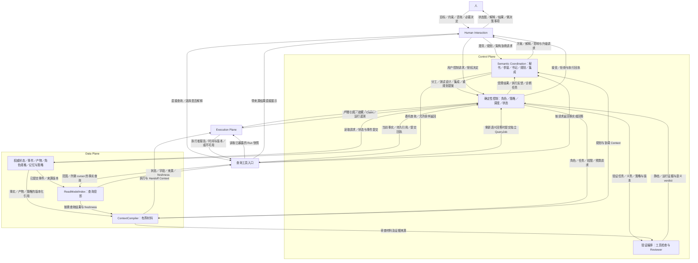
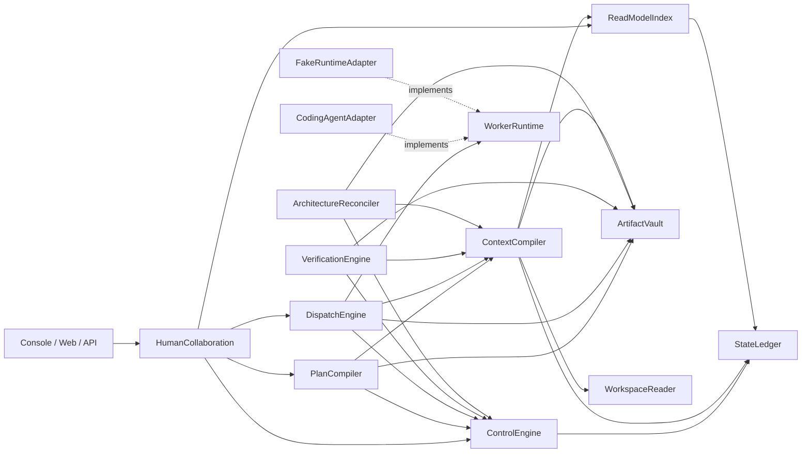

# Agent Platform Architecture Map

```yaml
status: draft
updated: 2026-09-06
scope: Plane、Module registry、长期依赖与全局不变量
```

本文是低分辨率地图。Module 内部机制、字段和状态转换只存在于对应 Module 或 Interface 文档。

2026-09-05：统一界面、参与式需求／架构建立和规划／集成—执行角色正在 [重新审阅](dev_docs/design/human-framework-role-review.md)。下列 Module 与 Interface 保留为候选，尚未证明覆盖修订后的完整产品承诺。

## Plane

此图表达候选运行时请求、指挥与反馈，每条箭头注明传递内容；源码依赖另见 ModuleDependencyDAG。
ReadModel 与 ContextCompiler 同属 Data Plane，分别提供查询投影和按任务编译材料的能力。Control Plane 内含语义协调、确定性控制与验证编排；角色分工、记录权限及 Context 使用策略由 Control 管理，工程事实、开发轨迹和语义提示的存储与编译由 Data 提供。



| Plane             | 责任                                               |
| ----------------- | -------------------------------------------------- |
| Human Interaction | 统一图文展示、对话、查询、需求／架构讨论、控制与决定入口 |
| Control           | 语义协调负责澄清、角色分工、耦合／测试设计与集成；框架管理角色绑定、记忆／Context 策略、通信、调度、验证、状态与架构对账 |
| Execution         | 完成一次 Worker Run，并报告事实                    |
| Data              | 持久事实与产物；ReadModel 查询投影；按角色／任务编译 Context |

Semantic Coordination 是 Control 内的能力分工；PlanCompiler 保留名称，但 Interface 扩展为有界协调工作的请求／结果处理，覆盖规划、咨询、集成与重规划提案，不持有全局模型循环。验证编排由 VerificationEngine 组织工具与 Reviewer。
协调、执行、Reviewer 和查询角色的模型运行均可使用 Execution Plane 的 WorkerRuntime；角色职责归属与运行承载分开。图中的查询工具是 HumanCollaboration 的候选访问能力，不据此新增独立 Module。
Security、Audit、Observability 和 Evaluation 是每个纵向切片的验收义务。遥测经框架聚合触发受控诊断，不能把每条异常都直接变成人工审批。

架构协作需覆盖“人与参谋确立需求和选项 → 适用决定 → 版本化规范／Baseline／Plan → 执行 → 事实与解释回报”。
初始 fixture 安装与后期漂移升级各覆盖其中一段。Planning→Control 是日常指挥入口：已授权分工、契约内设计与返工可直接提案并由框架接受；需要新业务选择或授权时，先由参谋提交选项和影响供人决定。

## Data Plane 的查询与 Context

| 能力 | 输入与行为 | 输出与消费者 |
| --- | --- | --- |
| ReadModelIndex | 对已提交事件做确定性投影、索引、过滤、聚合和重建；暴露来源及投影进度 | Goal／Task 状态、关系、Evidence 与 Decision 的查询结果；UI 和其他有权限消费者均可读取 |
| [ContextCompiler](dev_docs/modules/data/context-compiler.md) | 针对角色、任务、scope、当前版本和预算，选取事实、契约、产物、所需视图及历史决定；控制相关性与材料大小 | 有界 ContextBundle，供规划、执行、解释、Review、Handoff 使用 |

两者复用同一事实基础：ReadModel 回答“当前可查询的状态是什么”，ContextCompiler 回答“这次工作需要知道哪些材料”。
ContextCompiler 可以消费 ReadModel 的已有查询结果，不重新实现状态归约；它也需要 View 没有的源码、契约、产物与相关历史。
这种分工不是人／Agent 的读权限划分，也不要求独立进程。Data Plane 承担信息组织，Control Plane 持有状态转换与授权责任。

## 角色、记忆与 Context 的责任归属

“Context 规划”若指决定谁需要哪些信息，属于 Control 的角色和 Context 策略；若指检索、过滤和组装材料，则属于 Data 的 ContextCompiler。当前不新增独立 Context Plane。

| 事项 | Control 决定／维护 | Data 保存／提供 |
| --- | --- | --- |
| 角色定义与分工 | 协调者提出职责、任务拆分与能力要求；框架接受角色规格版本、绑定 Agent／Task、校验权限与生命周期 | 版本化角色规格、绑定事实和相应查询 |
| 开发轨迹与语义提示 | 校验记录权限与来源；影响授权、规范或验收的变化走正式决定路径，普通笔记不逐条审批 | 保存 Session／Handoff／报告与来源索引，检索当前适用材料 |
| 本次 Context | 根据已接受任务与角色确定信息义务、权限、预算、Skill 引用和刷新／交接条件 | ContextCompiler 按要求选择规范、事实、产物和相关记忆，返回 ContextBundle |
| 交流与反馈 | 确定消息接收者、用途、预算、何时唤醒或升级；任务／权限变化经过正式提案路径 | 有界消息、交接、讨论结论与产物引用 |

ContextCompiler 消费角色分工结果，不自行重新分配工作；选取记忆不等于批准记忆内容。角色职责允许按任务组合，不限定为固定枚举；保留 [短生命周期 Agent 自由模板](dev_docs/agent/templates/short-lived-agent.md)，由框架绑定任务、权限、预算和退出条件，运行仍使用 WorkerRuntime。精确契约在首个真实消费者处定义，不另建空管理模块。

### Context 生命周期与编排

WorkContext 跟随连贯工作持续，单次调用、活跃 Run、跨 Run 工作责任与持久历史分别维护。ContextBundle 是选材结果，不代表完整运行上下文；跨开发 Ticket 默认新建 Context，按需继承相关记录。准确事件与留痕行为见 [Context 生命周期契约](dev_docs/interfaces/context-lifecycle.md)。

Control 内的语义协调负责分工、跨包判断和 Context 使用提案；确定性控制校验、登记、路由与执行策略。各工作包可有规划／集成负责人，跨包议题有指定收敛责任；秘书／参谋组织架构／接口变化上报及人类取舍，书记整理来源和分歧。普通交流不自动形成调度依赖。具体闭环见 [运行时协作](dev_docs/interfaces/runtime-collaboration.md)。

平台维护跨 Run 关联与接续策略，WorkerRuntime 适配内核声明的持续执行、压缩及恢复能力；Data 编译材料，不新增独立 Context Plane、记忆存储或每角色常驻进程。

### 记忆以工程事实和开发轨迹为基础

Data Plane 从三个侧面组织材料，不要求建立独立 MemoryStore 或常驻 Memory Agent：

| 侧面 | 原始来源 | 使用边界 |
| --- | --- | --- |
| 当前事实 | 源码／Git、规范与架构、测试／Evidence、Task／Run／Artifact | 保留各自权威来源、scope 与 revision；索引不取代原始对象 |
| 开发轨迹 | Session、Handoff、变更、失败／重试、Decision | 记录做过什么及原因；历史报告不等于当前事实 |
| 语义提示 | 知识产生者留下的要点、经验、偏好、待解问题 | 带来源与不确定性；帮助发现材料，不自动产生约束 |

ContextCompiler 先按任务范围和版本检索当前状态、规范、相关代码关系、测试证据及近期交接；已有文本／语义索引可按需使用。需要新的模型判断时返回材料缺口，由 Control 路径创建短生命周期工作，再携结果引用重新编译，ContextCompiler 不自行启动 Agent。也可通过角色绑定定位相关 Agent，优先读取已有报告，仍不足时使用独立 QueryJob；不要求每次调用全部检索路径。

知识产生者按 [生命周期契约](dev_docs/interfaces/context-lifecycle.md) 在关键选择与检查点记录理由、来源和未解项；临时 Agent 按需整理、去重、分析冲突。普通记录经权限、格式与来源检查即可保存，只有改变策略、授权、规范、验收或具有约束力的偏好才进入相应接纳／替代流程，架构／接口变化按 [统一展示契约](dev_docs/interfaces/human-design-status.md) 主动上报，需要新取舍时由人决定。使用反馈可以改善检索和提示，不能自行扩大授权。

源码描述实际实现，当前有效 Spec／Baseline 规定应当满足的要求；二者冲突应对账，不能以“代码更新”自动覆盖规范。Session 中的“测试通过”只是报告，须关联对应版本的测试 Evidence 才能作为验证依据。

## 查询与 Agent 交流

查询具有三条候选路径：已有事实直接由 ReadModel 返回；已暴露的执行快照通过工具读取；需要新语义回答时由框架启动独立只读 QueryJob。用户可以跳过秘书／参谋，参谋也可以只调用工具后原样呈现。查询仍受 scope、权限和 freshness 约束。

执行快照只能包含公开报告、观察和可引用产物，不能访问隐藏思维或假定运行内核支持任意实时询问。不支持快照或没有最新报告时返回明确的不可用／过期状态，或按请求进入 QueryJob。新查询不得注入源 Coder 的执行 Context、修改其 lease 或义务；查询回答单独标明报告／解释来源，不改写正式完成状态。

Agent 之间需要有界通信，默认使用任务、报告、提案、问题和 Handoff；已有状态和工具结果不必重新生成一轮对话。耦合冲突、测试设计或相互矛盾的判断可以触发限定议题的讨论，按策略设置轮次／时间／Token 预算、参与者、退出条件和结果产物。

消息绑定 scope、角色、任务或查询 ID、来源版本与 correlation，接收者按需加载相关内容。讨论输出成为可追溯的解释、提案、决定或未解问题，权限与状态仍经框架校验；普通消息不是调度依赖，只有消费必需产物的工作才建立 blocking edge。

系统存在多个局部执行／规划反馈闭环：框架按持久状态和事件推进，各 Agent 在有界 Context 中完成一项工作并交接；静态查询、确定性调度和正常事件处理可以不调用模型。它不是由一个持有全部历史的大型 Agent 串行运行全局 plan→act 循环。

## 投影、校验与语义判断

- ReadModel 做事件 schema、顺序、作用域和 freshness 等投影完整性检查；这些检查不证明代码正确或任务完成。
- ContextCompiler 检查材料的权限、来源、适用版本和预算；材料被选入 Context 不等于材料中的判断被接受。
- 静态代码／规范检查、运行测试和 Agent 语义 Review 属于验证流程。Reviewer 使用 ContextCompiler 编译的材料返回有来源的 verdict，Control 依据适用 Evidence 和完成策略归约状态。
- ReadModel 随后展示验证结果。普通状态查询不需要再次调用 Reviewer；语义解释可以按需生成并绑定事实版本，过期解释不覆盖新的事实视图。
- 控制 guard 使用 canonical state；即使 Context 使用了派生视图，提交时仍复核当前版本，不能用过期查询结果授权写入。

## 协调、自治与人类知情

秘书／参谋参与面向人的需求／架构讨论，也承担或协同规划／集成者进行分工、模块耦合分析、测试策略、冲突处理和返工。
框架执行提案校验、派发、生命周期、验证和恢复，并把执行反馈送回协调角色。逻辑职责确定后，Agent 实例与 Context 是否分开按任务需要选择，不要求一个常驻大 Context 处理全部工作。

小型变更按授权、影响与不确定性处理：契约内重构、既定义务内测试与任务调整可以自治；改变需求含义、验收、公开契约或已接受 baseline 的变更，即使改动小，也必须有相应授权。
现有授权明确覆盖时沿版本化提案、校验和验证路径处理；否则由参谋升级具体取舍。初始需求与架构由人参与形成，后续已授权工作持续反馈，不逐项等待人批准。

事件触发诊断与处置的候选矩阵、协调记忆／Skill 的职责见 [复核稿](dev_docs/design/human-framework-role-review.md)。策略约束处置权限，记忆提供历史案例，Skill 提供分析步骤；后两者不能自行扩大授权或削弱验收。精确阈值、委托授权契约与 MVP 覆盖仍待冻结。

## Module Registry

| Plane             | Module                                                                    | Interface 摘要                                    | 契约状态          |
| ----------------- | ------------------------------------------------------------------------- | ------------------------------------------------- | ----------------- |
| Human Interaction | [HumanCollaboration](dev_docs/modules/interaction/human-collaboration.md) | `createGoal(request)`、`goalView(query)`          | first-slice draft |
| Control           | [PlanCompiler](dev_docs/modules/control/plan-compiler.md) | `request(intent)`、`accept(resultRef)`：有界协调 | extension draft   |
| Control           | [ControlEngine](dev_docs/modules/control/control-engine.md)               | `submit(command)`                                 | first-slice draft |
| Control           | [DispatchEngine](dev_docs/modules/control/dispatch-engine.md) | `drive(trigger)`（唯一入口）；公开运行快照经 WorkerRuntime.HandoffControlPort.snapshot（P1-06 冻结，noHiddenContextRead）与 ReadModel 视图；运行事实受理属 ControlEngine | extension draft   |
| Control           | [VerificationEngine](dev_docs/modules/control/verification-engine.md) | `verify(intent) → verification ref`               | planned           |
| Control           | [ArchitectureReconciler](dev_docs/modules/control/architecture-reconciler.md) | `inspect(intent) → assessment ref`                | planned           |
| Execution         | [WorkerRuntime](dev_docs/modules/execution/worker-runtime.md) | `capabilities/start/control/events`；可选 `snapshot` | extension draft |
| Data              | [StateLedger](dev_docs/modules/data/state-ledger.md)                      | `load/commit/events`                              | first-slice draft |
| Data              | [ArtifactVault](dev_docs/modules/data/artifact-vault.md) | `put/open`                                        | planned           |
| Data              | [ReadModelIndex](dev_docs/modules/data/read-model-index.md)               | `advance(page)`、`goal(query)`                    | first-slice draft |
| Data              | [ContextCompiler](dev_docs/modules/data/context-compiler.md) | `assemble(request) → ready/needs_material/rejected` | extension draft |
| Data              | [WorkspaceReader](dev_docs/modules/data/workspace-reader.md) | `read(query) → sourced/unsupported/stale/rejected` | extension draft |

扩展 Interface 的单一正文见 [运行时协作契约](dev_docs/interfaces/runtime-collaboration.md)，包括角色绑定、消息、查询、轨迹及来源读接口。`extension draft` 表示已同步设计而非实现／冻结。HumanCollaboration、ControlEngine、StateLedger 与 ReadModelIndex 的现有类型仍是 CreateGoal 首切片；扩展消费者须同时读取该契约，不能把首切片类型当作完整产品类型。

一个流程方框只有在拥有独立 Interface、隐藏实质复杂度且能通过该 Interface 验证时，才升级为 Module。
其余机制留在最近的深 Module Implementation 内。

## ModuleDependencyDAG

箭头表示调用者长期依赖被调用 Module 的 Interface，不表示开发顺序。



运行时可以形成 `Control → outbox → Worker → Fact → Control` 的反馈循环，但源码依赖仍保持无环。
外部 Host 根据 outbox/event 驱动 Dispatch、Verification、Architecture 和 ReadModel Module；这些 Module
通过 ControlEngine Interface 回交事实，不直接修改状态。

本轮新增依赖的含义如下；未画模型对话的回箭头，因为反馈由持久事件／产物传递，不是被调用 Module 反向依赖调用者。

| 调用者 → 被调用者 | 消费的 Interface 与原因 |
| --- | --- |
| HumanCollaboration → DispatchEngine | 读取可用的公开运行快照；UI 不直接依赖内核运行细节 |
| PlanCompiler → ControlEngine / ArtifactVault | 提交协调工作与提案、读取结果；模型运行通过正式派发路径完成 |
| DispatchEngine → ArtifactVault | 打开已编译 Context、保存运行报告／交接正文，回交持久引用 |
| ArchitectureReconciler → ContextCompiler | 获取相同版本的规范、代码关系和证据以做对账 |
| ContextCompiler → WorkspaceReader | 按显式 Workspace 版本读源码／Git／可用代码索引；这些来源不是 Ledger 事件或 Vault 产物的替代品 |

角色绑定与消息元数据仍由 ControlEngine／StateLedger 管理；轨迹正文和提示由 ArtifactVault 保存，ReadModelIndex 投影其已提交引用。它们改变契约内容，但不需要新增 RoleManager 或 MemoryStore。WorkspaceReader 则隐藏工作区读取、路径约束与索引版本差异，具有真实的独立读 Interface；没有 CodeGraph 时返回能力缺口，不能编造关系。

## 三类 DAG

| 图                   | 所有者               | 稳定性         | 表达                                |
| -------------------- | -------------------- | -------------- | ----------------------------------- |
| ModuleDependencyDAG  | ArchitectureBaseline | 长期           | Module 对 Interface 的依赖          |
| DevelopmentTicketDAG | 当前开发计划         | 临时           | Ticket 的 blocking edges            |
| RuntimeExecutionDAG  | PlanRevision         | 每个 Goal 一版 | Runtime Task 的真实输入输出前置关系 |

Development Ticket 可以纵向穿过少量 Module。Module Worker 可以并行，但必须在当前 Ticket 的
Integration Gate 汇合，不能把首次集成推迟到产品末尾。

## 全局不变量

1. Planner 只提出 Proposal/Patch；ControlEngine 才能接受并推进长期状态。
2. Worker 和 Reviewer 只提交事实、Claim 或 Verdict，不能直接完成 Task。
3. ControlEngine 从版本校验后的 transition 生成 snapshot/Event；StateLedger 只原子提交两者。
4. UI、Todo、Plan Matrix 和 Timeline 都是 ReadModel，不接受直接状态写入。
5. ModuleDependencyDAG、DevelopmentTicketDAG 与 RuntimeExecutionDAG 不互相充当真相源。
6. 每个执行、Evidence、Handoff 和 Decision 都绑定明确 revision 与来源。
7. MVP 中同一目标 checkout 同时最多一个 Writer。
8. GateTask 参与完成归约；只有显式 Runtime dependency 才阻塞调度。
9. 可激活 Plan 的 required executable Task、active required GoalGateTask、required AcceptanceObligation 与 required VerificationRequirement 集合都非空；空集合不能证明完成。
10. Workspace bootstrap 只从版本化 source 建立 Project/Workspace identity 与 manifest，不顺带创建治理 revision 或 Project active governance ref。
11. CompletionPolicy、ArchitectureBaseline 与 ArchitectureEvolutionPolicy 只在存在首个消费者的切片中，由显式版本化 source 经 install/activation contract 建立；local fixture 必须走同一正式路径，revision 持久且不可变，Project active ref 可审计，不存在内置默认值。
12. PlanRevision 在接受时固定解析出的 ArchitectureBaseline 与 CompletionPolicy revision；Project 默认 ref 后续移动不改写既有 Plan。
13. ArchitectureBaseline revision 不可改写；candidate 的 source ref 必须仍等于 Project 当前默认 ref，才能经显式 Decision、migration Gate 与 CAS activation 演进；否则必须基于新默认 ref 重新提案。
14. 归档文档永远不是当前状态来源。

## 第一条纵向切片

```text
版本化 Workspace bootstrap source
  → Project/Workspace identity + WorkspaceBootstrapManifest
  → 用户提交 CreateGoal
  → HumanCollaboration
  → ControlEngine
  → StateLedger
  → Domain Event
  → ReadModelIndex
  → 用户查询到 Goal
```

这个切片只展开四个 Module，以及 [Command/Event Interface](dev_docs/interfaces/command-event.md)、
[State Ledger Interface](dev_docs/interfaces/state-ledger.md) 和
[Goal View Interface](dev_docs/interfaces/goal-view.md)。它不包含 Planner、真实 Worker、
完整 UI、Handoff 或 Architecture Reconciler。

完成条件：

- bootstrap manifest 的 source digest、bootstrap revision 与 Project/Workspace entries 可以从 canonical state 校验，且未预建 governance revision/active ref；
- 同一 CreateGoal command 重试不会创建两个 Goal；
- 过期 expected revision 被拒绝且无副作用；
- 重启后可以从持久化 snapshot 恢复 canonical Goal；
- GoalView 可以从 Event 重建，且显示与权威状态一致；
- 进程重启后结果不变。

## 构建本产品时的 Context 编译

Module Worker 默认获得：

```text
当前 Ticket
+ 当前 Module 文档
+ 直接跨越的 Interface
+ DevelopmentTicketDAG 一跳依赖
+ 上游 output refs
+ 当前 source/workspace revision
```

Slice Integrator 额外获得本切片验收、所有 Module Artifact/Evidence、接口版本和回退方法。
如果 Integrator 无法在一个新 Context 中完成汇合，当前 Ticket 仍然过大。

## MVP 演进顺序

1. Goal 持久化并可见；
2. CompletionPolicy/ArchitectureBaseline 显式安装并激活后，PlanRevision 固定精确 refs，Plan/Task 可见；
3. Fake Worker 派发与状态回报；
4. Evidence 驱动 Task/Gate 满足；
5. required 义务归约为 Goal phase；
6. Run/Context 的 A→B Handoff 与双 Reader/单 Writer；
7. 只读查询、QueryJob、安全控制和目标变更；
8. ArchitectureBaseline 对账；ArchitectureEvolutionPolicy 在首次修复消费时显式安装并激活；随后执行修复和演进决策。

9. 复用上述能力完成 P1-15：人在统一界面参与初始需求／架构，协调者与 Coder 闭环并给出同源图文回报。开发最后集成，不代表产品运行时把初始设计放在执行之后。

这只是 DevelopmentTicketDAG 的低分辨率投影。准确 blocking edges 和验收条件见
[P1 Foundation DAG](dev_docs/planning/proposed/P1-foundation/DAG.md)。

## 文档路由

- 用户结果与非目标：[PRODUCT](PRODUCT.md)
- Task/Gate/Goal 完成语义：[Completion Policy](dev_docs/interfaces/completion-policy.md)
- 领域词汇：[CONTEXT](CONTEXT.md)
- 第一切片 Module：[Module docs](dev_docs/modules/)
- 跨 Module 契约：[Interfaces](dev_docs/interfaces/)
- 当前规划：[P0 DAG](dev_docs/planning/active/P0/DAG.md)
- 决策理由：[Decision Index](dev_docs/decisions/INDEX.md)
- 历史来源：[Archive Index](dev_docs/archive/INDEX.md)

## 2026-09-06 增量施工映射

P1-16 在 P1-06 后扩展同工作 Context 连续性与理由留痕；P1-09／10 消费其产物，P1-11 经 P1-10 取得该能力。P1-17 在 P1-16／05 后验证完成工作向新任务继承，P1-15 消费其结果并整合跨包冲突与人类决定闭环。G2 增加 P1-16，G3 通过 P1-15 包含 P1-17。准确依赖仍以 [P1 DAG](dev_docs/planning/proposed/P1-foundation/DAG.md) 为准。
