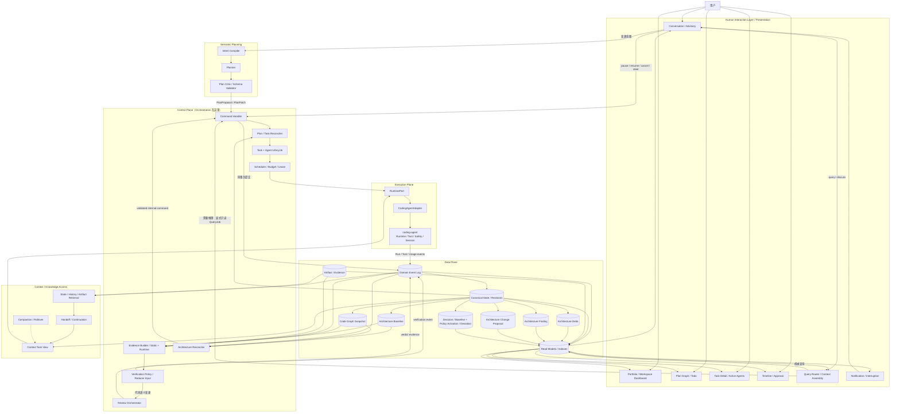
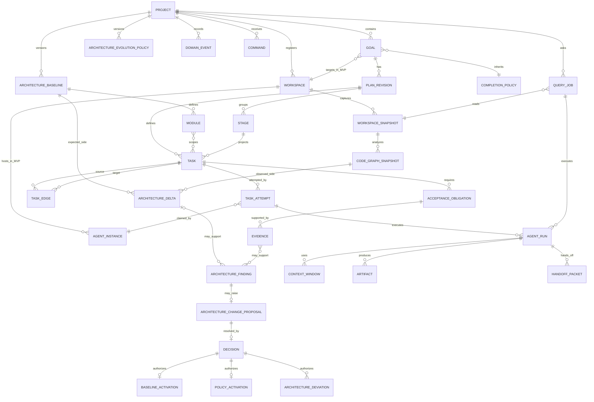
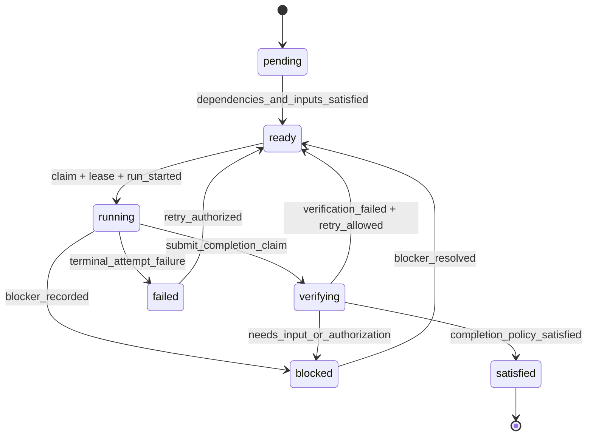
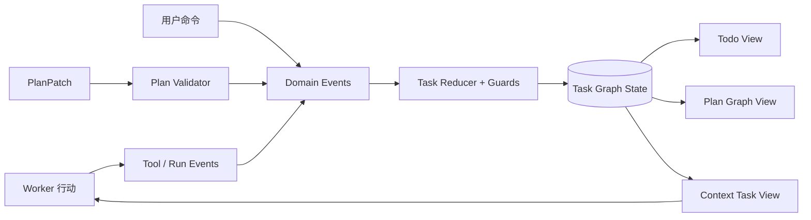
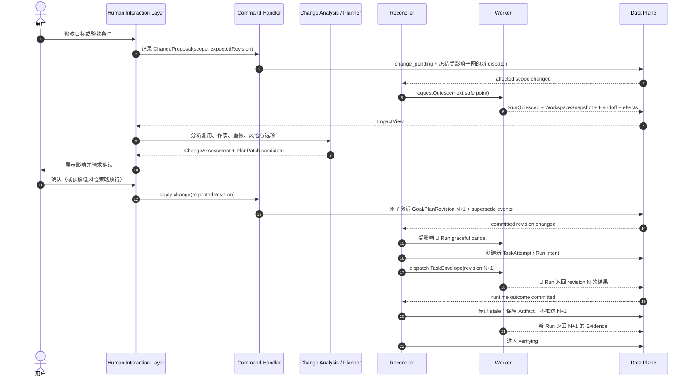

# Agent Platform 总体架构（v0.3）

```yaml
status: draft
updated: 2026-09-04
scope: Agent Platform 的目标架构、MVP 架构、对象模型、状态流、目录与依赖边界
related_code:
  - /home/han001/projects/agents/coding-agent/
related_docs:
  - ../../README.md
  - ../product/产品定义.md
  - ./任务图与完成判定.md
  - ../planning/P0-产品定义与总体架构.md
```

## 1. 架构结论

“计划图、数据面、控制面、编排、展示”不是五个平级模块。正确关系是：

> **计划图是核心状态模型；数据面保存事实与投影；控制面使期望状态收敛为当前状态；编排是控制面的决策循环；Human Interaction Layer 提供对话、仪表盘、提醒、咨询与命令入口。**

Human Interaction Layer 可以主动发现“需要人处理”的状态、组织讨论、发起只读 QueryJob 或提交 Command，
但不能越过 Controller 修改事实。它是一组人机协作能力，不是拥有全部权力的单一“超级 Secretary Agent”。

现有 `coding-agent` 位于执行面，通过窄 `RuntimePort` 被 Platform 调用。它不知道 Goal、
Task Graph、Scheduler 或 UI，也不承担跨 Agent 的业务真相。

六个权责句必须同时成立：

```text
Planner      决定 What should be done（提出方案）
Scheduler    决定 What runs now（资源与时机）
Worker       决定 How to execute（提交 CompletionClaim）
Verification Pipeline  生成结构、运行与语义 Evidence
Architecture Reconciler 决定 observed code 与 effective baseline 的 raw 差异如何解释
Controller   决定 What is valid / satisfied（按当前版本化策略唯一推进状态）
```

## 2. 目标系统总图



Security、Audit、Observability 和 Evaluation 是横切保障面，覆盖 Command、Control、
RuntimePort、Artifact 与所有外部副作用，不作为可以绕过主链的旁路。

## 3. 六层职责

| 层                         | 负责                                                                                     | 不负责                                    |
| -------------------------- | ---------------------------------------------------------------------------------------- | ----------------------------------------- |
| Human Interaction          | 对话、Portfolio/Workspace Dashboard、状态视图、主动提醒、Query 路由、Advisory 与审批入口 | 保存独立状态、直连或复制正在运行的 Worker |
| Semantic Planning          | 意图转 Goal/PlanProposal/PlanPatch，解释重规划理由                                       | 直接写 Task 状态、调度进程、宣告完成      |
| Control Plane              | Command 校验、Reconciler、Task/Agent 生命周期、Scheduler、预算、租约、验证               | 执行模型 loop、自由生成语义内容           |
| Execution Plane            | 一次 Run 内的模型、Context、Tool、安全、Session 和恢复                                   | 长期 Goal、全局 Task Graph、跨 Agent 调度 |
| Data Plane                 | 权威事件、当前状态、revision、Artifact、Evidence、读模型与索引                           | 决定下一步业务动作                        |
| Context / Knowledge Access | 从事实选择有界工作集、检索、Handoff、压缩与 rollover                                     | 拥有生命周期或改写事实                    |

### 3.1 编排的位置

编排不是独立于控制面的“另一个大脑”。它是一个受约束的循环：

```text
读取 desired/current state
  → 计算差异
  → 选择合法 transition
  → 调度一个动作
  → 等待已提交事实
  → 再次 reconcile
```

语义 Planner 可以帮助提出任务拆分，但只有 Reconciler 能通过状态机和 guard 将提议变为事实。

## 4. 核心对象模型



`AgentRun` 的执行所有者必须二选一：`TaskAttempt` 或 `QueryJob`，不能同时属于两者。

### 4.1 最小字段

`Project`：

```text
projectId, activeArchitectureBaselineRef, activeArchitectureEvolutionPolicyRef,
defaultCompletionPolicyRef, desiredState, phase, revision
```

`ArchitectureBaseline` 的单个 revision 不可变：

```text
architectureBaselineId, projectId, architectureBaselineRevision,
moduleRefs[], ruleRefs[], decisionRefs[], rationale,
supersedesArchitectureBaselineRevision?, createdAt
```

`ArchitectureDelta` 是不可变的机械结构差异；解释与动作另存为 Finding、Proposal、Decision 与 Activation：

```text
deltaId, architectureBaselineRevision, codeGraphSnapshotRef,
changeSet[], affectedBaselineRuleRefs[], deltaDigest, sourceRefs[], observedAt

findingId, deltaRef?, sourceEvidenceRefs[], affectedBaselineRuleRefs[],
architectureEvolutionPolicyRevision, ruleId, classification, severity,
confidence, recommendation, reviewerRef?

proposalId, baseArchitectureBaselineRevision, proposalKind,
proposedBaselineRef?, proposedPatchDigest?, problem, recommendedChange,
alternatives[], affectedBoundaries[], risk, migrationPlan, rollbackPlan,
verificationPlan, phase

Decision
decisionId, subjectType, subjectRef, outcome: accepted | rejected | deferred,
selectedOptionRef?, authorizedTargetRef?, actor: policy | human,
authorityRef, rationale, constraints[], revisitTriggers[], decidedAt

BaselineActivation
activationId, activationMode: genesis | advance, decisionId,
expectedProjectRevision, fromArchitectureBaselineRevision?,
toArchitectureBaselineRevision, migrationGateTaskId?, activatedAt

PolicyActivation
activationId, activationMode: genesis | advance, decisionId, policyKind,
expectedProjectRevision, fromPolicyRevision?, toPolicyRevision, activatedAt

deviationId, decisionId, architectureBaselineRevision,
workspaceGoalScope, allowedFindingRefs[], owner, expiresAt, phase
```

`advance` BaselineActivation guard 必须同时证明 `Decision.subjectType=architecture_baseline`、`outcome=accepted`、`authorizedTargetRef=toArchitectureBaselineRevision`、Project 当前 active ref 与 `fromArchitectureBaselineRevision` 相等、migration GateTask 已满足且 expected Project revision 的 CAS 成功。`genesis` 只允许 Project 当前 active ref 为空时使用，仍须 human accepted setup Decision 授权相同 target 并通过 CAS，但因不存在旧架构而不要求 migration GateTask。拒绝或延期 Decision 不能被消费，Decision 也不能授权另一个候选。

`Workspace`：

```text
workspaceId, projectId, kind, rootRef, baseRevision,
currentRevision, environmentDigest, desiredState, phase, revision
```

`WorkspaceSnapshot` 不是默认复制整个文件系统，而是可恢复的稳定引用：

```text
snapshotId, workspaceId, baseRevision, currentRevision,
overlayRef?, environmentDigest, artifactManifest[], eventCursor, createdAt
```

`Goal` 与 `PlanRevision`：

```text
goalId, projectId, workspaceId, objective, desiredState, phase,
activePlanRevision, createdAt, updatedAt, revision

planRevisionId, goalId, sourceArchitectureBaselineRevision?,
targetArchitectureBaselineRevision, completionPolicyRevision,
architectureEvolutionPolicyRevision, createdAt
```

Project 的 active baseline 只作为新 Plan 的默认值，不会追溯性改写运行中的 Plan，也不会直接让其 EvidenceBinding STALE 或触发 rebase。普通 Plan 在激活时固定 `targetArchitectureBaselineRevision`；架构迁移 Plan 同时声明 source/target，并在 migration GateTask 通过后以 BaselineActivation 原子推进 Project active ref。若既有 Plan 也要迁移，必须显式创建 PlanRebase/新 PlanRevision，此时才重新计算 EvidenceBinding applicability；迁移 Plan 原本已绑定 target baseline，其有效 Evidence 不因激活失效。Architecture Reconciler 始终解析 Plan/Workspace 的 effective baseline，而不是盲目使用 Project 最新值。

`Task`：

```text
taskId, goalId, planRevision, parentId?, title, objective,
taskKind: work | gate, scopeKind, moduleScopeRefs[], stageId, outputContracts[],
requirementLevel, disposition, desiredState, phase, priority, lane,
completionPolicyRef, verificationOverride?, readSet[], writeSet[], conflictScope[],
assignedAgentId?, activeAttemptId?, createdAt, startedAt?, completedAt?, revision
```

`TaskEdge` 首版可存 `parent_of` 与带具体输入/输出要求的 `depends_on`，但 `parent_of` 只投影 TaskHierarchy，不进入 ExecutionDAG、readiness、环检测或依赖满足。`depends_on` 可标记为
`CONTRACT | ARTIFACT | DECISION | ENVIRONMENT | GATE`；Gate 是 `taskKind=gate` 的特殊 Task。同属 Stage 或存在写冲突不能伪装成执行依赖，写冲突由 `conflictScope + lease` 管理。

`TaskAttempt`：

```text
attemptId, taskId, taskRevision, planRevision, agentId, leaseId,
status, budgetEnvelope, workspaceSnapshotId, workspaceRevision,
architectureBaselineRevision, completionPolicyRevision,
architectureEvolutionPolicyRevision, startedAt, endedAt?
```

`QueryJob`：

```text
queryJobId, projectId, workspaceSnapshotId, sourceTaskId?,
question, status, budgetEnvelope, createdAt, endedAt?
```

`CompletionPolicy` 在 Project/Goal 层版本化并由 Task 继承：

```text
completionPolicyId, completionPolicyRevision, defaultProfiles[],
riskRules[], gateRules[], humanOracleRefs[]
```

架构演进不塞进 CompletionPolicy，而由 Project 级不可变版本策略管理：

```text
ArchitectureEvolutionPolicy
architectureEvolutionPolicyId, architectureEvolutionPolicyRevision,
autoRemediationRules[], equivalentProposalRules[], escalationRules[],
driftBudget, reviewTriggers[]
```

Agent/Controller 只能提出新 Policy revision。MVP 中 CompletionPolicy 与 ArchitectureEvolutionPolicy 只能由 `Decision(subjectType=completion_policy|architecture_evolution_policy, actor=human, outcome=accepted)` 授权，再由各自 PolicyActivation 以 CAS guard 激活；现有 Policy 不能预授权替代自身，避免自我扩权。

PolicyActivation guard 必须证明 Decision subject 与 `policyKind` 一致、`authorizedTargetRef=toPolicyRevision`、Project 当前 policy ref 与 `fromPolicyRevision` 一致，且 expected Project revision 的 CAS 成功。genesis 时 `fromPolicyRevision=null` 且当前 ref 必须为空，仍需 human accepted setup Decision。VerificationPlan 分别绑定 completion policy、architecture baseline 与 architecture evolution policy 的精确 revision，避免版本构造环。

`Evidence` 不混合验证手段、来源和裁决主体：

```text
Evidence
  evidenceId, kind, result, summary, artifactRefs[], sourceEventRefs[],
  provenance, observedAt

EvidenceBinding
  bindingId, evidenceId, subjectType, subjectId, subjectRevision,
  workspaceSnapshotRef, verificationPlanRef, completionPolicyRevision,
  architectureBaselineRevision, architectureEvolutionPolicyRevision,
  coveredObligationRefs[], coveredBaselineRuleRefs[], producerVersion,
  contentDigest
```

Evidence 始终不可变；一份 Evidence 可通过多个 EvidenceBinding 覆盖多个 Task、Obligation 或 GateTask。`STALE` 是每个 Binding 相对于当前 VerificationPlan 的派生 applicability，不是回写 Evidence。

`kind` 可为 `static | executable | semantic | human_signal | live_signal`。External System 只产生
`live_signal`，Reviewer verdict 只产生 `semantic` Evidence；二者都不能直接修改 Task phase。

Observation、Evidence、Decision 与派生状态必须保持单向关系：

| 层            | 示例                                                            | 写入/用途                                             |
| ------------- | --------------------------------------------------------------- | ----------------------------------------------------- |
| Observation   | exit code、test result、commit、workspace revision、usage       | 工具或 Runtime 产生，不直接完成 Task                  |
| Evidence      | static/executable/semantic/human/live verdict + EvidenceBinding | VerificationPlan 选择后参与 guard                     |
| Decision      | Constraint、ArchitectureDecision、授权、例外                    | 带 provenance 的版本化事实                            |
| Derived State | Task phase、Goal phase、ModuleProgress、StageProgress           | Reducer 从上述输入确定性重建，不反向作为自身 Evidence |

## 5. Task 状态机

Task 的义务、处置与执行进度分为三个正交维度：

```text
requirementLevel = required | optional
disposition      = active | deferred | cancelled | superseded
desiredState     = active | paused
phase            = pending | ready | running | verifying |
                   blocked | satisfied | failed
```

`paused` 是用户期望状态；`deferred/cancelled/superseded` 是当前 revision 对该义务的处置；
`blocked/failed/satisfied` 才是工作进度。Attempt 的取消、崩溃或 stale 也不能自动改写 Task 的业务义务。
UI 由这些维度与 active Attempt 派生 `pausing/paused/cancelled/stale` 等展示状态。



### 5.1 Transition Guard

1. `depends_on` 指向的具体输出未满足，Task 不得进入 `ready/running`；
2. 同一 `conflictScope` 的 lease 未释放，另一个 Writer 不得 claim；
3. Worker 与 Reviewer 只能提交 claim/verdict，不能直接写 `satisfied`；
4. CompletionPolicy 要求的 EffectiveEvidenceSet 未满足，或 required EvidenceBinding applicability = STALE，不能进入 `satisfied`；
5. command 的 expected revision 不匹配时，无副作用地拒绝或标记 stale；
6. 当前 revision 的 required executable work Task、obligations 与 GateTask 未全部满足时，Goal 不得完成；
7. required 的 blocked/deferred/cancelled 不算完成；optional 不阻塞，但必须显式投影其处置结果。
8. active PlanRevision、required AcceptanceObligation 及其 required verification requirements 均不得为空；no-change 也必须由带 PASS Evidence 的 AlreadySatisfied GoalGateTask 表达。

## 6. Todo/Plan Graph 的正确实现

同一组 Task 同时按 `moduleScope` 和 `stage` 形成 PlanMatrix，但内部仍分别保存 ArchitectureBaseline、CodeGraphSnapshot、TaskHierarchy、ExecutionDAG 与 EvidenceGraph。Stage 是 PlanRevision 中的交付成熟度维度，StageProgress 才是投影。GateTask 总是参与对应 Module/Stage/Goal 的完成归约；只有下游 Task 在 ExecutionDAG 中显式 `depends_on` 该 GateTask 时，它才形成调度 barrier。因此同 Stage 的不同模块、甚至不同 Stage 中没有真依赖的 Task 都可以并行。



关键性质：

- UI 不能直接切换 checkbox；它只能发出显式 Command；
- 同一个 Event Log/State Store 重建后，Todo、Graph 和 Task Detail 必须一致；
- Worker 即使从不调用 plan/todo 工具，Reducer 仍能根据 claim、submit、verify 等事件推进；
- command exit、AST 检查结果和 Reviewer verdict 都只是 Observation/verdict；绑定覆盖范围与 revision、形成 Evidence 并被 VerificationPlan 选入后，才能参与 guard，且任何单项都不独立等于 Task 完成；
- ModuleProgress 与 StageProgress 是可重建投影；Goal 直接从当前 revision 的 required Task、obligations 与 GateTask 归约；
- 重规划产生新的 `PlanRevision` 和 `PlanPatch`，不会覆盖旧版完成事实与证据。

完整的 VerificationPlan、ReviewPacket、Task/Goal 归约、Module/Stage progress 投影和 Reviewer 防瓶颈规则见
[任务图与完成判定](./任务图与完成判定.md)。

为模型保留的动作应拆成明确语义，而不是万能 `update_plan`：

```text
propose_plan_patch(...)
claim_task(task_id, expected_revision)
submit_task_result(task_id, task_revision, completion_claim, observation_refs, summary)
block_task(task_id, reason, evidence_refs?)
request_defer(task_id, reason)
```

## 7. Command、Event、State 与 Read Model

### 7.1 写路径

```text
Command
  → 鉴权、schema、idempotencyKey、expectedRevision 校验
  → 状态机/依赖/预算/租约 guard
  → 在一个数据库事务内追加 DomainEvent
  → Reducer 更新当前 projection 与 outbox
  → 提交后才触发调度或外部动作
```

MVP 使用 SQLite 的 append-only `domain_event` 作为业务事实源，同时在同一事务中维护可查询的
current-state projection。Checkpoint/读模型可重建，不把纯 UI 数据当第二真相源。

### 7.2 读路径

```text
Query API
  → Read Model
  → PortfolioView | WorkspaceView | PlanGraphView | TodoView |
    TaskDetailView | ActiveAgentsView | TimelineView
```

查询分成两条路径：

- **机械状态查询**只读取 Read Model，不启动模型；
- **语义咨询**显式创建有预算、可取消、只读的 QueryJob，从已提交 `ContextTaskView`、Artifact 和
  `WorkspaceSnapshot` 组装新 Context。它不暂停源 Worker、不读取其隐藏思维链、不刷新源 lease，
  也不改变源 Task；结果以咨询 Artifact 返回。

QueryJob 会产生自身的成本与审计事件，因此不是“无副作用的数据库 Query”；但任何会改变业务状态的动作仍必须显式发 Command。

### 7.3 事件最小信封

```text
eventId, projectId, workspaceId?, aggregateType, aggregateId,
aggregateRevision, eventType, schemaVersion,
causationId, correlationId, idempotencyKey,
actor, occurredAt, payload
```

重复 eventId/idempotencyKey 无副作用；同一 aggregate 的 revision 必须单调递增。

## 8. Control Plane 与编排循环

Reconciler 是中枢，不是 Planner。伪代码将在 P0 用户裁决后单独编写，这里只冻结算法边界：

```text
for each changed aggregate:
  read desired state + current state + committed events
  derive eligible transitions
  apply deterministic guards
  choose next bounded action
  persist intent/lease before external dispatch
  dispatch through a Port
  wait for committed outcome
  reconcile again
```

Task Reconciler 与 Architecture Reconciler 是两个协调循环，共享 Event/Data Plane，但不能互相偷换事实：

```text
Task:         desired/current state → eligible transition → bounded action
Architecture: effective baseline + structural/runtime evidence → raw delta? → finding → remediation | proposal
```

Architecture Reconciler 在 Task 提交/merge 时增量检查，在 Module/Stage/Goal Gate 做范围复查，并按 drift budget 或重要边界变化触发全局 ReviewJob。结构变化先生成 raw ArchitectureDelta；性能、逻辑或权限问题也可由 executable/live/semantic Evidence 直接产生 ArchitectureFinding。RemediationSuggested 经 Controller/PlanPatch/Scheduler 的正常路径成为 RemediationTask；重大或含糊演进生成 ArchitectureChangeProposal 和 ArchitectureDecisionBrief。material 变更先以 migration Plan 验证候选 baseline，通过后才以 BaselineActivation 原子更新 Project 默认 ref；它不影响既有 Plan，只有显式 PlanRebase/新 PlanRevision 才重新计算相关 EvidenceBinding applicability。

Scheduler 只在 Controller 给出的 eligible Task 集合中选择“现在运行哪个”，考虑：

- 真依赖、module/stage 投影与 lane；同 Stage、不同模块且无硬依赖的 Task 可并行；
- priority 与公平性；
- Token、时间、工具调用和 Artifact 预算；
- 并发上限；
- Agent Profile、权限与 Workspace 能力；
- lease、heartbeat 和已有 Attempt。

Scheduler 无权修改验收标准，也不能把资源不足伪装为任务失败。

## 9. RuntimePort 与 `coding-agent` 边界

Platform 的 `control` 只依赖自有 Port：

```ts
interface WorkerRuntimePort {
  getCapabilities(): Promise<RuntimeCapabilities>;
  startRun(envelope: TaskEnvelope | QueryEnvelope): Promise<RunHandle>;
  queueMessage(
    runId: string,
    message: SteeringCommand,
    delivery: "next_safe_point",
  ): Promise<void>;
  requestQuiesce(runId: string, reason: string): Promise<void>;
  requestCancel(
    runId: string,
    reason: string,
    mode: "graceful" | "forced",
  ): Promise<void>;
  getRunStatus(runId: string): Promise<ExternalRunStatus>;
  subscribe(
    runId: string,
    cursor?: string,
  ): AsyncIterable<RuntimeEventEnvelope>;
}
```

`TaskEnvelope` 至少包含：

```text
taskId, taskRevision, objective, completionContractSlice,
architectureSliceRef, constraints, allowedCapabilities, budgetEnvelope,
workspaceSnapshotRef + expectedRevision, contextTaskView, idempotencyKey
```

`RunOutcome` 至少包含：

```text
runId, status, completionClaim, summary, observationRefs, artifactRefs,
workspaceRevision, usage, unresolved, runtimeEventCursor
```

“安全点”由 Runtime 与 Tool contract 声明，不由模型自称：活动 Tool 的真实结果和副作用已经记录，
Workspace revision 已捕获，下一次 Tool 尚未派发，并且此时能够生成结构化 Handoff。若 Runtime 不支持
quiesce 或某类工具不可安全中断，Adapter 必须报告 capability/unknown outcome，Controller 不得假装成功暂停。

这里的接口名仍是目标契约，P0-04 才会冻结具体 request/response 与错误语义。

`CodingAgentAdapter` 负责协议转换。禁止：

- `control` import `RuntimeRunner` 或 `RunState` 内部实现；
- Platform 直接写 `coding-agent` Session；
- `coding-agent` 反向读取 Platform 数据库；
- Runtime event 未持久化就先推进 Task；
- 通过 prompt 共享权限或绕过 Permission → Approval → Sandbox。

## 10. Handoff 与 Context 生命周期

统一使用一个 `HandoffPacket` 覆盖：

```text
Context → Context
Run → Run
Agent → Agent
Worker → Reviewer / Human Interaction Layer
```

这里的箭头表示由 Platform 持久化、授权和投递的 Artifact/Evidence/Handoff，不表示 Agent 可以自由
点对点聊天。MVP 中跨 Project/Workspace 的 Agent 消息、Task 依赖和隐式 Artifact 注入均被拒绝。

最小 schema：

```text
handoffId, executionOwnerType, taskId?, taskRevision?, queryJobId?, objective,
completed[], unresolved[], constraints[], decisions[],
evidenceRefs[], artifactRefs[], workspaceRevision,
recommendedNextStep[], sourceRefs[], generatedAt, schemaVersion
```

不变量：

1. 有硬大小上限，不能复制整个 transcript；
2. 机械状态由程序生成，模型只能补充有来源的语义字段；
3. unresolved、outcome_unknown、用户纠偏和当前 workspace revision 不得省略；
4. 原始 Session/Event/Artifact 不因 Handoff 或 Compaction 被删除；
5. 新 Worker 首轮 Context 明确标注事实来源和过期条件；
6. 当 source revision 不匹配时，Handoff 失效并重新投影。

Memory 是这些事实的派生索引或语义材料，不拥有 Task 真相。检索优先级建议：

```text
精确 ID / 关系
  → 当前 Task/Run/Workspace 状态
  → Evidence / Artifact / Decision
  → 关键词检索
  → 语义检索
```

## 11. 用户修改目标时的版本与迟到结果

所有入口先归一化为带 `scope + expectedRevision` 的意图，不能把普通询问统一当成 cancel/steer：

| 意图                    | 控制面默认动作                                               |
| ----------------------- | ------------------------------------------------------------ |
| `query/discuss`         | 不暂停；读状态或创建只读 QueryJob                            |
| `remind/context_add`    | 排队到下一个安全点，同一 Attempt 继续                        |
| `steer`                 | 验收不变时在安全点投递，并记录 Worker acknowledgement        |
| `amend_goal/task`       | 对受影响子图执行两阶段“暂挂—评估—确认—应用”                  |
| `emergency_stop/cancel` | 立即尽力取消，再对账副作用；结果不明时进入 `outcome_unknown` |

下面时序只描述会改变范围、约束、交付物或验收条件的 `amend_goal/task`：



用户意图变化不覆盖历史。旧结果可能仍是有用 Artifact，但只有显式 rebase/review 后才能绑定新 revision；
不受影响的 Task/Agent 可以继续运行，不必把整个 Project 一刀切停掉。

## 12. 故障、恢复与副作用

### 12.1 需要区分的状态

```text
queued | starting | running | waiting | completed |
failed | cancelled | outcome_unknown | orphaned
```

`outcome_unknown` 表示外部副作用是否发生无法确认；`orphaned` 表示 lease 失效但宿主状态未完成对账。
两者都不能被自动映射为普通失败并重试。

### 12.2 工具感知的安全静默与取消

- 搜索、读取和纯模型生成通常可以等待当前调用返回，或在 Runtime 支持时取消；
- build/test 必须终止所属进程树并记录 cancelled，而不是只结束父进程；
- 原子文件写应等待提交后记录 diff 与 Workspace revision，再进入静默；
- 包安装需要对账 lockfile、临时文件和残留进程；
- 数据库迁移、部署、支付等不可逆或外部操作可能无法安全中断，结果不明时进入 `outcome_unknown`，禁止自动重试。

强制取消只用于明确紧急停止或优雅静默超时；它不能承诺回滚已经发生的外部副作用。

### 12.3 恢复顺序

1. 校验事件序列、schema 和 checksum；
2. 重建 Goal/Task/Attempt/Run 当前投影；
3. 对账未完成 command、outbox 和 Runtime run；
4. 识别过期 lease、孤儿 Worker 和未知副作用；
5. 重建 Read Models 与 Handoff；
6. 达到稳定边界后才领取新 Task。

### 12.4 写隔离

MVP 的并行研究 Worker 默认为只读。唯一 Writer 使用独立 worktree/overlay，返回 patch/commit、
changedPaths、测试和 workspace revision；合并是独立、可审计、需验证的动作，不是 Worker 完成的隐式副作用。
这一门禁证明并发调度、隔离和汇总，不宣称首版已经解决多个 Writer 的并行开发与自动合并。

## 13. Target Architecture 与 MVP Architecture

| 能力                    | 目标架构                      | MVP                                                                           |
| ----------------------- | ----------------------------- | ----------------------------------------------------------------------------- |
| 部署                    | 可演进为多进程/多宿主         | 单机、单进程控制面                                                            |
| Project/Workspace       | 多 Project、跨 Workspace 协议 | 登记/切换/冻结多个隔离 Project/Workspace；一个 Goal 绑定一个 Workspace        |
| 存储                    | 可替换关系库、对象存储与队列  | SQLite + 本地 Artifact                                                        |
| Plan Graph              | 多 edge、版本与策略           | TaskHierarchy parent_of + ExecutionDAG typed depends_on + module/stage 投影   |
| Planner                 | 多轮批评、重规划与策略        | 受限 schema 的 Proposal/Patch                                                 |
| Scheduler               | 资源、能力、成本和公平性      | 固定并发上限与简单优先级                                                      |
| Workers                 | 多类型、多宿主、多个 Writer   | Worker A→B 接续；两个并行只读 Worker；目标 checkout 唯一 Writer               |
| Verification            | 可扩展 CompletionPolicy       | 静态结构 + 复用动态证据 + 语义变更 Reviewer；全量测试在 Integration/Goal Gate |
| Architecture Governance | 持续 review、演进策略与迁移   | effective baseline/code → raw Delta/Finding → 正常修复链或决策升级            |
| Context                 | 检索、压缩、rollover、记忆    | Task View + Handoff + WorkspaceSnapshot + QueryJob                            |
| UI                      | 完整控制台与 IDE 集成         | 一个应用壳内六个稳定面板、主动提醒与非阻塞咨询                                |
| 安全                    | 多租户与细粒度策略            | 单用户，继承 `coding-agent` 安全链                                            |

## 14. 目标目录结构

推荐把新产品放在与 `coding-agent` 同级的独立仓库。下面是目标结构，不要求 P0 一次创建：

```text
agent-platform/
├── AGENTS.md                   # 短地图，不是百科全书
├── ARCHITECTURE.md             # 顶层图、依赖规则和文档路由
├── package.json
├── apps/
│   ├── api/                    # Command / Query API
│   ├── console/                # Conversation / Advisory / Notification
│   └── web/                    # Portfolio/Workspace/Plan/Task/Agent/Timeline UI
├── src/
│   ├── domain/                 # Goal/Task/Plan/Event/状态机
│   ├── data/                   # Event Store、State、Artifact、事务
│   ├── control/                # Command、Reconciler、Lifecycle、Verifier
│   ├── orchestration/          # Planner、Scheduler、Budget、Lease
│   ├── context/                # Task View、Retrieval、Handoff
│   ├── read-models/            # Portfolio/Workspace/Plan/Task/Agent/Timeline 投影
│   └── runtime-adapters/
│       └── coding-agent/       # WorkerRuntimePort 实现
├── docs/
│   ├── product/
│   ├── design/
│   ├── decisions/
│   ├── plans/
│   │   ├── active/
│   │   └── completed/
│   ├── evaluation/
│   └── generated/
├── tests/
│   ├── domain/
│   ├── control/
│   ├── scenarios/
│   └── e2e/
└── tools/
    └── architecture-lint/      # 首条可消费规则出现时实现增量 baseline/code check
```

第一轮实现只创建当前 vertical slice 需要的叶子，禁止为了匹配目标图生成空目录。

## 15. 依赖规则

```text
apps
  → orchestration
    → control
      → domain

control
  → WorkerRuntimePort
    ← runtime-adapters/coding-agent

data / read-models / context
  → domain contracts
```

机械检查应尽早覆盖以下不变量：

- `domain` 不依赖数据库、模型 SDK、Web 或 `coding-agent`；
- `control` 不依赖具体 Runtime Adapter；
- `apps/web` 不直连 Worker 或 Event Store 写路径；
- Planner 输出必须经过 schema 与 PlanPatch guard；
- Task phase 只能由 reducer/transition service 改变；
- 每个 `SATISFIED` 必须存在绑定 revision、覆盖范围与 CompletionPolicy 的可追溯 Evidence；
- ArchitectureBaseline 的每个 revision 不可变；advance BaselineActivation 必须匹配 accepted Decision 的 subject/authorized target、当前 from ref、migration GateTask 和 expected Project revision CAS；
- genesis Activation 仅在对应 active ref 为空时成立，须 human accepted setup Decision + CAS，但 Baseline genesis 不要求 migration GateTask；
- PlanRevision、TaskAttempt、VerificationPlan 与 EvidenceBinding 绑定精确 baseline/policy revision；
- CompletionPolicy 不反向引用 ArchitectureBaseline，二者由 VerificationPlan 独立组合；
- Worker/Reviewer 不能通过修改 Baseline 为同一个 CompletionClaim 自证；
- BaselineActivation 只更新新 Plan 的默认值，不影响已固定版本的 Plan；只有显式 PlanRebase/新 PlanRevision 才按影响范围重算 STALE applicability 与复验；
- raw ArchitectureDelta 与语义 ArchitectureFinding 分离；Finding 可来自结构 Delta 或 executable/live/semantic Evidence，只有 allowlisted deterministic Finding 可触发 remediation；
- Policy revision 在 MVP 中只能由匹配 policyKind、authorized target 和当前 from ref 的 human Decision + PolicyActivation CAS 激活，执行策略不能替代自身；
- 跨边界输入必须进行运行时校验。

## 16. Harness Engineering 对本架构的影响

本方案吸收的是工程原则，而不是照搬目录：

1. `AGENTS.md` 只做导航，稳定知识进入分层、可索引的仓库文档；
2. Plan、PlanPatch、ArchitectureBaseline、进度、Decision 与 Evidence 都是一等、版本化工件；
3. 架构方向、schema、状态转换和可形式化门禁由代码/检查器机械强制；
4. UI、日志、指标和验收器必须对 Agent 可读取，形成短反馈回路；
5. 测试范围按改动与风险校准：Task 复用相关检查，Stage/Goal Gate 再扩大到集成或全量测试；
6. 先通过真实产品场景证明必要性，再增加自动化与“垃圾回收”机制；
7. Task/merge 增量架构检查、Gate 范围复查和周期性 Review/cleanup 共同限制长时任务漂移；
8. ArchitectureReviewProfile provider 必须版本固定、可审计，并把输出归一化为 Evidence/ArchitectureFinding/ArchitectureChangeProposal，而不是直接拥有状态；它只提供信号，效果由场景评测证明。

这与 OpenAI Harness Engineering 中“仓库知识作为记录系统、计划作为一等工件、通过结构检查约束架构”的经验一致；
但本项目仍以自己的产品假设、风险和实测结果决定实现范围。

## 17. P0-03 收敛状态

Human Interaction Layer、多 Project/Workspace、coding-first、两阶段目标修改、优化优先级和
多 Agent MVP 门禁与验证权责已经冻结。Task/Goal 汇总仍是待确认的 v0.3 收敛方案：

- TaskHierarchy 表达 parent_of；Task 以 module/stage 二维投影，ExecutionDAG 只表达真实 depends_on；
- 默认使用静态结构证据、复用动态证据与语义变更 Reviewer；仅无语义变化任务快放，Controller 唯一推进状态；
- CompletionPolicy 在 Project/Goal 层继承，不为每条 criterion 重复四类标签；
- 人类只处理真正主观的 oracle、风险授权、未预授权契约变化与例外；
- Module 是空间责任，Stage 是交付成熟度，ExecutionDAG 是真依赖，Task phase 是当前生命周期；ModuleProgress/StageProgress 才是投影；
- raw ArchitectureDelta 与语义 Finding 分离；Baseline revision 不可变，material migration 验证后才以 Decision + CAS 激活；
- Goal 由当前 revision 的所有 required executable work Task、obligations 与 GateTask 直接归约。

待用户确认上述 Task/Goal 汇总准确表达本轮意见后，P0-03 关闭并进入关键流程伪代码；精确 schema 与算法参数属于 P0-04。
