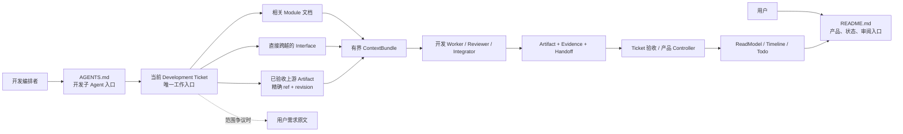
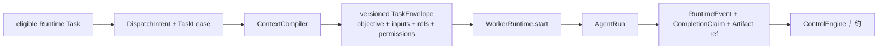
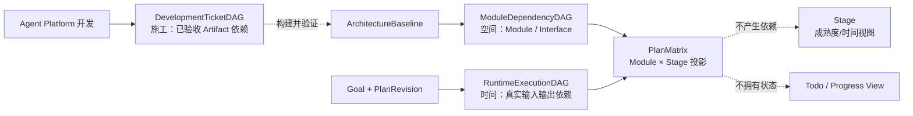
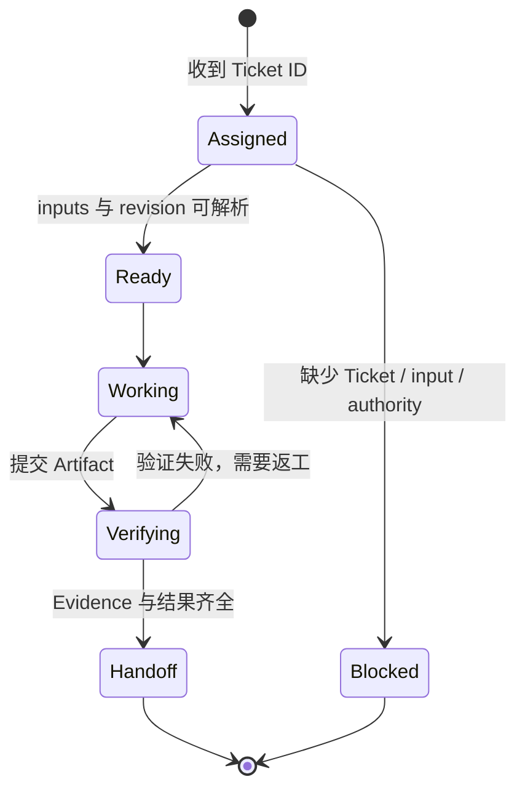
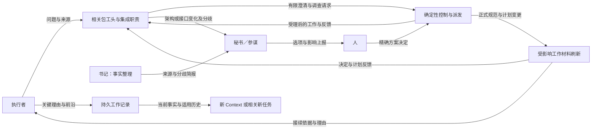

# 工作入口与系统结构图

```yaml
status: draft
updated: 2026-09-05
scope: 人类入口、工作 Agent 入口、产品信息流与三类图的关系
source_of_truth: false
```

本文是导航视图。Module 职责和依赖以 [ARCHITECTURE](../../ARCHITECTURE.md) 为准，执行要求以当前 Development Ticket 和 Interface 为准。

## 双入口

这里的工作 Agent 有两类：构建本产品的开发子 Agent 从根 `AGENTS.md + Development Ticket` 进入；产品运行后的用户任务 Worker 从版本化 `TaskEnvelope + WorkerRuntime.start` 进入。后者已有 P1-03 最小契约与 Fake Run 证据；完整 Context 连续性和角色协作尚待后续票验证。



入口规则：

- 人类从 `README.md` 进入并选择产品、架构、审阅或状态视图；
- 开发编排者必须把精确 Ticket ID 与最小派发信封交给开发子 Agent；`AGENTS.md` 只负责路由，不替代 Ticket；
- Worker 默认看不到完整 Roadmap、完整 transcript 和归档；
- 用户需求原文只在产品边界、目标解释或需求冲突时加载。

## Runtime Worker 入口（P1-03 有限授权实现；阶段 proposed）



`TaskEnvelope` 是 Runtime Worker 的唯一任务入口；Dashboard、聊天消息、Todo 和完整 transcript 都不能绕过它直接改写 Worker 义务。本链已有 P1-03 最小派发实现证据；完整持续工作、能力降级与真实内核接续由 P1-16 验证。

## 产品信息流

完整扩展面以 [运行时协作 Interface](../interfaces/runtime-collaboration.md) 为准：协调 Run 经正式派发，公开快照由 HumanCollaboration→DispatchEngine→WorkerRuntime 读取，Context 的源码／Git 来源经 WorkspaceReader 获取。展示图不取代该契约。

产品分层与 Data 内部职责以 [ARCHITECTURE 的 Plane 图](../../ARCHITECTURE.md#plane) 为准；协调指挥、执行反馈与事件升级见 [角色复核图](human-framework-role-review.md)。本页通过引用跟随当前图，避免保留另一份过期的产品总图。

ReadModelIndex 和 ContextCompiler 同属 Data Plane：前者提供事实查询，后者按角色与任务编译有界材料。验证由工具、Reviewer 与 Control 组织的流程完成。角色指挥通过协调者→框架→执行者，结果返回协调者；人通过统一界面知情并处理需要新取舍或授权的事项。

## 空间、时间与施工图



三张 DAG 的所有者与生命周期不同。Module 或 Stage 相邻不会自动生成运行依赖；Development Ticket 只有在消费已验收上游 Artifact 时才建立 blocking edge。

## 工作 Agent 的结束位置



`Handoff` 不是“自行宣布 Ticket 完成”。它把可检查结果交回编排/验收边界；缺少输入时以 Blocked 结束，不自行扩大范围。

## 持续 Context 与跨包决定反馈

该图表达运行时行为，依据为 [生命周期](../interfaces/context-lifecycle.md)、[运行时协作](../interfaces/runtime-collaboration.md) 与 [人类交互](../interfaces/human-design-status.md)，不表示新的源码依赖或固定进程数量。



普通契约内协调经框架继续，新的架构／接口取舍按人类决定路径处理；已有明确授权的变化仍主动汇报。协调者换手不停止独立工作，消息本身不产生阻塞边。开发 Ticket 的原结束图只表示交付流程，不把模型调用结束等同于工作生命周期结束。
