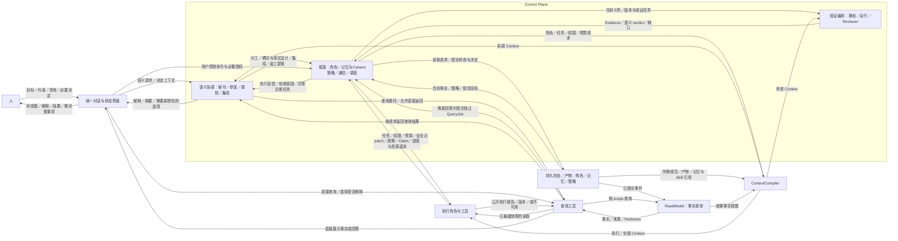

# 统一协作界面、角色与框架：产品／架构复核

```yaml
status: in_review
updated: 2026-09-06
source_of_truth: false
review_gate: P0-06
```

来源：用户于 2026-09-05 对 PRODUCT、ARCHITECTURE 的逐条修订，以及 [双方对话](../product/README.md)。本文承载候选方案与影响分析；明确意图写入 PRODUCT，未决接口不在此冻结。

## 2026-09-06 补充审阅：Context 生命周期与编排交互

用户进一步明确：根源是各类 LLM Context 的生命周期，书记与执行记忆的组织应从连续工作、换手和结束规则推导。**本轮集中阅读 [Context 生命周期、执行记忆与编排交互审阅稿](context-lifecycle-human-review.md)**；它覆盖各角色默认周期、关键理由留痕与历史继承，并按用户补充加入多个包工头间的冲突、秘书／参谋贯穿执行、架构／接口变化上报人类、决定反馈，以及语义协调与确定性控制的分工。反馈不能仅用测试失败代表。

用户随后认可方向并授权同步文档；正式规则、Interface 行为、Ticket 与 DAG 已更新，见 [专项同步记录](../verification/2026-09-06-context-orchestration-sync.md)。P0/P1 整体状态及实现授权未改变。下文“本轮收敛”“下游同步结果”均指 2026-09-05 的复核范围，不能据此认为 2026-09-06 的生命周期议题已被接受或实现。

## 已明确的产品意图

- 同一长期界面展示进度、状态图与文本解释；框架组织维护，工具处理可机械化事实，Agent 负责语义。
- 从 Context 有效性、状态生命周期和人的注意力解释问题，Todo 脱节是症状。
- 秘书／参谋支持需求确立、架构建立和变更；人参与架构生成并保持知情。
- 规划／集成与执行／coding 的角色分责是核心，并发数量不能证明协作。
- MVP 应图形化展示状态模型；对话、Memory、RAG 可辅助提供输入，不能独立决定进度。

## 本轮收敛与角色分工

用户本轮认可“澄清通信记忆契约”的总体方向，角色分工没有大问题，并要求保留短生命周期 Agent 自由模板。此反馈收敛角色与记忆方向，不表示完整架构、Interface 或 P0 已批准。记忆分责以 [ARCHITECTURE 的工程事实与开发轨迹](../../ARCHITECTURE.md#记忆以工程事实和开发轨迹为基础) 为准。

用户已反馈 PRODUCT 基本符合要求，角色定义随本稿收敛；尚未审阅架构后续部分。当前架构正文已将 ReadModel 和 ContextCompiler 归入 Data Plane，补充两者行为、校验边界及指挥／反馈连线。具体 Interface 与完整 P0 仍未冻结。

本轮补充：语义协调纳入 Control Plane，秘书／参谋与规划／集成承担其中的语义职责；Control 管理角色绑定、记录权限与 Context 使用策略，Data 保存工程事实、开发轨迹及语义提示，通过 ContextCompiler 提供材料。具体责任以 [ARCHITECTURE](../../ARCHITECTURE.md) 为准，不把“Context 规划”与“Context 编译”混为一个拥有全部状态的大 Agent。

| 职责 | 候选输入／输出 | 必须区分的责任 |
| --- | --- | --- |
| 秘书／参谋 | 意图与事实 → 澄清、方案、解释、决策简报；参与分工、耦合分析与测试策略，按需查询执行者报告 | Control 语义协调的面向人职责；可以仅查询并返回，不强制再次审核 |
| 规划／集成者 | 需求、架构、验收 → 角色／任务分配与契约／测试提案；执行反馈 → 集成、返工与重规划 | Control 语义协调的执行组织职责；框架校验后绑定角色和推进状态 |
| 执行者／Coder | 有界任务、契约、工作区 → patch、观察、验证材料 | 写能力不等于最终完成权 |
| Control 框架 | 提案、反馈、策略 → 角色绑定、通信路由、记录权限、Context 策略、调度、验证与状态推进 | 拥有确定性控制责任，按需调用语义 Agent |
| Data 与 ContextCompiler | 已接受角色／任务、权限、预算 → 事实视图、相关记忆、规范和有界 Context | 保存与提供材料，不自行分工或把检索结果当作决定 |

本轮以“协调角色／执行角色”表达核心分工；秘书／参谋与规划／集成是协调角色的职责视角，可按规模由不同实例和 Context 分担，不强制成为两个常驻进程。协调者可以提出模块契约、测试和集成修改，由框架在写入权限内交执行者落实；不能绕过写 lease。

Reviewer 能力可保留为语义复核职责；是否独立实例取决于风险与上下文隔离。框架依证据规则接受结果，集成者同意不单独构成完成条件。

角色列表不是封闭枚举。可用 [短生命周期 Agent 自由模板](../agent/templates/short-lived-agent.md) 配置临时调查、语义检索、测试分析或有界实现等工作；职责自由组合，权限、预算与完成权沿用框架约束。模板和具体字段由 Agent 维护，人审阅职责与授权边界。

## 运行时反馈与决策链（讨论图）

以下不是源码依赖 DAG；重点是画出协调者直接指挥、执行反馈、自动验证及有条件升级。所有工作无需都经过 UI→人→决定。



状态链：工具／Agent 产出 → 框架校验与归约 → 持久状态 → 事实投影 → 图形与解释 → 人。

决策链：人与参谋明确需求 → 共同形成架构选项与影响 → 按已有授权或人的决定接受 → 版本化规格／baseline／计划 → 执行与验证 → 回报变更与结果。

知情义务独立于批准权限：普通已授权细化执行并留下可见记录；需要人选择的架构取舍提供方案和影响。初始 Baseline fixture 只验证安装机制，不能证明人参与架构生成。

## 直接查询与角色间交流

图中的 T→V／W→T→UI 保留用户直接查询能力；A→T→UI 允许参谋只做工具路由。执行者报告标明作者、时效、版本与未验证性质，正式完成状态仍来自框架事实。缺少新鲜快照时显式返回不可用或过期；需要新语义回答时，使用独立只读 QueryJob，不把问题塞进源执行 Context。

协调角色之间以及协调者与执行者之间保留按需交流能力。默认是有界任务、问题、报告、提案和 Handoff；对耦合冲突、测试缺口或互相矛盾的结果，才按策略开启有限议题讨论。参与者只读取相关上下文，讨论有预算、轮次／时间上限和退出条件，结束必须留下方案、证据、决定或明确未解项。

例如两个模块对同一接口的错误语义理解不同：框架汇集双方产物与契约，协调者可请求双方澄清，再提出集成／返工方案；不需要全体 Agent 共享完整对话。任务、权限与验收的变动仍经过框架校验。

局部 Agent 可以采用 plan→act→feedback 循环，平台用持久状态、事件与真实产物依赖连接这些局部循环。正常状态查询与确定性调度无须唤醒协调模型；某个协调 Run 结束或失败后，其余独立工作仍可推进，新 Run 从状态与有界交接恢复协调。

## 小变更如何决定是否需要人

改动大小不是授权标准。默认先检查现有目标、验收、公开契约、baseline、权限和预算：

| 情形 | 默认处置 | 人如何参与 |
| --- | --- | --- |
| 任务重新分工、补集成测试、契约内重构、已定义需求的表达澄清 | 协调者提案，框架校验，执行与验证，记录原因和结果 | 按需查看摘要；有既有授权时无需逐次批准 |
| 局部架构违规，可在已接受边界内修复且命中授权策略 | 工具发现、协调者选修复路径、框架派发并验证 | 修复结果知情；不把每次 Finding 当成人工待办 |
| 小改动改变了需求含义、验收、公开契约或已接受 baseline | 检查是否存在覆盖该种变化的明确委托；有则按其约束提案、形成决定并验证，无则升级 | 选择方案或补授权；一行变更也可能需要人 |
| 缺少外部业务事实或多个选择涉及尚未表达的偏好 | 先查有权限的来源与已接受决定，仍无法确定时形成最小问题和选项 | 提供只有人掌握的事实或取舍 |

本轮没有自动授予 baseline 或需求变更权限。现有 P1-11/14 的 UserDecision 路径仍是未委托变化的候选；若增加策略授权路径，要定义授权来源、适用范围、版本、撤销与审计，并同步契约。协调者不能为自己的提案临时扩大策略。

## 事件驱动的协调策略（候选默认行为）

默认首先机械观测、去重和按阶段聚合，能确定性处理的在授权内处理；需要语义判断时派发有界协调／Review 工作；只有需要新的业务选择、外部事实或权限／预算决定时才升级给人。

| 事件 | 首先做什么 | 升级条件 |
| --- | --- | --- |
| 代码规范、文件夹规范、确定性依赖违规 | lint／结构检查定位；在授权范围内自动修复并重验 | 规则冲突、修复需改变契约或超出允许范围 |
| 模块耦合增加、接口不兼容、集成测试失败 | 协调者读取局部 CodeGraph delta、契约和证据，调整分工、测试或返工 | 现有需求／架构无法同时满足，需要人选取舍 |
| 缺少外部信息 | 在权限内检索、核对来源与时效，再向协调者报告缺口 | 唯有用户知道的业务事实或尚无访问授权 |
| 执行 Agent 压缩／rollover 频繁、重复探索 | 按任务规模检查 Context 输入、分解与 Handoff；安全点拆任务或更换有界 Context | 授权恢复尝试耗尽，继续需变更目标、预算或权限 |
| 参谋 Token／调用／等待开销异常 | 检查重复唤醒、重复检索、无效协调；批量事件、复用有效投影和按需调用 | 需要新的成本／质量取舍或扩大预算 |
| Agent 生命周期过短／过长或长期无进展 | 结合角色、阶段、工具状态和进度心跳诊断，合并过碎任务或安排安全交接 | 无法在现有策略内恢复，或副作用处置需新授权 |
| 连续自动修复失败或提案相互冲突 | 保存证据、限制重试，协调者提出替代方案 | 无法依据现有决定选择，需业务取舍 |

压缩次数、Token 和存活时间只是诊断信号，不直接证明失败、完成或需要杀掉 Agent。阈值按角色／阶段／任务规模设置观测窗口、次数上限和冷却，初版从实测基线设定；这里不编造通用数值。安全退出要看工具副作用和可恢复点；独立工作可以继续。

“默认”指拟议策略模板，部署时必须显式选择并版本化；不绕过已有 install／activation 约束。每次自动处置记录事件来源、适用策略、事实版本、动作、结果与重试预算。去重、冷却和失败上限防止无限唤醒、重规划和修复循环；成本优化不能减少既定验收义务。

## 记忆、Skill 与策略各保存什么

记忆是 Data Plane 中当前事实、开发轨迹和语义提示的侧面，不先建设独立记忆系统。代码库、Git、Session 与 Handoff 保留天然来源；知识产生者主动留下要点，按需由短生命周期 Agent 整理。普通记录不要求逐条接纳审批；Control 对权限、规范、验收和约束性策略的变更执行正式控制。ContextCompiler 依据任务与版本按需检索，角色分工仍由 Control 绑定。

| 材料 | 保存内容 | 权威边界 |
| --- | --- | --- |
| 版本化协调／演进策略 | 事件分类、允许动作、范围、预算、升级规则 | 框架据此校验处置权限 |
| 协调记忆 | 历史问题、备选方案、决定理由、适用 scope／revision 和实际结果 | 帮助检索类比，不自动构成当前授权或事实 |
| 协调 Skill | 耦合检查、测试设计、上下文诊断、权衡方案与反馈的可执行步骤 | 改善分析过程，遵守当前策略与验收 |

ContextCompiler 按当前角色和事件选取相关记录及 Skill 引用，排除过期或不适用材料。重复问题可以提出 Skill／规则改进，经版本化审查与验证后使用；不会因为旧案例曾放行，就自动放行当前变更。此处描述产品需要的能力，本轮不安装全局 Skill 或建立新的记忆系统。

## 状态真实性的工程实现

现有 ControlEngine、StateLedger、ReadModelIndex 是部分候选基础，给对象起名不等于完成实现：

| 层次 | 实现责任 | 可检查结果 |
| --- | --- | --- |
| 输入 | 区分目标、提案、工具观察、Agent 判断；保留作用域和来源 | 旧 revision、错误范围被拒绝 |
| 控制 | schema、权限、幂等、版本与转换规则校验；接入静态／运行／语义证据 | 不重复写入，不以 claim 直接完成 |
| 持久化 | 原子保存当前状态、事件与必要引用，保留历史证据 | 中断恢复后来源仍完整 |
| 投影 | 已提交事实生成状态图、任务卡片、时间线 | 重建等价，延迟可见 |
| 解释 | Agent 依据有界事实生成原因、风险和建议 | 标识事实版本，过期时重算或标明失效 |
| 控制入口 | 用户操作形成请求，经控制路径生效 | 点击或对话不能旁路修改进度 |

建议图形由渲染工具基于结构化事实生成，Agent 组织解释或选择视图。图和文字引用同一目标及兼容版本；解释尚未生成时事实视图仍可用。“生图”若指生成式图片，也仅作为表达形式，不承担状态计算和实时一致性。

视图与解释的配对契约、增量通知、状态模型图层次和验收场景尚未冻结。GoalView 目前只覆盖创建 Goal，不能代表完整协作界面。

## 2026-09-05 下游同步结果

本轮已把复核意见落实到正式设计草案，本文保留讨论与决定来源，不再作为另一份接口真相源。

| 范围 | 当前正文与施工归属 |
| --- | --- |
| 角色、记忆、Context、消息与查询 | [ARCHITECTURE](../../ARCHITECTURE.md)、[运行时协作](../interfaces/runtime-collaboration.md)；Module 文档与 P1 消费引用已同步 |
| 初始需求／架构、人类决定与同源图文 | [初始设计／展示](../interfaces/human-design-status.md)，P1-15 整合 |
| 基础能力与并行安全 | P1-00…14 保留纵向切片，07 只证明并发与唯一 Writer |
| 完整角色协作 | P1-15 覆盖初始协商、授权内返工、临时角色和协调换手；G3 等待 07 与 15 |
| 最终验收 | [MVP 场景](../evaluation/mvp-scenario.md) 已换成完整角色故事；[P1 DAG](../planning/proposed/P1-foundation/DAG.md) 与产物依赖同步 |

## 2026-09-05 收敛后的审阅边界

角色分工与记忆方向基本认可；用户本轮委托完成其余文档。默认界面采用任务进度／阻塞，架构与生命周期按需展开；初版只允许既定义务内的有限协调，未委托的规范或授权变化升级给人。这些选择已写入候选验收，不再作为无归属的待讨论事项。

上述为 2026-09-05 的审阅结论。2026-09-06 新增的 Context 生命周期议题已获专项确认并同步，wire 契约、阈值和运行验证由已安排的消费者继续完成；无需逐字段审批。

[P0-06](../planning/active/P0/tickets/06-user-review.md) 仍记录阶段批准；文档完成不等于已经实现或通过运行时验收。
