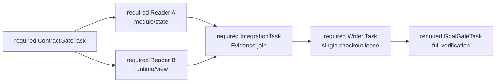

# Agent Platform MVP 评价场景

```yaml
status: proposed
updated: 2026-09-06
scope: P1-foundation 的单一端到端发布门禁
roadmap: ../planning/ROADMAP.md
phase_dag: ../planning/proposed/P1-foundation/DAG.md
```

## 1. 评价问题

2026-09-05：本候选已同步当前角色与记忆设计。完整场景以“人参与初始需求／架构 → 协调者组织 → Coder 执行 → 集成／返工与验证 → 统一图文回报”为主线；并发、恢复与隔离是独立可靠性检查。完整集成由 P1-15 承接，阶段仍待 P0-06 批准。

> 在一个非玩具 coding 任务中，平台能否让用户持续看清真实状态，让可替换 Worker 按真依赖推进，并以可追溯 Evidence 而不是 Todo/自报完成 Goal？

通过场景不自动证明平台更快或更省 Token；时间、成本和成功率必须与基线实测比较。

## 2. 目标仓库与任务选择

P0 用户审阅时确定目标仓库和具体变更。候选应优先来自真实 `coding-agent` 或同等规模仓库，并同时满足：

- 不是只改一个文件或纯格式任务；
- 至少涉及两个可独立调查的 Module 和一个集成边界；
- 有现成 build/test/lint 或其他可复用运行证据；
- 最终 patch 可以由一个 Writer 完成；
- 能安全注入 Run 中断、迟到结果、验证失败和一个架构 drift；
- 不需要真实付费、生产部署或不可逆外部操作。

主线角色为协调／集成与执行；Reader 是按需临时调查职责，不要求两个常驻实例。推荐任务形状是“为跨模块状态/恢复能力增加或修复一个功能”：Reader A 调查状态与持久化路径，Reader B 调查 Runtime/UI 消费路径，Writer 根据两边 Evidence 实施，GoalGateTask 运行全量检查。

若最终选择的真实任务不具备这些结构，应更换任务，而不是为展示并行凭空制造假依赖。

## 3. 有界工作图与角色分工



上图保留为并发／写入隔离的测试子图，不是完整角色定义。完整运行先在计划执行外完成初始设计与授权；协调者据已接受计划组织上述工作，验证失败时提出有界返工补丁，经 Control 接受后形成新任务／版本，而不是给 DAG 添加循环边。

`parent_of` 只用于在 PlanMatrix/Todo 中分组，不出现在上述 RuntimeExecutionDAG。Stage 只用于 contract、investigation、implementation、integration/release 的成熟度投影，不自动添加边。

每个 required executable Task（work 或 gate）至少映射一个 required AcceptanceObligation；每个 required obligation 编译出非空 required verification requirements。若真实仓库已经满足目标，使用带当前 PASS Evidence 的 required `AlreadySatisfied GoalGateTask`，不得提交空 Plan。

## 4. 运行剧本

| Release Gate               | 本场景的评价范围                                                          |
| -------------------------- | ------------------------------------------------------------------------- |
| G1 Foundation              | Step 1、Plan/Task fixture、Fake Run、Evidence/Goal reducer 与基础重启查询 |
| G2 Continuity              | G1 + Step 3（含 P1-16）                                                               |
| G3 Role Collaboration      | G1 + Step 0/2/5/5a/8/9，P1-07、P1-17 与 P1-15 证据 |
| G4 Human Control           | G1 + Step 4                                                               |
| G5 Architecture Governance | G1/G3 + Step 7                                                            |

每个 Gate 形成独立、可重放的评价记录；后续 Gate 复用已通过 Evidence，但 revision 改变时必须重新判断 applicability。完整 P1 MVP 才运行全部步骤。

### Step 0：人与参谋确立初始设计

基础能力安装后，在一个无 active baseline 的隔离 Project 中开始新目标：人说明含一处真实歧义的需求，参谋呈现至少两个方案、验收、架构关系和影响；人选择或修订后形成绑定版本的决定。规范／初始 baseline 经正式安装激活，再接受非空计划。此处以已 bootstrap 的身份为输入；Step 1 另测从空库恢复基础身份。

注入拒绝、延后和旧 proposal 决定；预期无未授权激活。展示部分提交的中间状态与恢复；已有 baseline 的项目必须走演进路径，不伪装成首次安装。fixture 只用于底层测试，完整 MVP 必须保留真实协商记录。

### Step 1：建立可见目标

空 Ledger 先通过受支持的、版本化 Workspace bootstrap manifest 初始化至少两个彼此隔离的
Project/Workspace，并记录 source digest 与 revision；两个 Project 故意复用同一个本地 `workspaceId`，且禁止
直接插入存储表。用户随后从 Human Interaction Layer 在两个范围分别提交 Goal，并故意复用同一个本地
`goalId`。ControlEngine 为两个完整作用域分别原子提交 Goal snapshot/Event，GoalView 可精确查询；此时两个
Goal 的 `activePlanRevision = null`，都没有隐式 Plan、Task、Run 或 dispatch outbox。

故障注入：重复相同 idempotency key，并重启平台。

预期：每个完整作用域都恰好只有一个 Goal；跨 Project 使用相同 idempotency key 不会互相判重，同一作用域内
重放仍保持幂等。重启后两个 canonical Goal 分别从持久 snapshot 恢复，GoalView 从 EventPage 重建；每组
snapshot/View 的 Project/Workspace/Goal identity、revision 与 phase 一致，任何查询都不会命中另一范围。

### Step 2：验证真依赖与并行

先通过 `ApplyPlanRevision` 接受一份预先批准的 Plan fixture，原子建立 Stage、TaskHierarchy、RuntimeExecutionDAG、required AcceptanceObligation 和 GateTask。ContractGateTask 产生双方需要的版本化 contract 输出；它满足后 Reader A、Reader B 同时获得只读 lease 并运行。这是 G1 的确定性 fixture 子场景；完整 G3 必须复用 Step 0 的已接受设计与 PlanCompiler 路径生成计划，不能以 fixture 代替角色协作。

故障注入：给 Reader 增加相同 Stage，但不给彼此 `depends_on`。

预期：两 Run 时间真实重叠；Stage 不会把它们串行化；任何未满足的显式依赖都会确定性阻止 dispatch。

### Step 3：验证 A → B 换手

在 Reader A 已提交部分 Observation/Artifact 后，强制其 Context rollover 或 Run crash。平台生成有界 HandoffPacket，由替换 Worker A2 接续。

故障注入：A 的旧 Run 在 lease 过期后提交迟到结果。

预期：A2 不回放完整 transcript，仍保留 objective、constraints、unresolved、Evidence/Artifact refs 与 Workspace revision；旧迟到结果不能覆盖新 Attempt。

P1-16 增加同工作连续多轮模型／工具反馈、关键理由增量留痕与真实内核接续验证。注入缺最终总结、原会话不可恢复、必要材料不足；结果必须区分原运行恢复、新 Run 接续和缺口，并保留未知副作用。旧 P1-06 PASS 只证明原换手范围。

### Step 4：非阻塞查询、控制与目标变更

用户先从 Portfolio 列出两个 Project/Workspace，并在复用相同本地 id 的两个范围之间切换；当前范围的 Goal、
Agent 与 Evidence 始终来自完整作用域查询。Reader 仍工作时，用户询问“为什么这两项可以并行、当前风险是什么”。
机械部分从 Read Model 回答；需要工程解释时创建只读 QueryJob。随后用户提交一个不改变验收的 steer，并在安全点投递。

预期：Portfolio 列表与切换不启动模型、不修改 canonical state，也不泄漏另一范围的数据；源 Worker 不暂停，
QueryJob 不刷新源 lease；steer 有 acknowledgement 和 Timeline 记录。

随后用户提出会改变 Goal objective 或 AcceptanceObligation 的请求。平台先安全停止受影响子图，保存当前事实，
生成 ChangeImpactAnalysis 与 PlanProposal，并等待有权限的用户 Decision；普通 steer 路径不得偷改目标。

故障注入：提交基于旧 Goal/Plan revision 的 Decision。

预期：旧 Decision 被 CAS 拒绝；合法 Decision 创建新的 Goal/PlanRevision，旧 revision、Task 与 Evidence 仍可追溯，
当前 EvidenceBinding 按新 revision 重新计算 applicability。

### Step 5：协调、执行、集成与唯一 Writer

两个 Reader 的结论进入 IntegrationTask。若 Evidence 冲突，平台必须保留两条来源并由 Reviewer/用户按策略解决，不能以后到结果覆盖前者。Join 满足后，一个 Writer 获得目标 checkout 的唯一写 lease并提交 patch、changedPaths、测试和 Workspace revision。

故障注入：第二个 Writer 同时 claim 相同 conflictScope。

预期：最多一个 claim 成功；Reader 无法修改目标 checkout；所有实际写入可追溯。

增加角色故障：让 Coder 首次遗漏一个既定测试义务，协调者依据反馈提出授权内测试／返工任务，由框架接受并执行，无需人逐条批准。再制造需要改变验收或 baseline 的冲突，必须携选项升级；不能从旧记忆推断授权。临时分析角色有独立绑定、预算与退出记录，协调者换手后仍可据有界来源继续。

### Step 5a：测试失败之前的跨包架构／接口冲突

两个工作包由不同包工头负责，指定共同集成职责。甲认为接口缺字段，乙认为增加字段会破坏模块职责；即使测试尚未失败也提交带版本的议题。双方有限澄清，必要时正式派发调查；书记整理来源与分歧，秘书／参谋向人说明选项、影响、迁移成本及暂停范围。

先拒绝或延后：拟议变更不得实施，依赖该选择的动作等待，独立工作继续。随后接受一个精确方案：框架经适用的规范／baseline／Plan 和验证路径受理，全部受影响工作收到决定与理由，材料刷新或 Context 重建后继续；旧版本决定和迟到结果被拒绝。共同集成负责人可以换手，议题和等待条件仍可接续。

另测已有明确授权覆盖的契约变化会主动汇总通知且不重复通知，不因无需重复批准而隐藏。该场景不授予额外 baseline 激活权限，P1-14 原决定／迁移／CAS 门禁保持有效。

### Step 6：证据驱动完成

VerificationEngine 运行增量结构检查、已有 affected/contract/smoke tests 和目标化 Reviewer。GoalGateTask 对可测试功能运行全量测试。

故障注入：先制造一次静态或测试 FAIL，修复后产生新 PASS；另让一份旧 EvidenceBinding 因 revision 变化成为 STALE。

预期：失败 Attempt 不完成 Task；新 PASS 可进入当前 EffectiveEvidenceSet，旧 FAIL 仍保留；STALE 是 applicability，不修改 Evidence。

### Step 7：架构对账

对 Writer 结果生成 CodeGraphSnapshot 并与 effective ArchitectureBaseline 比较：

1. 注入一个命中 allowlist 的局部、可逆 drift；
2. 注入一个会改变 Module/Interface/依赖方向的 material proposal。

预期：前者经正常 PlanPatch→dispatch→verify 链形成 RemediationTask；后者形成 ArchitectureDecisionBrief，用户接受且 migration GateTask 通过前不能激活新 baseline。

### Step 8：完成与恢复查询

所有 required work Task、AcceptanceObligation 和 GateTask 满足且没有未对账副作用后，Goal 进入 COMPLETED。平台再次重启，用户查询完成理由和完整 Timeline。

预期：同一界面的状态图与文本事实来自重建后的 State/Evidence/Decision；默认显示进度／阻塞，可展开架构与生命周期。解释标注来源与版本，故意延迟解释时标 stale，最新事实仍可读；不依赖任何 Worker 记忆或 Todo 自报。

### Step 9：完成工作供后续任务继承

消费 P1-17：工作完成并重启平台后创建相关新任务，以新 Context 加载当前规范／代码、此前关键取舍与适用性清单。修改一个旧前提，验证接续者能指出旧理由不适用，保留当前义务而不恢复旧授权或旧完成状态；缺失记录与跨 scope 请求显式拒绝或报告缺口。确定性选材由 P1-17 留证，真实模型继承效果由 P1-15 完整场景验证。

## 5. 必须保留的 Evidence 与 Artifact

- Goal/Plan/Baseline/Policy revision；
- TaskHierarchy 与 RuntimeExecutionDAG；
- Command、DomainEvent、outbox 和 reducer transition；
- Attempt、Run、lease、budget 和 runtime cursor；
- WorkspaceSnapshot、patch/commit、changedPaths；
- CompletionClaim、Observation、Evidence、EvidenceBinding、Reviewer verdict；
- HandoffPacket、QueryJob Artifact、关键理由、WorkContext 来源清单、议题／通知与决定投递及材料刷新证据；
- ArchitectureDelta、Finding、RemediationTask、DecisionBrief/Decision；
- Portfolio、WorkspaceSummary、PlanMatrix、Todo、TaskDetail、ActiveAgents 和 Timeline 最终投影。

## 6. PASS 门禁

场景只有全部满足才 PASS：

1. Portfolio 能列出并切换至少两个隔离 Project/Workspace；相同本地 `workspaceId/goalId` 不会串范围；
2. 状态查询准确率为 100%，所有显示状态可追溯到当前 revision 和 Event/Evidence；
3. Todo 从未由 Worker 手动维护，仍随 reducer 事实推进；
4. 平台重启、Worker crash、Context rollover 和 A→B 换手后不丢义务、阻塞、未决风险或来源；
5. 人参与需求／初始架构，协调→执行→返工／验证有完整轨迹；两个 Reader 的并发子测试与唯一 Writer 也通过；
6. `parent_of`、Stage 或相邻 Module 不会产生隐式执行依赖；
7. Worker/Reviewer 自报、单个 exit=0 或单项测试不能独立完成 Task；
8. required work Task、required obligation、required GateTask 和副作用对账未全部满足前，Goal 不会 completed；
9. FAIL、STALE、BLOCKED、NEEDS_DECISION、CANCELLED 与 outcome_unknown 不被互相伪装；
10. 目标或验收变化只能经影响分析、用户 Decision 和新 revision，普通 steer 不得修改；
11. 普通任务由系统闭环，只有主观 oracle、未预授权重大变化或高风险授权升级给用户；
12. baseline activation 不能洗白旧失败或隐式迁移既有 Plan；
13. 自定义临时角色可安全退出，普通笔记不逐条审批；Context 来源过期或必要材料缺失不能伪装成可用；
14. 图与文本事实同源，过期解释标明；直接查询无需参谋，快照不支持如实返回；
15. 同工作 Context 持续、理由留痕、能力降级及完成后历史继承可追溯，不依赖最后总结成功；
16. 无测试失败的跨包契约冲突可上报人并形成决定，拒绝／延后不实施变更；受影响工作更新材料后接续，授权内契约变化也有主动通知。

任一关键事实只能靠 prompt、自觉更新 Todo、完整 transcript 回放或人工查看数据库才能确认，场景即 FAIL。

## 7. 对照与度量

至少运行：

1. 当前单一长会话 `coding-agent`；
2. Agent Platform P1-foundation；
3. 必要时增加“全 transcript 回放”作为 Context 成本对照。

记录：

- 任务最终成功率与首次通过率；
- 总墙钟时间、关键路径时间和真实并行重叠；
- Token、工具调用、缓存命中和 Context 峰值；
- 重复探索、返工和 Reviewer 等待时间；
- 用户介入次数及其是否真正必要；
- Handoff 采用率、恢复成功率和迟到结果拒绝率；
- 状态查询准确率、Evidence 完整率和不可解释状态数。

P1 不预设 Platform 必然更快或更省 Token。若可靠性提升但调度、验证或 Reviewer 开销过高，结果应明确记为对应瓶颈并决定下一阶段，而不是调整指标定义。

## 8. 停止条件

出现以下任一情况时停止扩展功能，返回最近负责的 ticket：

- canonical aggregate 无法从持久 snapshot load，或 ReadModel 无法从 EventPage 重建，或 snapshot 引用的必要
  Evidence/Artifact 已不可恢复；
- RuntimePort 无法可靠报告安全点、事件 cursor 或未知副作用；
- CompletionPolicy 无法把当前 Evidence 唯一归约为明确状态；
- 两个 Reader 需要共享隐藏 transcript 才能协作；
- 唯一 Writer 无法隔离目标 checkout；
- 用户无法从控制台解释“为何运行、为何阻塞、为何完成”；
- 目标仓库任务过小，无法真实区分单 Agent 与平台能力。
