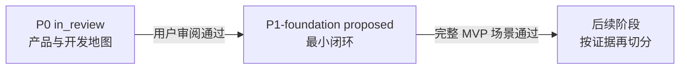

# Agent Platform 开发地图

```yaml
status: current
updated: 2026-09-05
scope: 从当前 P0 设计冻结到 P1 foundation MVP 证据链的唯一阶段导航
active_phase: ./active/P0/DAG.md
next_proposed_phase: ./proposed/P1-foundation/DAG.md
evaluation: ../evaluation/mvp-scenario.md
```

## 1. 如何使用这张地图

本目录把长期架构依赖与临时开发先后分开：

- 产品、领域语言与架构真相分别由 [PRODUCT](../../PRODUCT.md)、[CONTEXT](../../CONTEXT.md) 和 [ARCHITECTURE](../../ARCHITECTURE.md) 定义；精确完成规则见 [Completion Policy](../interfaces/completion-policy.md)；
- `DAG.md` 中的边只表示“后一个 ticket 开始前需要哪些已验收产物”，不创造新的运行时依赖；
- 每个实现 ticket 都必须是 tracer-bullet vertical slice：从一个输入穿过必要 Module Interface，到达用户可见状态或可审计 Evidence；
- Plane 只是权责视图。真正的开发所有权落在有小 Interface 的深 Module 上；
- 不按 Data、Control、UI 横向施工，不创建没有当前消费者的空目录或假 seam。

状态词：

| 状态         | 含义                                           |
| ------------ | ---------------------------------------------- |
| `completed`  | 该 ticket 声明的验收已有对应 Evidence          |
| `in_review`  | 实现或文档已形成，等待指定 Reviewer/用户确认   |
| `blocked`    | 缺少显式依赖、外部输入或裁决，当前不能合法推进 |
| `proposed`   | 尚未授权施工，只是下一阶段候选                 |
| `superseded` | 已被新 ticket/revision 替代，仅保留追溯        |

## 2. 当前阶段

### P0：产品定义与开发地图

- 状态：`in_review`
- 活动 DAG：[active/P0/DAG.md](./active/P0/DAG.md)
- 已完成：来源归档、地图重写、Plane→Module 切分、首个 slice contract 和 P1 候选 DAG；
- 当前门禁：用户审阅 Task→Goal Completion Policy 与本开发地图；
- 2026-09-05 新增 [角色、统一界面与架构参与复核](../design/human-framework-role-review.md)，相关 Module、Interface、P1-15 集成票及 MVP 门禁现已同步成可审阅草案；运行时 schema 在首个消费者冻结；
- P0 未授权创建产品代码仓库或开始 P1 实现。

## 3. 下一候选阶段

### P1-foundation：可重放、可观察、可换手的最小闭环

- 状态：`proposed`
- 候选 DAG：[proposed/P1-foundation/DAG.md](./proposed/P1-foundation/DAG.md)
- 目标：从持久化 Goal 开始，以 Agent-sized 纵向切片交付 Plan、dispatch、Evidence、Goal 归约、换手、并行、人机协作与架构对账；
- 发布评价：[MVP 场景](../evaluation/mvp-scenario.md)；
- 激活条件：P0 用户审阅通过、产品/设计文档转为 `current`、首个仓库和技术栈由用户授权。

## 4. 阶段关系



本地图不预建 P2 及以后编号。P1 的测量结果才能决定下一阶段是扩展 Planner、并行写、跨 Workspace、性能/成本，还是先偿还可靠性缺口。

## 5. Promotion 规则

一个 proposed phase 只有同时满足下列条件才能移动到 `active/`：

1. 上一阶段的用户门禁已经通过；
2. 每张 ticket 都有 `Blocked by`、可观察交付、Module/Interface 引用和可证伪验收；
3. 阶段 DAG 无环，且边表达开发依赖而不是 Stage 顺序；
4. 第一张票无需依赖尚不存在的生产 Adapter；
5. MVP 场景能区分 PASS、FAIL、BLOCKED、STALE 与 outcome_unknown；
6. 没有把目标收益（更快、更省 Token）写成尚未测量的事实。
