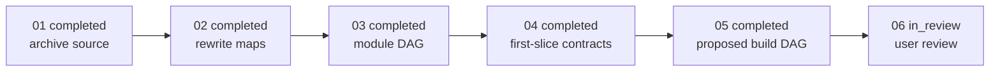

# P0 DAG：产品定义与开发地图

```yaml
status: in_review
updated: 2026-09-05
phase: P0
scope: 冻结产品语义、深 Module 切分、首个 vertical slice contract design 与下一阶段候选 DAG
```

## Outcome

2026-09-05 新增的产品／架构修订由 [P0-06](tickets/06-user-review.md) 承接。下表 completed 表示当时已交付的文档工作，不表示旧设计已获当前接受；影响与修订范围见 [复核记录](../../../design/human-framework-role-review.md)。

P0 不交付产品代码。它交付一条可以被用户从“问题来源”一路审阅到“首个可运行 slice”的可追溯设计链，并明确哪些决定已经完成、哪些仍等待用户。

## Development DAG



这些边只描述 P0 文档工作的先后。它们不是 Agent Platform 的运行时依赖，也不表示 P1 必须按 Plane 串行实现。

## Tickets

| Ticket                                                            | 状态        | 交付物                                     |
| ----------------------------------------------------------------- | ----------- | ------------------------------------------ |
| [01 Archive source](./tickets/01-archive-source.md)               | `completed` | v0.3 改写前快照可追溯                      |
| [02 Rewrite maps](./tickets/02-rewrite-maps.md)                   | `completed` | 当前产品、领域和架构地图一致               |
| [03 Module DAG](./tickets/03-module-dag.md)                       | `completed` | Plane→deep Module→Interface 与依赖方向     |
| [04 First-slice contracts](./tickets/04-first-slice-contracts.md) | `completed` | 首个 tracer bullet 的 contract design      |
| [05 Proposed build DAG](./tickets/05-proposed-build-dag.md)       | `completed` | P1 vertical-slice DAG 与 MVP 场景          |
| [06 User review](./tickets/06-user-review.md)                     | `in_review` | 用户接受/修订 Completion Policy 与施工地图 |

## Exit gate

只有 06 得到用户明确结论后，才可以：

- 将产品、架构与 Completion Policy 从 `draft/proposed` 提升为 `current`；
- 将 P1-foundation 从 `proposed/` 提升为 `active/`；
- 创建正式产品代码仓库、技术栈 ADR 或实现 ticket。
