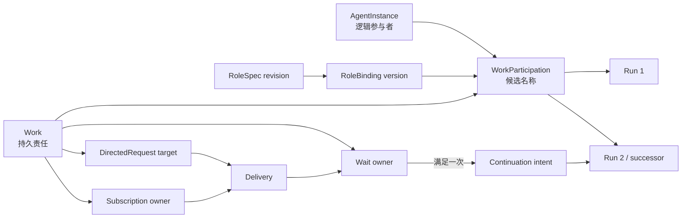
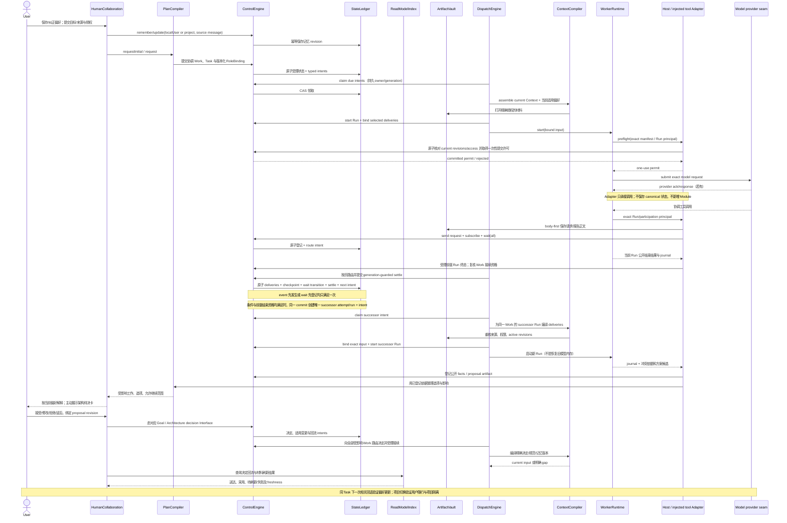
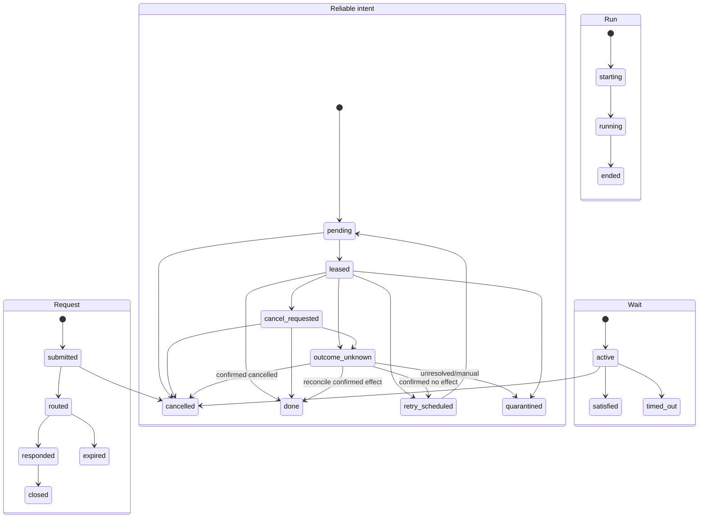
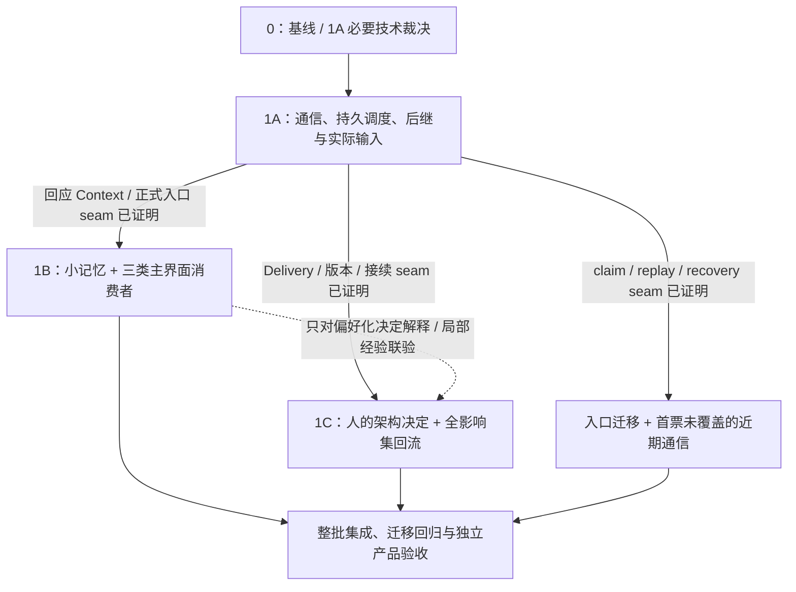

# 角色协作、运行通信、记忆、知识来源与 Skill 复用：架构与实施计划

当前执行提示（2026-09-18）：I01–I04 已在 snap-30-context-corroboration 精确快照上由独立 Agent 全部接纳，当前 I 阶段关闭；最终身份、V01–V22 与真实/替身边界见 [module-status](../../../../human/module-status.md) 及产品 `evidence/collaboration-memory/batch/integration/snap-30-context-corroboration/acceptance-final/`。下文2026-09-12准备阶段的暂停／授权描述和snap26/snap27过程均为历史。三角色引用发布与用户按需复核的边界仍以[现行接口](../../../interfaces/query-semantic-reliability.md)为准；历史语义质量失败保留。后续R1–R11、Session/生命周期、Agent状态记忆和ContextCompiler拆分属于另立快照的重构，不继承snap30 PASS；不重新实施已接纳S阶段。

日期：2026-09-12。状态：**推荐设计已进入实施准备；候选 Interface 待实现验证，本轮不授权产品代码实施**。

调查与设计已经完成。原始需求保留在 [Agent 通信、编排与记忆：原始对话](../../../product/conversations/2026-09-12-agent通信编排与记忆-原始对话.md)，当前源码逐入口证据见 [当前通信与运行调用链证据](CURRENT-CALLCHAIN-EVIDENCE.md)，拆票判断见 [READINESS](READINESS.md)。本轮准备整批近期实施包：三个 Prompt、首张 1A 正式 Ticket、1B/1C 与入口迁移／集成路线及验收映射，入口为 [HANDOFF](HANDOFF.md)。用户指派统筹者后按证据自主细化后续票、持续推进整批；本轮仍不修改产品代码、不启动实施、不提交或推送 Git。

本文使用四种标记，避免把需求、事实、建议和猜测混在一起：

- **[需求]**：来自 PRODUCT 或本次用户委托，必须保持追溯。
- **[现有事实]**：当前工作区源码、模块状态或已冻结契约能够证明。
- **[设计建议]**：本计划推荐的责任、状态或演进关系，在明确指派的 Ticket 中经必要裁决与实际验证收敛，不表示已冻结接口。
- **[待验证假设]**：尚未被真实消费者、并发或故障测试证明；字段和签名均可在纵向实现中调整。

“PaaS”是语音误识别，不是产品要求。历史 Assistant 的方案和完成声明不作为当前事实。

## 0. 调查基线与权威顺序

- 产品仓：`main@0eb02717d16412298c786166a75ca1a9d3e05ac7`，调查时为 dirty worktree；本次判断包含现存未提交的 RoleSpec、协作选材和 WorkMemory 增量，不以 HEAD 单独代表现状。
- 文档仓：`main@e99484fb2bd3296a32d8442e74b47d8ed569b3d5`，调查时也有既存未提交／未跟踪文档；本轮只改 collaboration-memory 计划目录。
- 要求与责任依次核对 [PRODUCT](../../../../PRODUCT.md)、[ARCHITECTURE](../../../../ARCHITECTURE.md)、[module-status](../../../../human/module-status.md)、相关 Module／Interface 和实际源码。原始对话中用户后续纠正优先；文档方向不能替代源码现状，测试通过也只证明覆盖到的范围。

### 0.1 本轮用户纠正与范围收缩

**[需求，来自本次计划审阅后的用户补充]** 以下决定替代上一版对应候选政策，原始对话文件保留不变：

- 记忆保存后，从下一次能纳入新输入的相关回话开始使用；可以是同一 Task 的后续 Run，不以创建新 Task 为条件。原 Context 中仍有那句话只能证明短期遵循，持久能力还须在原话不再提供时验证。
- 首版是单用户、多项目。用户记忆默认随同一用户进入各项目；项目记忆默认隔离，用户明确允许时才引用或继承。无需等待多用户账户体系。
- 用户明确说“记住”“以后这样”或纠正偏好，已构成该内容保存／更新的依据，不重复询问确认。模型推测与用户明确表达分开；偏好不能扩大任务、工具或架构变更授权。
- 近期记忆范围缩到少量可维护的用户偏好、项目／团队习惯和有来源的局部经验。优先复用 Hermes、OpenClaw 的成熟规则与工具机制；自动画像、复杂后台提炼、结构化知识库和自动 Skill 演化延期。
- 正式编码／开发规范仍是版本化规范；编译器、游戏开发等通用领域资料保留为知识来源方向。预留仅指本文中的消费边界与未来接入条件，不在代码中创建空框架。
- 人参与实质架构取舍及决定回到全部受影响工作是整批必要结果，须有前端可见的接受／修改／拒绝／延后及材料刷新／接续反馈。

对外部审阅四条意见的裁决：第一、二条成立；第三条关于运行中增量积累与协作行为覆盖成立，但按上述类别和近期范围处理；第四条成立。当前状态应描述为“方向对齐、已按审阅补齐产品行为与阶段范围的待验证计划”，不宣称原始需求已全部实施。

## 1. 推荐方案

**推荐保留现有 12 Module，以 Work 为持久协作地址，增加有类型的通信状态和一套可靠派发原语；主 Agent、Skill 与领域插件只表达语义意图，Control 正式受理，Dispatch 可靠执行，ContextCompiler 统一选材，WorkerRuntime 只运行一次 Run。**

选择这个方案有六个理由：

1. **责任与执行不会混淆。** Work 承担可跨 Run 的义务、收件、订阅和等待；AgentInstance 只标识“哪个逻辑参与者在承担”；Run 只表示一次模型／工具执行。Agent 被替换或 Run 结束不会让等待失去 owner。
2. **复用当前最强的事实基础。** 当前已有 Control 校验、Ledger 原子提交、Task/Attempt/Run/Outbox、WorkContext、ArtifactVault、Context 与 Runtime 输入链，以及特定的“反馈 Query → 后继 Run”闭环；新设计扩展这些深 Module，而不是另建消息总线、工作流内核或 MemoryStore。
3. **统一机械调度，不抹平领域状态。** ordinary Task、Query、Reviewer、路由页、等待接续仍有各自业务状态机，但领取、可见性超时、退避、并发、取消、恢复和未知副作用使用同一可靠原语，并由唯一的 `DispatchEngine.drive(trigger)` 对外收口。
4. **通信、Context 和 Runtime 有可核对的边界。** “检索命中”“编入 Context”“绑定到 Run”“提交给模型”分开记录。当前真实 Runtime 不支持会话恢复，因此等待满足后启动同一 Work 的后继 Run，不虚构原模型内存恢复。
5. **记忆优先解决下一次协作。** 用户偏好和项目习惯按范围保存、纠正、删除，由主界面对话、方案解释和进度反馈消费；WorkNote 保留原始过程，正式规范继续保持权威。结构化知识库和自动 Skill 演化不进入近期实现。
6. **同一纵向场景连接技术与产品。** 先验证“请求／等待→唯一后继 Run→真实输入与恢复”，再沿同一主界面验证偏好更新、架构决定回流和下一次回话；成熟开源机制用作筛选、维护与选材依据，复杂框架等待实际需要。

### 1.1 稳定的责任分界

| 责任 | 推荐 owner | 关键边界 |
| --- | --- | --- |
| 语义分工、咨询、冲突判断、计划／返工提案 | PlanCompiler 与协调角色 | 只提出有界工作和 Plan 变化；不领取队列、不直接启动 Runtime |
| 身份、授权、版本、命令幂等、状态转换 | ControlEngine | 所有 canonical 写入的唯一入口；不执行模型，不读取隐藏 Runtime 状态 |
| 原子事实、事件、typed intent、领取记录 | StateLedger | 只实现原子存取／CAS／有序事件；不判断订阅语义或业务完成 |
| 路由页、就绪选择、领取、并发、退避、恢复 | DispatchEngine | 隐藏可靠执行机制；所有正式状态变化仍提交给 Control |
| 一次 Run 的模型／工具执行和公开观察 | WorkerRuntime | 不持有全局编排循环；副作用未知就报告 unknown，不盲重跑 |
| 正文、不可变版本和内容完整性 | ArtifactVault | 保存不等于受理；无权判断业务真实性或记忆是否应激活 |
| 有界选材、权限／版本复核、输入 manifest | ContextCompiler | 不分配角色、不创建工作、不自行启动提炼模型 |
| 本地／外部原生来源读取 | WorkspaceReader | 返回有来源、版本和覆盖范围的材料或明确缺口；不注册长期状态 |
| 查询投影与解释 | ReadModelIndex | 可重建、带 freshness；不成为调度或授权权威 |
| 人的入口、决定与可见性 | HumanCollaboration | 翻译请求和展示事实；不在 UI 层复制 reducer |
| 正式验证与独立 Reviewer | VerificationEngine | 产出证据／verdict；不反向调 Dispatch |
| 架构来源对账 | ArchitectureReconciler | 复用现有 WorkspaceReader／来源版本机制；未来 KnowledgeSource 接入另验，不承担通用记忆治理 |

当前证据不要求新增第 13 个 Module。若纵向实现暴露无法由现有 owner 合理承担的具体冲突，再以独立职责、隐藏的复杂度和实际消费者证明是否调整 Module Registry；不为保住数量硬塞职责，也不为尚不存在的消费者建立空框架。

## 2. 当前能力与缺口

权威现状以 [module-status](../../../../human/module-status.md) 为准；下面只按本次问题重排。更细的调用者和源码行号见 [CURRENT-CALLCHAIN-EVIDENCE](CURRENT-CALLCHAIN-EVIDENCE.md)。

### 2.1 已实现并可复用

| 能力 | 现有证据 | 本方案如何复用 |
| --- | --- | --- |
| Task 领取和 Run durable outbox | [dispatch contract](/mnt/d/1.project/Software/agent_platform/src/contracts/dispatch.ts)、[claim](/mnt/d/1.project/Software/agent_platform/src/control/control-engine/claim.ts)、[start-run](/mnt/d/1.project/Software/agent_platform/src/control/control-engine/start-run.ts) | 保留 TaskLease/Attempt/Run 业务状态；不把 TaskLease 冒充消息消费者租约 |
| Ledger 原子提交、幂等、CAS、有序事件 | [ledger contract](/mnt/d/1.project/Software/agent_platform/src/contracts/ledger.ts)、[SQLite ledger](/mnt/d/1.project/Software/agent_platform/src/data/state-ledger/sqlite-ledger.ts) | typed intent、投递和等待状态仍由 Control 生成 commit，复用同一事务权威 |
| Work 与 Run 分离、同工作接续 | [context-continuity](/mnt/d/1.project/Software/agent_platform/src/contracts/context-continuity.ts)、[task-work-identity](/mnt/d/1.project/Software/agent_platform/src/contracts/task-work-identity.ts) | Work 成为请求、订阅和等待的 durable owner；后继 Run link 到同一 Work |
| 不可变正文、精确授权、撤销和 stale 检查 | [artifact](/mnt/d/1.project/Software/agent_platform/src/contracts/artifact.ts)、[material-access](/mnt/d/1.project/Software/agent_platform/src/contracts/material-access.ts) | 通信正文、记忆、知识快照和 Skill 正文 body-first 保存，并按精确版本授权 |
| 有界 Context 与实际 Runtime 输入链 | [runtime-context](/mnt/d/1.project/Software/agent_platform/src/data/context-compiler/runtime-context.ts)、[coding-agent-runtime](/mnt/d/1.project/Software/agent_platform/src/execution/worker-runtime/coding-agent-runtime.ts) | 扩展同一选材和 manifest，不另接独立 Memory selector |
| 独立只读 Query 与反馈后继消费 | [query-drive](/mnt/d/1.project/Software/agent_platform/src/control/dispatch-engine/query-drive.ts)、[runtime-collaboration](../../../interfaces/runtime-collaboration.md) | 作为“定向补料”已成立的窄样例；通用请求不得退化为隐式修改源 Run |
| Workspace 多读／单写约束与 unknown 不重跑 | [runtime-dispatch](/mnt/d/1.project/Software/agent_platform/src/control/dispatch-engine/runtime-dispatch.ts)、[worker runtime](/mnt/d/1.project/Software/agent_platform/src/execution/worker-runtime/coding-agent-runtime.ts) | 并发策略复用写租约；任何有未知副作用的 intent 先 reconcile |
| RoleSpec 多版本、权限交集和 Runtime 工具约束 | [RoleSpec](/mnt/d/1.project/Software/agent_platform/src/contracts/role-spec.ts)、[module-status](../../../../human/module-status.md) | AgentInstance 和 Skill 均不能靠名称或正文扩权 |
| WorkMemory 修订、废止和跨工作历史说明 | [work-record](/mnt/d/1.project/Software/agent_platform/src/control/control-engine/work-record.ts)、[completed-work compiler](/mnt/d/1.project/Software/agent_platform/src/data/context-compiler/completed-work-context-compiler.ts) | 保留为 WorkNote／工作级经验源，不冒充用户／项目长期记忆 |
| 主界面独立只读问答与目标澄清决定 | [conversation](/mnt/d/1.project/Software/agent_platform/src/ui/src/features/conversation.tsx)、[feedback choice](/mnt/d/1.project/Software/agent_platform/src/ui/src/features/feedback-choice.tsx)、[feedback decision compiler](/mnt/d/1.project/Software/agent_platform/src/control/plan-compiler/feedback-decision-compiler.ts) | 可作为面向人的解释消费者起点；完整秘书／参谋对话、偏好写入及架构接受／拒绝／延后 UI 尚未形成 |

### 2.2 文档已有方向、Interface 尚未确定

- **[现有事实]** [runtime-collaboration](../../../interfaces/runtime-collaboration.md) 已描述 RoleBinding、消息、等待和安全点方向，但明确属于 extension draft；当前 `RoleBindingRefV1` 仍是最小引用。
- **[现有事实]** [context-lifecycle](../../../interfaces/context-lifecycle.md) 已区分 WorkContext、Run、接续和知识来源预留，但真实 Runtime 的 session restore、safe point 和 snapshot 未接通。
- **[现有事实]** Architecture 已要求 Context 按 Skill 引用选材，但产品源码没有项目 Skill 的安装／激活聚合或实际选择入口。
- **[现有事实]** 内核有 `SkillProviderPort`、`MemoryProviderPort` 和 typed context fragments，但当前产品组合固定加载 `coding-safety`，并创建 `EmptyMemoryProvider`；这不能证明平台记忆或 Skill 已接入。

### 2.3 已有多个入口，需要明确组合关系

| 入口 | 当前关系 | 推荐去向 |
| --- | --- | --- |
| ordinary `DispatchEngine.drive` | 正式 GUI 的普通 Run 消费收口 | 保留为统一公开 drive，内部使用可靠 intent handler |
| `PlannedTaskDispatch`／`OperatorTaskDispatch` | 负责从计划或人工入口 claim，再触发 ordinary drive | 保留受理差异；最终只产生同一种 Task dispatch intent，不自行拥有运行队列 |
| `WorkspaceDrive.driveParallel` | 仅 harness；并发消费 ordinary pending，且与 ordinary Work identity 处理有差异 | 不作为第二生产入口；把“选多个只读候选”并入统一 scheduler policy 后退役或降为测试适配 |
| Query drive | 独立 QueryJob 事件扫描和状态机 | 保留 Query 业务状态，迁移到共享领取／恢复 primitive；不强行变成 Task |
| Reviewer drive | 独立 ReviewWork 与输出资格 | 保留 typed handler，复用同一 start/fact/recovery primitive |
| Handoff drive | replacement 专用，当前只在 harness | 保留专用协议；真实 Runtime 能力成立前不宣传产品可用 |
| Rework drive | 读取正式失败材料、产生 Plan 提案，不直接启动 Worker | 保留语义职责；受理后的任务只走统一 scheduler |
| `planningQueue`、`semanticReworkQueue`、`RuntimeDispatch.queue` | 进程内 Promise 串行，非持久权威 | 迁移期仅作防重加速；持久 intent 能重建后逐个移除，不能与新循环双重推进 |
| direct Runtime cancel 与 ControlIntent | 两条未闭合路径 | 最终由 desired-state-first ControlIntent 驱动；真实 adapter unsupported 时明确失败 |

### 2.4 确实需要新增

- 可查询的 AgentInstance 身份或等价的稳定参与者身份，以及与 Work、RoleBinding、Run 的唯一关系。
- Agent 发起命令的正式 principal/causation 表达；当前 `ActorRef` 只有 human/system，不能继续用假 human 身份代替 Agent 归因。
- DirectedRequest、Subscription、Delivery、WaitCondition 的 canonical 状态和权限语义。
- scheduler consumer 的领取代际、可见性超时、退避、并发／公平、取消、dead-letter／人工处置和 backlog 统计。
- 防止 pub/sub 分页扇出漏投的持久 routing checkpoint。
- Context 的 Delivery 与小规模用户／项目记忆选材，以及 provider 边界的输入证据；面向人的回复也必须消费该路径。
- 本地稳定用户身份、偏好／习惯的保存更新删除、范围解析和最小来源／版本记录；项目间经用户允许的材料引用／继承。
- 将既有公开运行记录／WorkMemory 接到小记忆维护、用户纠正及下一次对话／进度反馈消费者；不再造一份同义工作笔记状态。
- 架构变化的主动展示、精确人的决定、全部受影响工作的投递／材料刷新／接续回执。

KnowledgeSourceVersion、SkillRevision 自动候选／激活和后台提炼属于后续候选，不因本节列出概念就成为近期新增聚合。

## 3. 身份模型

### 3.1 推荐关系

| 概念 | 推荐语义 | 不拥有的东西 |
| --- | --- | --- |
| RoleSpec | 可复用职责、必读材料、声明性产出、权限／预算上界 | 当前工作、队列、完成状态 |
| RoleBinding | 某次参与关系使用的精确模板和授权版本 | 逻辑 Agent 的永久身份 |
| AgentInstance | 同一模板多个参与者的稳定、可归因身份；跨同一职责的 successor Run 可保持 | Task/Work 完成状态、权限来源、订阅进度 |
| Work | 可寻址、可接续的持久责任；拥有 inbox、subscription、wait | 模型会话或工具进程 |
| WorkParticipation | Work、AgentInstance 与 RoleBinding 在一段时间／版本上的关联；名称和字段为候选 | 计划真相或运行结果 |
| Run | 一次模型／工具执行，绑定精确 participation、权限、Context 和输入版本 | 跨 Run inbox、长期责任 |
| DirectedRequest | 发给一个 Work 的有回应生命周期请求；可带 expected participation/Agent 作为并发校验，不能作为模糊路由目标 | 新建 Task／扩权 |
| Subscription | 一个 Work 对有界事件范围的持续兴趣，带 start position、filter、取消状态 | 等待条件或模型消费证明 |
| Delivery | request 或 subscription 命中的一次持久投递，引用正文／事件，不复制整段会话 | 业务验收、Run 调度 |
| Wait | Work 的继续资格条件，观察 Delivery／正式状态；all/any/timeout/cancel | 消息正文或 scheduler lease |

**[设计建议]** Durable address 选 Work，而不是 Run 或 AgentInstance。正式 DirectedRequest API 最终必须携 WorkRef；“发给某 Agent”只是 Human/Tool Adapter 的便利解析。首条纵向范围内约束一个 AgentInstance 在一个 Project/Workspace 至多有一个 active WorkParticipation；解析结果连同 expected participation revision 提交给 Control。未来若允许同一 Agent 同时承担多个 Work，调用者必须显式选 Work，不允许 Dispatch 依据“最近活跃”猜测。换手后请求仍归 Work，expected Agent 不匹配时返回 stale，而不是偷偷转投。

**[设计建议]** 引入最小 AgentInstance，而不把 `bindingId` 或 Work 改名为 Agent。理由是 PRODUCT 明确要求同一模板可有多个独立实例，而模板绑定可能升级、Work 可能换手。AgentInstance 只保留 identity/lifecycle/attribution，避免复制 ActiveAgent 投影。是否允许一个 AgentInstance 跨 Goal 复用是产品选项，首条纵向实现先限制在一个 Project/Workspace。

**[待验证假设]** `WorkParticipation` 可能是 WorkContext 的版本化扩展，也可能是独立关联记录。首条实现要用“同一 Work 换 Agent”和“同一 Agent successor Run”两例决定；在此之前不冻结文件和 TypeScript 字段。

**[现有事实]** 当前 `WorkContextBinding.status` 恒为 `active`，没有 end command；它本身还不能证明一个通信 owner 仍可接收新请求。首条纵向实现必须决定是从 Task/Query/Review 等领域状态解析 Work 可接收性，还是增加一个版本化 lifecycle extension。无论采用哪种，Subscription 和 Wait 都要有自己的 cancel/expiry 终态，不能把“绑定曾存在”解释为永久在线。

**[设计建议]** Agent 发起动作时，授权 principal 应绑定 exact Run/Work participation/RoleBinding；传输或代执行者可以仍是 system，但审计必须另记 agent/run causation。是否版本化扩展 `ActorRef`，由首条消费者决定；禁止沿用当前部分驱动中的固定 `human:user-1` 作为 Agent 行为证据。

## 4. 一条贯穿全链的纵向场景

场景名称：**按用户习惯解释并行调查，并把架构决定送回执行**。

用户在主界面说“记住：先给结论，进度只说变化、阻塞和需要我的决定”，随后要求主协调者依据当前本地规范调查两个问题。明确偏好经正式入口保存到本地用户范围；项目中的测试约定保存在项目范围。两个同模板 AgentInstance 并行读取规范的精确版本，各自产生报告。协调 Work 订阅报告并等待 all；沿用现有 WorkspaceReader/source pin，不先建设知识库。

执行中发现一处会改变跨模块接口的冲突。书记汇总依据，秘书／参谋在同一主界面用用户偏好的密度展示缺口、选项、影响和可继续范围。需要新取舍的部分等待用户接受／拒绝／延后；已有授权的独立工作继续。Control 按对应 Goal/Architecture 决定入口受理，Delivery 将精确决定送回全部受影响 Work，后继 Run 重新编译当前规范、决定与待办；UI 展示哪些工作已经采用、哪些仍待刷新或接续失败。

用户在同一 Task 中纠正“解释架构取舍时可以详细一点，普通进度仍简洁”。保存更新后，下一次相关解释采用新偏好，无需另开 Task；重启或移除原聊天原话后仍能使用。切到项目 B，用户偏好随行，项目 A 的习惯不自动带入；只有用户明确允许选定条目继承时才进入 B。执行中出现的局部经验先写有来源 WorkNote，可将明确且可复用的约定保存为小规模项目记忆，下一次进度检查、阻塞上报或交接采用；自动画像、结构化知识库和自动生成 Skill 不在这条近期闭环内。

第一张 walking-skeleton Ticket 仍只验证“request/wait → 唯一 successor Run → Delivery 进入 provider request，以及 crash/cancel/unknown”。后续同一负责人延长这条场景，完成主界面偏好消费者和人的决定回流。每个 seam 单独放票；后续知识／Skill 探索不阻塞这些已被证明的部分。

### 4.1 调用图

### 4.2 状态关系

通信状态和调度状态不合并：

关键关联：

- Request/Subscription 命中产生 Delivery；Delivery 与 Run-input receipt 至少可区分 `pending`、`bound_to_run`、`provider_call_authorized`、`provider_call_attempted`，以及能力可得时的 `provider_acknowledged`。这些均不表示模型同意内容或业务完成。
- Wait 的 `satisfied` 事务以 `(workRef, waitRef, satisfiedRevision)` 为唯一键，同时创建至多一个领域 execution anchor（首条 Task 场景是 successor TaskAttempt）、一个 canonical Run 和它的唯一 reliable intent；不能先留一个裸 continuation intent，再由 Dispatch 猜测或重复创建 Run。
- 取消采用 desired-state-first：Control 先以 expected generation 记录 `cancel_requested`，handler 再确认 cancelled、已完成或 unknown；过期 generation 不能 settle。intent 的 lease 过期只允许重新领取**已证明未产生外部副作用**的工作。`outcome_unknown` 由对应 typed handler/Dispatch reconcile，只有确认完成、确认未开始、确认取消或人工 quarantine 后才离开，不能按普通退避盲重做。
- Run 结束仍不等于 Task 或 Work 完成，继续沿用 Evidence／Reduction。

### 4.3 这条纵向实现要验证的假设

1. Work-owned inbox/wait 能在 AgentInstance 更换和 Run 结束后继续，不需要复制 Work 状态。
2. Direct request 与 pub/sub event 可以共享正文和 Delivery 机械路径，同时保留不同回应／重放语义。
3. 两个 Dispatcher 竞争时，持久 claim 而不是 Promise queue 保证一次有效处理。
4. 分页扇出在任一页前后强杀都不漏投、不跨权限、不重复有效 delivery。
5. all-wait 对“事件早于注册”和“事件晚于注册”得到相同结果，并原子创建恰好一个 successor attempt/Run/intent 组合；事件先到但前驱 Run 尚未结束时不重叠启动同 Work 的后继。
6. 只读工作真实并行；写范围重叠仍由现有 workspace lease 阻止。
7. successor Run 绑定同一 Work、精确 Agent participation、RoleBinding、权限和材料版本。
8. Context 的 retrieval、selection、binding、provider-call authorization/attempt/ack/witness 可重建；模型输出或工具行为能引用测试 nonce 和版本。
9. 记忆落盘后，同 Task 的下一次相关主界面回话、方案解释和进度反馈会读取当前适用版本；去掉原聊天原话后仍成立，跨项目只默认带用户记忆。
10. 接受／拒绝／延后的架构决定会回到所有受影响 Work，UI 能区分决定已记录、材料已刷新、后续运行已采用，且不会把拒绝／延后当作实施授权。

假设 1–8 由 1A/Gate A 验证，假设 9 由 1B/Gate B 验证，假设 10 由 1C/Gate C 验证。第二领域和自动 Skill 演化作为后续扩展条件单列，不阻塞近期核心闭环。

## 5. 关键 Interface 与事务边界

本节明确**推荐的责任与可观察语义**，不形成正式冻结契约。首条纵向实现通过前，所有签名均标为候选。

### 5.1 协作受理 Interface（Control owner）

**调用者：** HumanCollaboration、受任务授权且由 Host 注入的协调工具 Adapter；Adapter 携带 exact Run/participation principal 调正式 Interface，自身不保存状态。Skill 和插件只能声明或调用这些工具，不能写 Ledger。

**候选操作：** send directed request、publish referenced report、create/cancel subscription、register/cancel wait、respond/close request。创建／修改 Task 继续走 PlanCompiler，不塞进消息操作。

**输入：** caller Work/Run/Agent participation、命令幂等身份、正文 ref 与来源、target 或 event filter、scope、start position、deadline、expected revision、授权依据。

**输出与可观察结果：** committed/replayed/rejected receipt、canonical refs、commit cursor；ReadModel 可查询 request/subscription/wait/delivery 状态和拒绝原因。

**事务：**

- 正文先放 ArtifactVault；Control 在一个 Ledger commit 中登记业务对象及首个 route/schedule intent。后续 commit 失败只留下不可查询的 orphan body，不伪造跨存储事务。
- 定向请求目标唯一且有界时可同事务创建首个 Delivery。
- Wait 注册必须在同一 Control 命令内读取／校验当前条件版本，并提交 `active at cursor`，或原子提交 `satisfied + successor execution anchor/Run + reliable intent`。后者以 `(workRef, waitRef, satisfiedRevision)` 唯一；首条 Task 场景沿用 TaskAttempt/Run 受理约束。并发事实以 CAS 重试，不能使用“先订阅再查一次”的空窗。
- 首条范围同一 Work 的后继不能与仍在执行的前驱 Run 重叠。事件已到但前驱尚未结束时，保留可重建的条件观察和等待原因；事件变化与前驱终态受理都需复核接续资格，最后一个条件成立时才原子完成上述 satisfied/successor admission。Wait 注册本身不假装挂起模型；公开结束路径及与既有 TaskAttempt 受理约束的组合须由 1A 实测，不能以进程内锁代替。
- Wait condition 只允许引用有类型的 canonical fact、Delivery、Request response、Artifact/Evidence 或 Task reduction；不接受任意脚本／表达式，不借本批次引入工作流 DSL。deadline 由 durable due intent 驱动，重启后仍可 timeout。

**错误语义：** invalid、forbidden、not_found、stale_source/binding、revision_conflict、idempotency_conflict、over_limit、unavailable。不存在“尽力投递后仍返回成功”的含混状态。

### 5.2 路由与 Delivery Interface（Dispatch 机械执行，Control 写状态）

广播事件与 DirectedRequest **不合并领域对象**，但都生成相同形状的 Delivery reference。推荐使用“持久 route intent + 分页 checkpoint”，不在源事件提交时无界 fan-out。

每个路由页：

1. Dispatch 领取 route intent；
2. 读取源事件、当前 Subscription 页和授权；
3. 向 Control 提交该页候选；
4. Control 复核 canonical subscription/filter/access，在**同一个 generation-guarded Ledger CAS** 中写入以 `source event + subscription` 唯一的 deliveries、页 checkpoint、相关 wait transition／successor admission、下一页 route intent，并 settle 当前 intent。

第 4 步提交成功而 receipt 丢失时，同一命令和 generation 只能 replay 已提交结果；不能再次创建下一页 intent 或 successor Run。把 settle 拆成第二个 commit 会同时留下“旧页仍 leased、下一页已可执行”的双重权威，本方案明确不采用。

route intent 固定 source event position 和一次 subscription-registry horizon；只有在该事件位置有效、且 start position 覆盖它的订阅进入这次分页。分页期间新建的订阅不插入旧 horizon；若请求有限历史重放，由该 Subscription 自己的 catch-up intent 处理。这样才能在并发增删订阅时得到稳定页集。

顺序只承诺单 Subscription 内按来源位置递增；不同 Work／Subscription 不承诺全局执行顺序。Cursor 对上层保持 opaque，分页 token 由 Ledger/ReadModel 产生和解释。取消后不产生新 Delivery；已存在 Delivery 是否仍可读由取消／撤权策略明确，不由缓存决定。

Delivery 只证明“目标 Work 获得了一个可见引用”，不自动授予 ArtifactVault 正文读取。后继 Run 准备时才按其 exact Run/participation、当前 source version 和 access policy 生成或核对精确 grant；Context 打开正文时再复核。这样目标尚无活跃 Run 时无需伪造 reader principal，撤权也能阻止旧 Delivery 进入新输入。

### 5.3 可靠派发 Interface（Dispatch 深 Module）

**[设计建议]** 不把 `DispatchOutboxEntry` 泛化成收件箱；把它作为 ordinary Task 的**唯一** reliable-intent authority，并把共享调度契约设计成 tagged ref/handler family。Task variant 原位演进或适配现有 `DispatchOutboxEntry`；首条 wait 创建 Task successor 时，唯一调度记录就是新 TaskAttempt 对应的 outbox，不再创建独立 `successor` intent。只有 route page、非 Task 领域的 successor、QueryRun、ReviewWork 和 maintenance Work 才增加各自需要的 typed ref。`LedgerCommit.outboxIntents` 与对应 Task outbox snapshot 是同一提交事实的两种表示，不得再落一份引用同一 TaskAttempt 的通用 pending/started/done 记录。

阶段 0 必须在首票产品代码修改前核对 schema/migration 并明确这一唯一权威。默认选择“Task variant 原位演进”，因为它保留现有 claim/start/fact 原子链。只有兼容性调查证明不可行时，才允许改为新的统一 intent aggregate；此时新 aggregate 是唯一 writer，旧 `DispatchOutboxEntry` 只作单向、只读兼容投影，迁移完成前不得双向同步。Delivery／scheduler 的 retry count 是机械执行计数，不创建或递增领域 `TaskAttempt`；只有领域重试政策经 Control 受理时才产生新 TaskAttempt。

统一机械状态至少包含：

- due/pending、lease owner、lease generation、expires/heartbeat；
- attempt count、available-at、last failure classification；
- done、cancelled、quarantined 或 outcome_unknown；
- project/workspace/resource class、read/write scope、priority/fairness key；
- domain ref、幂等 side-effect identity 和 causation。

公开入口保持一个 `DispatchEngine.drive(trigger)`。不同 typed handler 可以存在，但必须复用同一 claim/settle/recovery/replay primitive。StateLedger 只提供有序候选读取和原子 commit；claim/settle 命令仍经 Control，避免第二个 canonical writer。

背压策略：

- 有界 batch 和每 project/workspace/resource class 并发上限；
- 只读可并发，重叠写 scope 继续服从 WorkspaceLease；
- backlog 返回总数／最老年龄／重试和 quarantine 数，而不是当前 `pendingRemaining <= maxIntents` 的近似；
- retriable 采用带抖动退避，权限／版本拒绝等待外部变化或进入人工处置，不热循环；
- 本地通知只负责唤醒 drive；启动扫描和 deadline timer 从 durable intent 恢复正确性。

取消和 unknown 也属于共享 primitive：Control 先写 desired cancellation 与 expected lease generation；handler 以同一 generation 确认取消、已完成或不可确认。每个有外部副作用的 typed handler 必须提供 reconcile 策略，把 unknown 收敛到 confirmed done、confirmed no-effect 后 retry、confirmed cancelled 或 quarantine/manual；没有 reconcile 证据就不能重做。

首个 transport 是宿主内唤醒／轮询 Adapter，只承诺加速；它不保存消费权威。将来接远程 Worker 或 broker 时也必须服从同一 claim generation、Control receipt 和 outcome-unknown 语义，不能把 broker ack 当作业务完成。

### 5.4 Context 与模型输入 receipt

ContextCompiler 产生一个候选 `PreparedRunInput`：

- prompt／task materials；
- 当前范围内的用户偏好、项目习惯和少量适用经验 fragments；
- 已有规范／Skill 引用和 Delivery refs；结构化 KnowledgeSource／自动 Skill revision 只保留将来可选的来源边界；
- 每项来源、版本、资格、授权依据、选入理由、裁剪原因；
- composite manifest digest。

推荐由 ContextCompiler 成为唯一**组装与选材点**，而不是授权权威：Control 持有授权、版本和生命周期的 canonical 状态，ArtifactVault／WorkspaceReader 在实际读取时执行精确复核，ContextCompiler 依据这些结果建立 manifest。WorkerRuntime 只把已经解析的 fragments 传给内核。**不同时让内核 MemoryProvider 再次 recall 同一数据**；否则选择、失效和审计会有两份规则。内核现有 `MemoryProviderPort` 保持空，除非以后它被改造成只消费平台已经解析的只读快照，而不是第二个存储／检索权威。

在实际 `ModelClient` 调用前，Host 注入一个无状态的窄 preflight Adapter：用 exact Run、manifest digest、selected revisions 和 access/revocation epoch 向 Control 请求一次性 submission authorization。Control 原子重核 canonical currentness/access 并记录线性化结果；它不重新选材。撤权先提交则拒绝，authorization 先提交则允许这次调用并在随后撤权时按风险取消／unknown，不能声称撤回已发送内容。若 Host 在 authorization 后、call evidence 前退出，permit 不得直接重发；typed handler 必须依据 runtime journal/provider 能力确认未调用后才换 generation 重试，否则进入 unknown/reconcile。这个 seam 的字段仍待纵向验证，但 owner 和竞态语义需在首票受其约束的代码修改前确定。

这里的强制复核针对授权、正式依据和来源可用性；小偏好 revision 的普通更新不自动撤销旧调用许可。记忆新鲜度在下一回应的选材处保证，不能为一次“以后简洁些”增加新的人工许可或让所有后台 Run 失败。若本次提交依赖的正式来源失效，则仍须拒绝／重新编译。

可观察层次：

| 层次 | 证明什么 | 不证明什么 |
| --- | --- | --- |
| retrieved | 候选被检索命中 | 已选入、获权 |
| selected/compiled | 通过权限、版本和预算，进入 manifest | 已发送给模型 |
| bound_to_run | Control.startRun 固定 exact manifest/delivery revisions | Runtime 已调用 provider |
| provider_call_authorized | Control 在提交前重核 current revisions/access，并发出一次性许可 | provider 已收到请求 |
| provider_call_attempted | wrapper 在实际 `stream(request)` 调用边界记录 request digest、fragment ids 和 model config | 远端 provider 已接收；调用可能在边界失败或结果 unknown |
| provider_acknowledged | provider/SDK 返回可关联 request id、首个响应元数据或等价 ack（能力支持时） | 模型语义采纳或结果正确 |
| response/tool witness | 同 request 的响应或工具行为引用唯一 nonce/version，并经验证 | 普遍质量提升 |

生产环境不必保存完整敏感 prompt；保存稳定 digest、公开 fragment refs 和实际可得的 request/response id。若 provider 不提供 ack，必须诚实停在 `provider_call_attempted`，不能把本地函数调用命名为远端 receipt。严格验收用确定性 ModelClient 捕获实际 request，重算 digest，并要求输出使用只存在于目标版本中的 nonce。仅有“通知已发送”或模型自述不算消费证据。

#### 5.4.1 记忆刷新与面向人的真实消费者

**[现有事实]** 主界面 [SemanticQuery](/mnt/d/1.project/Software/agent_platform/src/ui/src/features/conversation.tsx) 为每次提问登记独立只读 Query；同文件的 Composer 仍以 `runRealTask` 提交开发任务。完整秘书／参谋对话尚缺，不能把现有 Task 测试当作对话行为证据。[observed-model-run](/mnt/d/1.project/Software/agent_platform/src/execution/worker-runtime/observed-model-run.ts) 在调用 `runCodingAgent` 时固定 `input`，目前没有偏好刷新 Adapter。内核 [before_model Hook](/mnt/d/1.project/Software/agent_platform/vendor/coding-agent/src/core/hooks/protocol/hook-protocol.ts) 允许修改 request，且 [runtime-runner](/mnt/d/1.project/Software/agent_platform/vendor/coding-agent/src/core/runtime/loop/runtime-runner.ts) 会复核容量；但 [composition-root](/mnt/d/1.project/Software/agent_platform/vendor/coding-agent/src/app/composition/composition-root.ts) 的产品接入未暴露记忆刷新。因此“内核能做”仍是候选 seam，不等于产品可用。

**[设计建议]** 主界面每个回应单元都取得 `localUser + currentProject + purpose + current user instruction` 的有界记忆快照。首选扩展既有只读 Query/协调 Work 消费链，让一轮对话或解释拥有实际 Runtime 输入；保存偏好本身经 HumanCollaboration→Control 处理，不要求创建开发 Task、不申请 checkout 写权限，也不必打断正在执行的 Worker。

现有 Query 的 read-only 约束不被偷偷放宽：第一条记忆写路径由用户消息／维护操作经 HumanCollaboration 受理，Query 只消费已保存材料。若以后让模型主动调用记忆写工具，需在真实任务信封中明确受限的 profile/project memory capability，保持与文件写权限分离，并复用同一 Control 入口；不能仅把额外工具塞进 read-only runtime 就声称获权。

| 时机／消费者 | 近期保证与验证 |
| --- | --- |
| 同一主界面 Task 的下一次回话 | 记忆提交成功之后新组装的回应读取最新适用 revision；可由同 Work 的新 Run/QueryRun 完成，不要求用户另开 Task |
| 同一 Run 内保存后还有模型调用 | 先检查现有 tool result／公开 Hook 能否传递当前快照；若采用 Hook，复用 Context 选材和容量校验，按 request 记录版本。未接通时不声称同 Run 动态刷新，主界面在下一回应边界使用新输入 |
| 已经提交的模型请求 | 仍按原输入解释；不回写旧 manifest。下一次组装必须使用更新，UI 可区分“已保存”和“本回复已采用” |
| 方案解释 | 秘书／参谋按当前主题的解释深度、结论顺序输出；不因“简洁”隐藏实质取舍或必要依据 |
| 进度检查、阻塞上报、交接反馈 | 确定性事实保持完整；展示层按偏好组织变化、阻塞、下一步及需要人的事项。不增加每次状态读取的模型调用，也不隐去必须上报的架构变化 |
| 原话被压缩、应用重启、切换项目 | 从持久记忆重新选材，验证用户记忆随行、项目记忆隔离，而非依赖 transcript 残留 |

一次性“这次详细解释”作为当前指令优先，不自动改写长期偏好；明确“以后解释架构都详细些”则更新有适用条件的条目。存储容量与每次输入容量可配置，沿用已有运行预算；本计划不新增累计调用或 Token 限额。偏好更新只使相关回复快照需要刷新；它不是权限撤销，不应把正在工作的开发 Run 一律取消或置为 unknown。真正的来源撤权仍遵守 5.4 的权限边界。

### 5.5 小规模记忆、作用域与维护 Interface

按来源、用途和维护方式分类；是否个性化不是唯一分界。下表定义产品语义，不要求每行都新增 aggregate：

| 内容 | 近期形成／维护方式 | 作用域与消费者 |
| --- | --- | --- |
| 用户偏好、沟通习惯 | 明确表达直接保存／更新；推测另作可纠正候选 | 本地用户范围；主界面对话、方案解释、进度反馈，默认跨项目可用 |
| 项目／团队习惯、技术 taste | 记录具体约定、来源、适用条件；团队暂作为项目约定，不建设团队账户 | 当前 Project；执行、检查、交接；跨项目需明确允许 |
| 正式编码／开发规范、架构决定 | 维护既有规范／Decision 的精确引用与版本；记忆只提示相关性 | 当前授权范围；冲突以正式规范和决定为准 |
| 工作笔记、局部经验 | 执行中增量 WorkNote；可复用的小经验按项目记忆受理 | 同 Work 连续性或适用项目协作；状态、完成和权限仍看 canonical facts |
| 编译器、游戏开发等领域知识 | 使用现有文件、来源 pin 和按需读取；结构化知识库延期 | 后续 KnowledgeSource 接入方向，不纳入近期记忆写入工具 |
| 可重复方法与 Skill | 复用既有／人工选定的 Skill 与出处；保留从经验整理方法的方向 | 自动生成、自动演化和完整激活治理延期；Skill 文本不授予工具权限 |

**本地用户与项目边界。** 宿主初始化一个稳定 local user/profile identity，同一安装内项目共享它，无需登录或多用户账户系统。用户记忆只有一份权威内容，项目不能各复制一份后独立漂移；项目习惯只读取当前 Project。现有 `CommandIdentity` 和 Ledger refs 主要按 Project 设计，这是真实技术缺口，建议在 Control/StateLedger/ArtifactVault 的相关 Interface 增加最小 profile scope 支持，或适配同一 Control 管理的 profile 存储；不伪造 Run、Project 或某个项目为“全局用户”。存储路径、表结构与两库事务不预先冻结：用户记忆保存本身是一个原子操作，项目回话读取其已提交 revision，不要求跨项目分布式事务。

**允许跨项目时。** 推荐先支持用户选定条目的版本化继承：B 保存自己的项目习惯，记录来自 A 的条目／revision、用户授权和适用条件，不继承 A 的权限或完成结论。用户要求引用时才读当前获准来源，版本更新需要重新核对；两种方式的 UI 文案要区分“复制此版本”和“引用来源”。默认不导入全部项目历史，也不自动同步后续修改。首个实现可只交付“复制选定版本”，引用同步作为后续候选。

**值得记录什么。** 采用成熟项目的筛选思路，优先具体、稳定、可操作且会改变后续行为的信息；保存时携带范围和依据。临时路径、原始日志、大段代码、可轻易重查的常识和泛泛标签通常留在工作材料。用户明确要求保留一个临时事实时可附有效期，不以筛选规则覆盖其明确意图。不给用户固化“能力低／高”等笼统画像。

| 候选操作／调用者 | 输入与结果 | 权威、版本及错误 |
| --- | --- | --- |
| remember/update/remove：HumanCollaboration 或受限记忆工具 Adapter | 内容或目标条目、localUser/project scope、源消息／公开记录 ref、适用条件、expected revision、幂等键；返回 committed/replayed/conflict/rejected 与当前可见 revision | Control 受理，Ledger 保存最小条目状态；Vault 仅在需要不可变正文时提供 body。明确“记住／以后／纠正”不再确认；同键异载荷拒绝 |
| list/select：记忆维护 UI／ContextCompiler | 用户、当前项目、相关主题／回应目的、容量；返回当前条目和选入／排除原因 | 读取一份权威快照；revision 变化重新选择；不按每个角色维护私有用户画像 |
| import selected revision：用户入口 | 源项目、精确条目、目标项目、明确允许及适用条件 | 不带入源权限；目标保存来源；重复请求不产生多份副本，源不可读时拒绝 |

近期无需完整画像模型、向量库、知识图谱或统一 Memory/Knowledge/Skill 框架。小条目最少能表达内容、范围、explicit/inferred 来源、适用条件、revision 和 active/superseded/removed；具体字段由真实消费者决定。模型推测可先留候选并展示依据，不自动取得用户明确偏好的地位，也不把每次推测变成弹窗审批。用户的明确纠正优先替代旧条目；当前一次性指令优先于适用长期偏好；正式规范／授权不可被偏好覆盖。

删除先保证当前列表、检索、缓存与后续输入不再使用目标条目，防止自动整理把已删除内容重新保存；删除行为保留必要 tombstone／修订元数据。历史 Run 的已发送内容按既有运行记录处理，UI 不能宣称已从历史模型输入撤回；也不默认永久保留被删除偏好的全文。条目保留与历史日志清理的精细策略留到对应真实存储消费者验证，不阻塞保存、纠正和停止使用的小闭环。

缓存按 profile/project memory revision 与必要来源／授权 revision 命中。下一回应主动检查版本，失效通知只加速刷新。KnowledgeSource/Skill 的未来正文、来源和撤权可以复用 Vault/Context 的机制，但本批只设计接入口，不新增空 provider。

### 5.6 运行中积累与开源复用

经验不只在阶段结束形成。近期采用三条短路径：

1. 用户在对话、方案讨论或进度反馈中明确偏好／纠正 → 当场提交小记忆 → 保存回执 → 下一次相关回应读取当前版本。
2. Worker／协调者发现局部经验 → 增量 ExecutionNote/公开报告，包含条件、观察、失败或纠正、来源版本 → 有明确依据且适用的项目习惯经同一个记忆入口保存；尚不确定的经验保留候选。
3. 下一次进度检查、阻塞上报、产物交接或反馈组织 → 选取当前适用项目习惯 → 用实际行为与反例核对是否有效。例如“阻塞上报附已尝试办法和需要的决定”，不能仅以工具选择发生变化代替协作改进。

正式 Decision 的即时回流不依赖经验提炼。阶段结束复核和跨任务整理保留为将来一个普通只读 maintenance Work：读取公开记录、形成有来源候选、通过同一维护入口修订；不读隐藏推理，也不以最后一条聊天摘要代替证据。自动后台复核、自动画像和 Skill 演化暂不在近期放票范围。

**复用优先级。** 第一方文档／源码与精确版本见 [记忆机制复用证据](MEMORY-REUSE-EVIDENCE.md)。建议优先适配 Hermes 的小条目增删改、去重、唯一匹配失败及容量反馈；借鉴 OpenClaw 每轮重新加载用户材料的边界。选择一套符合本产品语义的筛选提示，保留来源、适用条件、明确／推测之分；不把两者不同的提示词机械叠加。

复用验证先列出可直接取用的规则／函数／测试向量及上游许可，再确认 TypeScript 适配量和宿主依赖。Hermes 的 session 冻结策略、OpenClaw 的宿主插件／索引基础设施不能直接当作本产品实现。若提供 `USER.md`／项目记忆 Markdown 视图，它只能是权威条目的可读投影，或由同一 Control 写入口管理的唯一存储，不能与 Ledger 形成两份可写真相。明确的来源记录、单用户多项目 scope 和实际模型输入消费者是必要适配，其余新框架等待证据。

### 5.7 主 Agent、Skill 与领域插件如何编排

协调 Run 只需要少量深能力：

- 提出／修改 Work 与依赖：走 PlanCompiler；
- 发定向请求、订阅、等待、回应：走 Control 协作受理；
- 发布带来源报告：ArtifactVault body-first，再由 Control 登记；
- 查询当前状态和材料缺口：ReadModel／Context 查询；
- 请求人的实质决定：按变化种类走既有 Goal 或 Architecture decision／适用路径。

调用者不需要知道 cursor 比较、路由分页、lease generation、退避或恢复扫描。Skill 说明“何时并行调查、何时等待、如何比较冲突”；领域插件把领域来源、工具和验证结果适配为这些正式能力。插件不得直接启动 Runtime、提交 Ledger 或绕过 TaskEnvelope 权限。一个请求若实质上需要新工作或新权限，必须提出 Plan/authorization，而不是把 DirectedRequest 偷偷升级成 Task。

### 5.8 人的架构决定与前端回流

**[需求]** [PRODUCT 的架构治理](../../../../PRODUCT.md#架构治理) 和 [统一展示 Interface](../../../interfaces/human-design-status.md) 要求主动上报、接受／修改／拒绝／延后，以及决定回到全部受影响工作。它在近期完整场景内保留，不随知识库和自动提炼一起延期。

**[现有事实]** [FeedbackChoice](/mnt/d/1.project/Software/agent_platform/src/ui/src/features/feedback-choice.tsx) 目前只展示目标澄清选项，选择后由 [FeedbackDecisionCompiler](/mnt/d/1.project/Software/agent_platform/src/control/plan-compiler/feedback-decision-compiler.ts) 生成 `accept` 并走 Goal 变更；[goal-change](/mnt/d/1.project/Software/agent_platform/src/contracts/goal-change.ts) 与 [baseline-evolution](/mnt/d/1.project/Software/agent_platform/src/contracts/baseline-evolution.ts) 已分别有 accept/reject/defer 和正式适用守卫。现有窄闭环可以复用，但不能证明完整架构决策 UI 或全部工作已刷新。

**[设计建议]** 秘书／参谋／书记是可配置职责，可按需要组合；界面展示一个带来源的决定卡与受影响工作列表，不要求每个角色依次转发同一内容：

| 用户可见内容／动作 | 正式路径与可观察结果 |
| --- | --- |
| 原方案缺口、证据、选项和建议 | PlanCompiler／ArchitectureReconciler 产出精确 proposal revision，列受影响 Work／规范／接口、验证成本、暂停部分和可继续部分 |
| 已授权的普通调整 | Control 按现有授权受理，聚合主动通知变化与结果；不新增逐步审批 |
| 接受／修改 | HumanCollaboration 调对应 Goal 或 Architecture decision Interface；先复核 proposal/source revision，修改形成新提案；需要 baseline activation/MigrationGate 时沿既有协议，不用 PlanRevision 绕过 |
| 拒绝／延后 | 记录精确 outcome；不实施候选变更，不激活候选 baseline；继续范围由旧有效计划与授权判定，保持待决项或拒绝理由可见，沉默不是接受 |
| 决定回流 | 沿 Delivery／持久 intent 投递至提案影响集合内全部 Work；每个 Work 可查 `待送达→已送达→材料已绑定→后续调用已采用` 或 stale/gap/续接失败。复用 input manifest 和 provider-call evidence，不另造一份业务完成状态 |

Control 是决定与适用变更的状态权威，Ledger 保证各正式步骤幂等；跨 proposal/decision/activation 的必要多步过程保留现有可恢复中间态，不假称一个跨模块大事务。source 更新后旧决定被拒绝或标为过期，重启可重建缺失的回流 intent。UI 通过 ReadModel 展示 freshness、具体未采用原因和允许的重试；“决定已记录”不等于全部受影响工作已经采用。

验收在两个工作包都受影响、尚未测试失败时提出冲突，分别跑接受／修改／拒绝／延后四条分支；修改形成新提案并核对适用版本。在决定落账后、投递后和 Context 绑定前后中断，每条分支核对用户看见的卡片、正式版本与后续执行一致。

## 6. 关键取舍

| 问题 | 候选 | 推荐与理由 |
| --- | --- | --- |
| Agent identity | A. Work 即 Agent；B. bindingId 即 Agent；C. 最小 AgentInstance + Work participation | **C**。A 混淆责任与执行者；B 在模板／授权升级时失去稳定身份。C 只承担归因，不复制 Work 状态 |
| Pub/sub fan-out | A. 源事件事务内全部投递；B. 持久 route intent 分页 | **B**。A 只有在订阅数永久有严格上限时安全；B 能背压和断点恢复，但页提交必须幂等 |
| 调度统一方式 | A. 把 Task/Query/Review 都改成一个状态机；B. 保留 typed 状态，共享机械 claim/recovery | **B**。统一复杂机制，不抹掉回答、Reviewer 资格、Task Evidence 等领域差异 |
| 等待后执行 | A. 原 Run 热注入／resume；B. 同 Work successor Run | **B（当前）**。真实 adapter 声明 replayable/snapshot=false；未来只有 capabilities+ack 证明后才增加 A |
| 记忆接入与刷新 | A. ContextCompiler 每回应选择当前小快照；B. 新增自主 MemoryProvider 与完整画像 | **A**。Control 负责授权／生命周期，Context 统一选材；同 Task 后续回应可见更新，同 Run Hook 需实际验证 |
| 近期记忆模型 | A. 完整 Memory/Knowledge/Skill 统一框架；B. 小条目偏好／习惯 + 既有规范/WorkNote | **B**。先证明保存、纠正、范围隔离与行为消费者，结构化知识库／自动 Skill 演化延期 |
| 并发实现 | A. 保留 ordinary 与 driveParallel 两个生产入口；B. 一个 drive 按策略领取多个 intent | **B**。避免重复 Work identity/start/replay 逻辑，harness 并行能力改为同一 scheduler 的测试 |
| 明确记住与模型推测 | A. 所有条目再次询问；B. 明确要求直接生效、推测保留候选 | **B，用户已明确**。简单偏好无需二次确认；候选不得冒充用户原话，能力变更仍依既有授权 |
| 用户跨项目范围 | A. 等账户体系后实现；B. 稳定本地 profile，用户记忆随行、项目记忆隔离 | **B，用户已明确**。这是单用户多项目需求，额外账户系统不是前置 |
| 开源复用 | A. 整包引入 Hermes/OpenClaw；B. 优先复用窄工具、筛选规则和刷新机制 | **B，建议**。先核源码、许可和依赖，再以本产品真实消费者验证适配；不同时运行第二套记忆权威 |

## 7. 整批近期实施路线、依赖与交付

**[需求，最新交接纠正]** 本实施包覆盖 1A、1B、1C、相关入口迁移及整批集成／回归验收。1A 完成只是首段通过。用户选择并指派统筹 Agent 后，统筹者在前置证据成立时自主细化后续正式 Ticket，持续推进本节全部近期结果；正常拆票和已授权技术细化无需再次请求用户批准。只有新的产品取舍或权限需求才上报。本轮仍仅准备文档，不执行这条路线。

当前只生成首张 [CM-1A-001](CM-1A-001.md)。下面 B/C/M/I 编号是**阶段结果与验收映射，不是已经派发的 Ticket**；后续制票引用其适用子集、实际依赖和源码快照，不预先冻结所有字段、文件边界或并行数量。若同一负责人继续贯通，也要有相应正式票与交付证据；不必为凑分工强拆。

### 7.1 路线与依赖总览

图中箭头表示实际 seam 的证据依赖，不强制等前一整段所有无关验收通过。1B 的 profile 只需真实回应 Context／正式写入口；无需等待完整 pub/sub 产品化。1C 的决定回流依赖持久投递、版本和接续；核心决定路径可先于 1B 完成，偏好化解释与协作经验效果在整批合流时验证。

| 路段 | 开始／放票依据 | 负责人、输出与结束边界 |
| --- | --- | --- |
| 0 | 当前两仓与准备基线可识别 | 统筹者／1A owner 完成 D01–D05 和环境核对，不冻结 B/C 字段 |
| 1A | 正式 Ticket；不依赖未实施 CM 票 | 单一 owner 贯穿共享契约；交 A01–A12，独立验收后记录 Gate A 的实际适用范围 |
| 1B | 正式记忆受理的责任／scope 技术决定、真实回应输入 seam；涉及 A 的部分有当前证据 | 原纵向 owner 收口 B01–B05；Gate B 后才独立拆成熟维护／展示 |
| 1C | 对应正式决定入口与精确影响集确定；A 的 Delivery／接续可复用 | 原纵向 owner 收口 C01–C04；Gate C 后拆稳定展示／适配；与 B 的联验不阻塞无关决定路径 |
| 入口迁移 M | Gate A 对共享 primitive 的证据，以及待迁入口的真实生产者／消费者清单 | 统筹者按 M01–M06 实际依赖制票；成熟入口可独立，未知 start/reconcile seam 仍由纵向 owner 处理 |
| 整批集成 I | B/C/M 已交相关实际结果；较早可增量联调，最终以集成快照为准 | 统筹者负责 I01–I04 与 §10.1 全覆盖；另一 Agent 独立验收。不是汇总单票 PASS 后直接关闭 |

目前各路段均**未实施／未运行验证**，只有 1A 正式票达到材料可指派状态。执行时在整批 evidence 的 `coverage.md` 与 `release-log.md` 维护“阶段结果→正式票→owner→依赖快照／Gate→当前证据／缺陷／剩余工作”；这个开发记录不是新增产品状态机。即使每票局部都通过，只要近期剩余项或集成验收未通过，整批仍未完成。

### 阶段 0：首票最小语义裁决

在修改受影响产品代码前，由同一 owner 按 CM-1A-001 D01–D05 核定：

- Work 持有 durable communication/wait；AgentInstance 只归因，RoleBinding 固定授权版本。定向目标为 WorkRef，首条一 AgentInstance 至多一个 active participation。
- Agent-originated command 使用 exact Run/participation causation；DirectRequest、Subscription、Delivery、Wait 和 typed intent 各有明确状态用途。
- ordinary Task 的现有 DispatchOutboxEntry 是唯一 scheduler authority；默认原位演进，必须替换时旧 outbox 只能单向只读投影。
- wait 的条件与前驱公开结束资格共同控制原子 successor Attempt/Run/outbox admission；路由页 settle 与 Delivery/checkpoint/next intent 同 commit。
- Host Adapter 注入受限工具和 provider preflight；Runtime 不反向依赖 Control/PlanCompiler。取消、generation、unknown 对账有可达结果。
- 首条只采用 successor Run continuation；Control/Ledger、Vault、Dispatch、Context、Runtime 的权威按 §5。

输出 decision-log、兼容策略、可证伪用例及必要 Interface 更新。字段、分页、局部错误码按消费者收敛；本地 profile、决定 UI 等只在相应阶段开始前决定其必需语义，不挡住 1A。

### 阶段 1A：正式 walking-skeleton Ticket

一位负责人贯穿已受理 Work 的 Host 协调工具 → Work-targeted request/subscription/all-wait → durable claim/route settle → 唯一 successor Attempt/Run/outbox → Context/provider-call evidence。真实消费者、两个独立进程竞争、事件／前驱结束时序、丢 wake、强杀、desired cancel、unknown、只读并行与写冲突，均按 [CM-1A-001 A01–A12](CM-1A-001.md#5-acceptance本票局部标准与-plan-追溯) 验收。

小记忆和完整前端不塞进首票。any-wait 与首票未覆盖的通信边界进入 M06；Query/Reviewer/Handoff 完整迁移进入 M02/M03。1A owner 的交验不等于统筹者停工，后者继续核对可释放的下一段。

### 阶段 1B：小记忆与真实主界面消费者

**范围／消费者：** 用户消息或维护动作经 HumanCollaboration→Control 直接保存、纠正、删除少量偏好／项目习惯／有来源局部经验；稳定 local profile 下用户记忆跨项目，项目记忆隔离并可获准复制选定版本。Context 统一选当前 revision，供同一主界面的秘书接话、参谋方案解释、书记进度／阻塞／交接反馈。角色可共享 UI/Runtime 组件，不新建三份记忆或要求三次串行转发。最小维护 UI 与真实回应接线均在本段，不由之后“UI 美化票”补猜语义。

**前置／技术裁决：** 按 §5.4.1、§5.5 与 MEMORY-REUSE-EVIDENCE 确定最小 profile 持久 scope、唯一写入口、Explicit/候选处理和下一回应刷新 seam。既有 Query 保持只读；保存由人的入口受理，模型写工具如被需要则使用单独受限 memory capability，不借 checkout 写权限。复用单位固定 SHA／许可并做适配验证。阶段 owner 在对应修改前自行收敛；不需账户系统、完整画像、全通信完成或新的用户审批。

**仍为候选：** 条目 schema／容量、profile 数据布局、精确 tool 签名、响应缓存／Hook 形式、UI 组件拆分；采用同 Run Hook 时补实际请求验证，否则保证下一回应新输入，不谎称热更新。验收所需最窄消费者和失败行为稳定后再拆票。

| 阶段结果 | 必须交付／验收 | PLAN 映射 |
| --- | --- | --- |
| B01 | 明确“记住／纠正”直接 committed/replayed，冲突／唯一匹配／重复保存／容量／并发更新／存储失败可见；失败不说已记住。查看、更新、删除带来源／scope／revision，候选不冒充明确事实；删除内容不被旧记录复活 | V08、V12 记忆维护、V22 |
| B02 | 未新建开发 Task 也可维护；同一用户在项目 B 读到用户偏好但读不到 A 的项目习惯；获准仅复制选定 revision，来源保留、不带权限／完成状态；重初始化项目不抹掉用户记忆 | V21 |
| B03 | 保存后的下一相关回应使用当前版本，包括同 Task 后续 Run；原话移除／压缩及重启后成立。临时例外不改长期条目，纠正、删除与来源失效影响下一输入；偏好更新不被当作撤权而取消全部在途 Run | V11、V18 输入与失效 |
| B04 | 主界面“全部简洁→架构详细、进度简洁”的 before/after：接话、解释、反馈三个真实消费者的输入和可见行为对应当前版本；实际浏览器核对保存／采用区别、失败和维护操作；实模型样例单列，不以脚本写死回复冒充 | V12、V17 近期消费者、V18、V14 |
| B05 | 执行中增量 WorkNote／公开报告保存条件和来源，经同一入口形成可纠正局部习惯；下一次相关规划／进度、阻塞或交接反馈实际采用，条件变化／正式规范冲突时停用。交实际复用单位、许可、适配差异和失败用例，不建设后台自动提炼 | V08、V19 近期部分、V22 |

**交付：** 正式票与接口裁决、唯一权威／旧入口说明、实际 CRUD／作用域与输入证据、浏览器／真实模型分层结果、来源版本和复用差异、迁移／删除说明。Gate B 只按这些小范围实际结果放票，不代表已取得长期个性化效果。

### 阶段 1C：人的架构决定与全部工作回流

**范围／消费者：** 两个受影响工作包在测试失败前提出接口冲突；协调者汇总精确依据和选项，由主界面主动展示决定卡、影响集、暂停与可继续部分。用户接受／修改／拒绝／延后经现有适用 Goal/Architecture 路径受理。受影响 Work 的 Context／后继 Run 消费当前决定；ReadModel／前端展示每项送达、材料绑定、调用采用、stale/gap 和接续失败，而不另建业务完成状态。

**前置／技术裁决：** 对照 §5.8 和 human-design-status，确定哪类决定走 Goal change、哪类走 Architecture/baseline 适用路径、影响集版本如何确定／变更及哪些工作须暂停。复用 A 已证实的 Delivery、version/currentness 与 successor seam；必要 activation/MigrationGate 按现有领域协议。修改产生新提案，不能把旧提案 accept 当成修改。B 仅是偏好化解释／局部经验联验的依赖，不是核心决定受理的总锁。

**仍为候选：** 影响集与 receipt 的具体投影字段、精确 UI 布局、跨步骤恢复 handler 和显示聚合；由真实决定消费者及故障测试收敛。未经用户授权的新实质取舍上报；已经明确的四种决定与回流要求不再询问是否实现。

| 阶段结果 | 必须交付／验收 | PLAN 映射 |
| --- | --- | --- |
| C01 | 真实协调入口在测试前上报跨包冲突；前端显示来源／提案版本、选项、建议、影响与可继续范围。普通已授权调整通知后继续，需要新取舍的受影响动作等待决定 | V06、V20 |
| C02 | 接受／修改／拒绝／延后四分支绑定精确提案；修改生成新版本，过期决定拒绝或 stale、重复点击幂等；拒绝／延后不激活候选变更、不让沉默变授权；沿既有 baseline 适用守卫 | V20、V15 |
| C03 | 每个受影响 Work 均可追溯决定→Delivery→当前材料→后续调用的采用或失败；部分成功不能显示“全部采用”。决定落账／投递／bind 前后中断可重建，一 Work 失败可见且不重复启动其他 Work | V03、V12 决定回流、V20 |
| C04 | 真实浏览器与实际 Runtime 证明决定卡、持久事实和执行一致；与 B 合流时，偏好仅影响解释／反馈组织，事实、授权和必须上报事项不变。分别记录流程替身与真实模型协调／反馈样例 | V06、V13 的决定段、V14、V18–V20 |

**交付：** 精确 proposal/outcome/影响集、每 Work 输入／调用证据与 UI 对照、四分支恢复和回归、正式 Interface 的适用说明。未解决影响集或 activation 语义仍由纵向 owner 收口，不单独抛给 UI Agent 决定。

### 阶段 2：按实际证据释放独立实施子票

这不是每段之后必须停下等用户再派的审批阶段。统筹者根据 §11 为下一张票提供信封、真实消费者、上游版本、稳定依赖、适用验收及当时写入责任；执行工具无子代理时由同一 Agent 按票串行完成。主线未稳定的事务／输入／恢复契约仍由一名负责人贯穿。

| 可独立的部分 | 放票所需实证 | 留给纵向 owner 的部分 |
| --- | --- | --- |
| 机械调度、backlog/read model、有限通信扩展 | Gate A 相应 claim/route/wait/input/恢复证据 | 新 handler 的副作用／unknown、尚未验证的等待资格 |
| 逐入口迁移 | 对应 shared primitive、旧／新消费者和 ownership 清单完整 | 最终组合与 Host queue 退出、领域 reconcile |
| 记忆维护／反馈展示 | Gate B 对应写入／revision／回应／UI 消费已稳定 | profile、同 Run 刷新或新 scope 的共享语义 |
| 决定展示／协作适配 | Gate C 对应影响集／四分支／采用失败已稳定 | baseline 适用守卫、跨步骤恢复 |
| UI 细化 | 已有真实 ReadModel、freshness、receipt 及最小可用交互 | 未明确产品语义不由 UI 独立猜测 |

其他 Agent 可并行做有界只读调查、失败场景设计和独立审阅，不独立冻结共享 Interface。独立实现的写入范围依据已验证 seam 划分，而不是按 CM-01～CM-05 横向切。换 owner 必须交当前快照、未决问题和唯一写责任。

### 阶段 3：入口迁移与首票剩余通信（M）

本批必须收口以下结果，不因 1A 不覆盖就延期。下面是迁移清单，不是新建一套通用业务状态机；每条在实施前登记实际生产调用者、被复用入口、被移除／限制入口、数据兼容和失败语义。只有定义齐全且共享 seam 已验证的入口才独立拆票。

| 结果／消费者 | 依赖与实施边界 | 验收与 PLAN 映射 |
| --- | --- | --- |
| M01 ordinary/planned/operator + parallel | 复用 A 唯一 Task outbox 与 claim；把 harness 的并发选择接成同一生产 drive policy，WorkContext 身份／输入绑定不分叉 | 正式 app 路径真实只读并行、写 lease／公平／backlog 可见；旧入口与新循环同时触发仍唯一启动。V03、V05、V06、V16 |
| M02 Query／执行反馈与主界面只读回答 | 保留 QueryJob/QueryRun／答案与来源状态，复用机械领取、start/replay/recovery；与 B 同用 Query/回应 seam 时由统筹者协调唯一 owner | Query 不获 checkout／隐式记忆写权；running/outcome_unknown 可对账到明确结果或可见 quarantine，重启不盲重跑；原反馈来源／后继选材回归。V03、V06、V14、V16 |
| M03 Reviewer／Handoff | 保留 reviewer 资格／输出绑定和 ReplacementAttempt／lease 专门协议，复用 start/fact/replay 原语；对既有 handoff 明确正式宿主消费者 | 真实 Runtime/产品组合验证 replacement 与 ordinary 不抢同一工作，重复／取消／unknown／恢复无双启动；旧 review、替代资格回归。不能仅报 harness PASS 或承诺同 Run 热恢复。V03、V06、V14、V16 |
| M04 规划与 Rework 触发 | Rework 只产生正式 PlanRevision，受理后由唯一 scheduler 消费；组合根传公开事实，Verification 不反向调 Dispatch | 同一触发重放、受理后 wake 前强杀均只产生合法计划／调度，计划修订、旧 source pin、反馈与返工闭环回归。V06、V14–V16 |
| M05 Host queues／取消与启动恢复 | M01–M04 按迁移项证明 durable scan + event/timer wake 后逐个撤掉 RuntimeDispatch.queue、planningQueue、semanticReworkQueue 的状态责任；保留者仅本地互斥 | 重启无需内存 queue 恢复正确性，无竞争调度入口；普通 cancel 统一到 desired-state-first，能力不支持则明确 unsupported，unknown 不假装 cancelled。列旧库兼容、停用入口与生产调用检索证据。V03、V05、V14、V16 |
| M06 any-wait 与通信剩余边界／可观察性 | 复用 A wait/Delivery/接续；真实协调消费者等待两个可替代只读报告中的首个合格结果，不把“可选报告”扩成绕过必需验证；补 A 未覆盖的有限重放／订阅 start/cancel/顺序场景 | any/all、迟到事件、timeout/cancel、前驱结束并发都至多一次后继；迟到报告仍可查、无默认取消其他 Work。有限重放有边界且不越权；通信时间线、等待原因、积压与失败来自持久状态/freshness。V01–V05、V12 通信部分 |

M02 对 B 的 Query 改动、M03 对 C 的后继／replacement 使用须逐消费者联调；有变更影响旧 Gate 时重新验受影响契约，不沿用旧 PASS。入口未迁完不阻塞无关的 B/C 局部验证，但整批关闭前 M01–M06 必须有结果。

### 阶段 4：整批集成、回归与独立验收（I）

| 结果 | 整批要求 |
| --- | --- |
| I01 端到端用户行为 | 用 §4 同一 Coding 场景贯通并行调查／共享本地规范、同 Task 偏好保存与纠正、主界面接话／解释／进度反馈、执行中局部习惯、架构上报与四种决定、全部 Work 回流、强杀恢复和下一回话；另验第二项目的用户随行／项目隔离。包含确定性流程和真实模型样例，不是拼贴不同产品旁路日志 |
| I02 入口与数据集成 | M 清单全部有生产消费者／唯一调度 owner／旧入口去向；在集成版本重跑普通、并行、Query、Reviewer、Handoff、规划／Rework、取消、旧库兼容、source/grant/RoleSpec/WorkMemory 相关回归。检查跨入口并发、撤权、来源更新、未知副作用与启动扫描，不能只逐单元孤立 PASS |
| I03 同快照回归 | 冻结可识别的集成源码／配置与上游版本，按实际 package.json 完成必要全量回归、类型、Module DAG、内核／平台／UI 构建、文档检查与真实浏览器；现有用户增量纳入回归。记录产物来源、模型／替身边界、环境阻断，不用旧 dist 或旧 PASS |
| I04 独立产品验收与交接 | 另一 Agent 按 §10.1 对近期项逐项核验：全覆盖、缺陷修复新快照重验、唯一 owner／可读性审阅、真实模型未验证效果如实标注。交整批差异、覆盖矩阵、迁移清单、运行／恢复手册与剩余延期项；全部近期通过才可报告整批完成 |

界面细化以 V12/V20 的实际可见行为为界；不额外要求一套美化系统。之后才按新需求评估同 Run 更及时刷新、结构化知识库、自动画像／后台提炼、自动 Skill 演化及第二领域。它们不是本批关闭门槛，1B/1C/M/I 则不是可选扩展。

## 8. 实施前决定、纵向收敛项与用户选项

### 8.1 实施前必须决定

- 第 3 节的身份语义、Work-owned communication/wait、首条 participation 基数和 Work-targeted routing。
- 第 5 节的 canonical writer、body-first、routing-page settle 和 wait→successor admission 原子边界。
- ordinary Task 的现有 DispatchOutboxEntry 是唯一 scheduler authority；默认原位演进，替换时只能保留旧 outbox 单向只读投影。
- Host／工具 Adapter seam、exact Run principal 和公开结果受理方向，不允许 WorkerRuntime 反向调用 Control/PlanCompiler。
- desired cancellation、lease generation 和每类外部副作用的 unknown reconciliation 终态。
- 当前 Runtime 只采用 successor Run。
- typed domain state + shared reliable intent primitive，而非一个万能业务状态机。
- retrieval/compiled/bound/provider-call authorized/attempted/acknowledged/witness 的证据层级。
- 明确记住的直接受理、稳定 local user scope、项目隔离与“下一相关回应”作为记忆消费者；这些产品语义已由用户纠正，不再列为待确认选项。
- 人的架构决定继续走现有 Goal／Architecture 适用入口，并回到全部受影响 Work。

### 8.2 可在纵向实现中收敛

- `WorkParticipation` 是否独立记录、AgentInstance 的最小字段和 lifecycle 名称。
- typed intent、Delivery 和 receipt 的确切 TypeScript 字段、错误码和分页大小；但 Task authority 的原位扩展／替换迁移选择不留到实现中猜测。
- scheduler poll／in-process wake 实现、退避默认值和 UI 布局。
- 复用记忆工具／规则的具体函数与适配方式、profile 存储布局、条目容量和最窄回应刷新 Adapter；不预建完整知识／Skill provider。
- Query/Reviewer 的具体迁移批次。

### 8.3 需要用户决定的实质选项

已明确的产品决定见 0.1：明确偏好无需再次确认、单用户记忆跨项目、项目习惯经允许继承。近期不以自动画像／Skill 激活政策为阻塞，先采用来源明确的维护与可纠正候选。

真正可能需要后续产品取舍的是：是否提供跨 Goal 常驻 Agent；是否从“候选可见”升级到模型推测自动长期生效；是否建设结构化知识库及自动 Skill 演化；是否需要跨设备同步和历史日志级别的彻底清理。这些不妨碍当前小闭环，遇到具体范围再讨论。

技术默认自行收敛：单机可用跨进程 CAS 保证可靠领取；本地 profile 一次初始化；项目继承先支持复制选定版本；同 Run 更新若当前 public seam 不足，先保证下一回应的新输入。上游版本、存储路径和函数拆分由有实际消费者的纵向工作决定，不额外要求用户选技术实现。

## 9. 风险与验证方法

| 风险 | 当前证据／原因 | 纵向验证 |
| --- | --- | --- |
| AgentInstance、Work、RoleBinding 重复拥有责任 | 当前无 Agent aggregate，Work binding 又含 role/run | same Work 换 Agent、same Agent successor Run；断言唯一 inbox/wait 和明确 attribution |
| 两个 driver 重复启动 Runtime | pending scan 无 consumer claim，start replay 处理不一致 | barrier 同时 drive，计数 ModelClient；恰好一次 side effect，另一方 owned_elsewhere/replay |
| Task outbox 与通用 intent 双重推进 | 当前 Task outbox 已随 claim/start/fact 原子推进 | 断言 Task 只有一个 pending/leased/done authority；兼容视图不可写，retry count 不产生 TaskAttempt |
| lost wakeup | 尚无 Wait 原子协议 | event-before-wait、wait-before-event、commit response lost 三例均只一个 continuation |
| pub/sub 分页漏投或越权 | event cursor 不是 per-subscription queue | 每页前后强杀、取消／撤权并发、相同 digest 不同权限 |
| 进程队列冒充持久正确性 | 当前多个 Promise queue | canonical commit 后、Host wake 前强杀；重启自动发现 pending intent |
| 只读并行与写冲突互相覆盖 | production ordinary 串行，harness 有 parallel | 两只读真实重叠；重叠写只有一个 lease；不同 scope 公平 |
| “Context 有材料”误报模型已用 | 当前有 inputDigest，但无分层 provider-call evidence | captured ModelRequest digest + provider ack（若有）+ nonce/version output/tool witness |
| source update/revoke 后缓存误用 | 多层材料和现有 grant 可能缓存 | selection、bind、provider submit 三个边界分别更新／撤权并断言结果 |
| Query running 永久悬挂 | 当前 driver 报 unknown 但 Job 可留 running | 强杀 Query 后重启，显式 reconcile/quarantine，无盲重跑 |
| profile 作用域伪造 Project/Run | 当前 refs 主要 project-scoped，Vault owner 以 Run 为主 | 用户未创建开发 Task 也能保存；两个项目读同一用户 revision，项目习惯不串 scope |
| 开源宿主与本产品形成双重权威 | Hermes 文件工具、OpenClaw 插件各有自身生命周期 | 列真实移植单位，确认只有一个写入口；并发／容量／读取刷新失败案例在本产品消费者上通过 |
| 把短期 Context 误认为持久记忆 | 原偏好消息或工具结果可能仍在 prompt | 去掉原话、重启后同 Task 下一回应仍读到当前 revision，旧偏好和一次性指令不混淆 |
| 架构决定已记录但影响未回流 | 现有 UI/Compiler 是目标澄清窄切片 | 两 Work 接受／拒绝／延后分支；决定落账后强杀，UI 按每个 Work 显示刷新／采用／失败 |
| 推测或旧经验误写成正式规则 | 简单文本维护没有可靠语义分类器 | 明确／推测分开，用户纠正、适用条件变化和规范冲突反例；复杂自动提炼延期 |
| shallow wrapper 和双重校验 | 现有 specialized drivers 各有差异 | 代码审阅定位唯一 permission/currentness/replay rule owner；第二消费者复用而不转发复制 |

## 10. 验收标准

保留原 V01–V19 编号并明确延期项，新增 V20–V22。以下是计划的可证伪验收，不是已完成声明；“近期”表示本次收缩后的目标，“后续”保留追溯但不作为本批关闭门槛。

| 编号 | 范围 | 验收行为 |
| --- | --- | --- |
| V01 | 近期 | 一份正文被两个授权订阅 Work 引用；第三个无权 Work 不可读取敏感正文；相同 digest 不串权限 |
| V02 | 近期 | DirectedRequest、Subscription start/cancel、有限重放和按订阅顺序工作；重复／乱序不产生重复有效 Delivery |
| V03 | 近期 | route page、领取、Context bind、provider authorization/call evidence 边界强杀可恢复；过期 generation 不能 settle；desired cancel 和 unknown reconcile 有确定结果 |
| V04 | 近期 | event-before-wait 与 wait-before-event 等价；all/any、timeout、cancel 产生确定状态和至多一个 successor execution anchor/Run/intent 组合；事件先到、前驱后结束及相反顺序均不丢接续、不重叠启动 |
| V05 | 近期 | 两只读 Work 实际并行，重叠写受控；并发上限、公平、积压、退避、quarantine 可观察 |
| V06 | 近期 | 主 Agent 经携 exact Run principal 的 Host 工具组织工作、整合冲突；普通调整依既有授权，实质变更走相应正式决定；WorkerRuntime 无反向 Control/PlanCompiler 依赖 |
| V07 | 后续 | 第二个非 Coding 领域用真实 Skill/source/verification Adapter 证明 scheduler 无领域分支；不能用空 Adapter 宣称完成 |
| V08 | 近期小范围；自动提炼后续 | 用户明确记住／纠正无需二次确认，执行中可增量留 WorkNote 和局部经验；小记忆有来源、scope、revision、更新／删除，推测不冒充明确事实 |
| V09 | 后续结构化来源 | KnowledgeSource 的采集／组织／更新产品延期；近期继续以现有本地规范读取与 source pin 验证 currentness，不算已交付知识库 |
| V10 | 后续自动 Skill | 自动 SkillCandidate→activation、持续演化延期；保留人工选择／既有 Skill 的适用与授权边界 |
| V11 | 近期 | 保存后的下一次相关回话读取当前用户／项目记忆，可在同 Task 不同 Run；不要求新 Task。所选 revision 与实际输入相符，去掉原话／重启后仍有效 |
| V12 | 近期 | UI 可查看记忆内容、范围和来源，直接纠正／删除；通信与决定回流展示持久事实、freshness、材料刷新和失败，不能只展示“已发送” |
| V13 | 近期 | 同一场景贯穿并行调查、共享本地规范、用户偏好更新、架构上报、接受修改拒绝延后、全部受影响工作回流、重启和下一回话 |
| V14 | 近期 | 依据 package.json 和实际改动运行受影响测试、必要全量回归、类型／Module DAG、构建、文档与真实浏览器；记录同一源码快照。流程替身与真实模型效果分别留证 |
| V15 | 近期 | 用户纠正、PRODUCT、Module owner、Interface、实现消费者和测试逐项映射；已延期需求明确标注，文档检查不冒充运行验证 |
| V16 | 近期 | 独立源码审阅覆盖唯一状态／授权／选材 owner、取消恢复和输入消费；没有双重调度、重复校验或无意义转发层 |
| V17 | 后续跨领域证明 | 第二领域实际改动清单证明扩展性；近期先验证主界面对话／规划解释／进度反馈三个实际消费者，不宣称当前均已接通或已取得通用领域结论 |
| V18 | 近期 | 同一 Task 中将“全部简洁”纠正为“架构解释详细、进度简洁”；下一次秘书接话、参谋解释、书记进度反馈按各自目的改变。测试当前一次性例外、删除、压缩／重启，保留前后输入与行为证据 |
| V19 | 近期局部经验；自动进化后续 | 执行中记录有条件的项目习惯，下一次任务拆分、进度检查、阻塞上报、交接或反馈组织实际采用；条件变化／正式规范冲突时放弃。工具／并行策略仅是其中部分，不等于整个团队已自动进化 |
| V20 | 近期 | 测试前的跨包架构冲突主动出现在前端；用户接受／修改／拒绝／延后绑定精确版本并回流全部受影响 Work。拒绝延后不推进候选变更；过期决定、重复点击、中断恢复及单工作接续失败均可见 |
| V21 | 近期 | 单一本地用户切到项目 B，用户偏好可用，A 的项目习惯不可用；用户允许复制选定 revision 后才出现在 B。项目重初始化不抹掉用户记忆；不继承源授权／完成状态；无需账户系统 |
| V22 | 近期 | 上游复用清单固定版本、文件／规则、许可、必要适配和失败案例；实现能证明唯一匹配、重复保存、并发更新、容量失败、保存失败不报成功、下一回应刷新；仅摘录文档不算已完成移植 |

近期功能覆盖 V01–V06、V08、V11–V13、V18–V22；恢复覆盖 V03–V05、V20–V22 的中断与失效；产品一致性覆盖 V15 及下一回应、范围隔离、人的决定三个闭环；可读性由 V16 与 V22 验证；可扩展性先验证多个真实消费者，跨领域结论等待 V07/V17。完整用户画像、知识库与自动 Skill 演化不混入近期 PASS。

效果验收不只查字段：确定性 ModelClient 捕获实际 request/revision，用受控前后样例断言输入与失败语义；真实模型样例验证主界面回复密度、解释目的、进度／阻塞组织的变化。原聊天原话必须在至少一组样例中不再提供，避免把短期 Context 当作持久记忆。少量样例不外推为用户画像准确率或普遍效率收益。

### 10.1 整批路线与验收映射

这是整批覆盖索引，行为标准仍是上表，阶段结果定义在 §7。正式 Ticket 只认领适用子集；未认领的近期部分进入整批 coverage，不能用单票 N/A 删除。最终证据绑定 I03/I04 的集成源码快照：旧票证据可用于追溯，不能直接拼成当前版本 PASS。

| PLAN 要求 | 首段／后续责任落点 | 整批还需证明 |
| --- | --- | --- |
| V01 | 1A A02–A03；M06 | I01/I02 真实共享来源与权限隔离 |
| V02 | 1A A02–A03；M06 补全有限重放／订阅边界 | 生产入口顺序、取消、迟到／重放不漏投 |
| V03 | 1A A03–A09；C03；M01–M05 | I02 跨入口、决定回流、Query/Reviewer/Handoff 的取消／unknown／强杀恢复 |
| V04 | 1A A05/A07/A09 只覆 all/timeout/cancel；M06 负责 any 及剩余组合 | 相同时序与前驱资格语义，不把首票 all PASS 外推到 any |
| V05 | 1A A04/A10；M01/M05/M06 | 正式 app 并行、写互斥、积压／公平／退避可观察 |
| V06 | 1A A01/A11；C01/C04；M01–M04 | I01 的主 Agent 语义协调、正式决定与唯一机械调度 |
| V07 | 后续第二领域；无本批实施票 | 不要求第二领域；不得宣称跨领域已验证 |
| V08 | B01/B05 | 明确维护与增量公开局部经验；复杂自动提炼延期 |
| V09 | 结构化来源后续；1A 来源使用、I02 既有 source pin 回归 | 近期本地规范 currentness／授权不退化，不计作知识库交付 |
| V10 | 自动 Skill 后续；I01/I02 既有人工 Skill/授权边界回归 | 现有选择／引用不绕过工具授权，不要求自动生成或激活链 |
| V11 | B03 | I01 同 Task 下一相关回话、去原话／重启与 exact revision |
| V12 | B01/B04 维护；C03/C04 决定；M06 通信 | I01/I03 浏览器检查三种展示均来自持久事实／freshness |
| V13 | B/C/M 的用户消费者合流至 I01 | 同一场景的完整链，不能只交三个孤立演示 |
| V14 | 每票受影响验证；I02/I03 全批 | 当前集成快照的回归、构建、文档、浏览器和分层模型证据 |
| V15 | 每票需求／Interface 追溯；I04 覆盖收口 | 最新纠正及近期／延期归类无遗漏；规范按已实现事实同步 |
| V16 | 每票关键路径独立审阅；I02/I04 跨票审阅 | 唯一状态／授权／选材规则、取消恢复，无重复调度或无效转发 |
| V17 | B04 近期三个消费者；第二领域扩展证明后续 | I01 验接话／解释／反馈，不拿多角色冒充第二领域 |
| V18 | B03/B04；C04 的决定解释；I01 | 同 Task 纠正、临时例外、删除、压缩／重启，实际前后输入及行为 |
| V19 | B05；C04；I01 | 执行中局部习惯影响下一次协作反馈，失效／规范冲突停用；自动进化延期 |
| V20 | C01–C04；I01/I02 | 四种决定、精确版本、全影响集、单 Work 失败与重启/UI 一致 |
| V21 | B02；I01 | 单用户两项目随行／隔离／授权复制与项目重初始化 |
| V22 | B01/B05；I04 核对来源和适配 | 固定上游版本／许可、实际移植与失败测试，不以摘录文档冒充复用 |

在整批交付中，coverage 的每行保留适用范围、正式票 ID、当前快照、确定性／实内核／实模型证据、独立结论和未解决缺陷。原生执行工具不能启动另一 Agent 时，统筹者交可识别快照等待外部验收证据；可以继续不依赖该结论的安全工作，但不能自行出独立 PASS。这个证据等待不产生重新批准 1B/1C/M/I 的要求。

## 11. 放票门槛与并行方式

可并行的有界只读调查：上游规则／许可与最小提取成本、profile scope 与旧数据兼容、回应刷新 seam、架构决定 UI 的真实入口和故障断点。每项输出证据与未决问题，不独立冻结共享 Interface。

Control commit、Ledger 状态、Dispatch claim、Context binding、Runtime 输入证据和故障 harness 先由 1A 单一负责人贯通。1B/1C 仍由同一负责人整合尚未验证的跨模块消费者；成熟包释放后可并行实现，不要求先冻结全产品。

**Gate A — 核心通信／调度。** ordinary Task 保持唯一 outbox；两个 consumer 只产生一次有效 Runtime side effect；event/wait 两种时序、response lost、路由页 settle 强杀不漏投；唯一 successor admission、exact principal、输入绑定与 provider evidence 可重建；cancel／unknown／wake 丢失有确定结果；尚未迁移入口不与新循环竞争。通过后释放相应调度、通信、read model 和入口迁移票。

**Gate B — 小记忆与回应。** 明确保存／纠正／删除、稳定 local profile、项目隔离／授权继承、同 Task 下一次相关回话、原话不再提供及重启均通过；来源与版本可核对，两个角色并发更新不丢失；用户看得见维护结果；上游复用单位和实际适配量已确定。通过后可释放成熟记忆维护和反馈展示部分，无需等知识库、自动画像或自动 Skill。

**Gate C — 人的决定与协作反馈。** 以 C01–C04 的接受／修改／拒绝／延后、过期／重复、全部受影响 Work 回流、材料刷新／采用／失败和前端可见性验证 1C。C04 中与 B 合流的偏好／习惯效果可后于核心决定 seam 验证，但须在 I01 关闭；核心 seam 已证明时可释放无关的界面／协作适配，不能宣称合流效果也通过。不以 Gate A 技术成功代替产品成功。

这些 Gate 表达各自放票证据，不是任何变更都必须等 A/B/C 全部通过的全局锁。执行统筹者依据可识别快照与独立证据，记录释放范围和残余风险并自主生成下一张正式票；正常拆票不另请用户批准。Stage/CM 名称与文档检查均不是放票依据。

整批关闭还须完成 M01–M06 与 I01–I04，满足 §10.1 所列全部近期部分，并由另一 Agent 对最终集成快照独立核验。1A 或 Gate A/B/C 的局部通过都不是整批完成；各段未验证的剩余项必须持续跟进。V07/V09/V10/V17 的后续部分单列跟踪。文档／类型／DAG 检查只证明覆盖到的静态约束。

## 12. 范围追溯与延期处置

原 CM-00–CM-05 继续作为需求簇。用户最新纠正见 0.1；本表记录从上一版候选范围到当前范围的处置：

| 需求簇 | 近期落点 | 后续保留 |
| --- | --- | --- |
| CM-00 基线与契约 | 第 2、3、5、6 节；已有调用链及开源复用证据 | 仅在真实消费者出现时细化未来 Interface |
| CM-01 通信与调度 | 第 4、5.1–5.4、7、11 节；V01–V05 | 远程 transport、真实同 Run 恢复 |
| CM-02 动态编排 | 第 4、5.7–5.8 节；V06、V19–V20 | V07/V17 第二领域完整验证 |
| CM-03 记忆与提炼 | 第 5.4.1、5.5–5.6 节；V08、V11、V18–V19、V21–V22 | 自动画像、复杂后台提炼和长期效果评估 |
| CM-04 知识与 Skill | 现有规范／来源 pin 和 Skill 引用继续有效；分类及未来消费边界留在 5.5 | V09 结构化知识库、V10 自动 Skill 演化与完整治理 |
| CM-05 产品交付 | 第 5.8、7、10、11 节；V12–V16、V18–V22 | 跨领域产品化随对应消费者单独确认 |

明确延期：结构化知识采集／组织系统、完整个人知识库、自动画像、持续后台提炼、自动生成／演化 Skill、远程 Worker／broker 集群、通用 A2A/ROS、workflow DSL、无限 spawn、插件商店和模型权重修改。运行中局部记录、明确偏好维护、单用户多项目和人的架构决定回流仍在近期范围。

本次实施准备只更新本目录：正式 PRODUCT/Architecture/Interface 与现有模块状态保留原有权威和历史基线；0.1 保留用户纠正。三个 Prompt、首票、基线与交接入口共同消费 §7 整批路线及 §10.1 映射；必要正式规范变更由被指派的实现 owner 根据已验证消费者同步。

## 13. 本轮交付边界

前轮完成调查与设计；本轮按用户后续委托交付整批近期实施准备包，见 [HANDOFF](HANDOFF.md)。保留原始对话与两份调查证据，未修改产品代码、未启动实施、未提交或推送 Git，也未把候选 Interface 写成正式冻结契约。由用户选择并指派实施统筹 Agent 后，先按 CM-1A-001 开工，再依据已验证依赖自主制票、交验并推进 1B/1C、入口迁移和整批集成。本轮交付后停止，不自动成为该实施统筹者。

最终文档检查通过只说明文档结构与链接规则通过；它不证明本架构已经被真实调度、恢复或模型消费验证。
