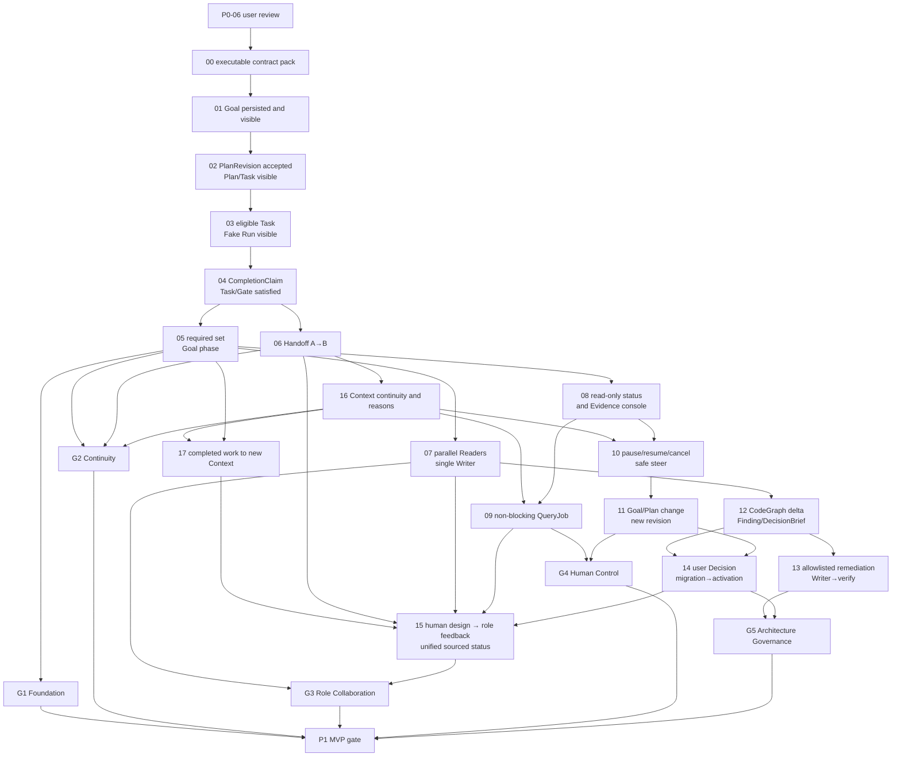

# P1-foundation DAG：Agent-sized 纵向切片

```yaml
status: proposed
updated: 2026-09-06
phase: P1-foundation
blocked_by:
  - P0-06
architecture_ref: ../../../../ARCHITECTURE.md
evaluation: ../../../evaluation/mvp-scenario.md
release_gates:
  - G1-foundation
  - G2-continuity
  - G3-multi-agent
  - G4-human-control
  - G5-architecture-governance
mvp_waits_for:
  - G1-foundation
  - G2-continuity
  - G3-multi-agent
  - G4-human-control
  - G5-architecture-governance
```

## Outcome

2026-09-05 设计复核：本 DAG 与叶子 Ticket 保持 `proposed`。新的 [产品／架构复核](../../../design/human-framework-role-review.md) 涉及角色协作、统一图文界面和需求／架构建立。下文已同步角色、Context、来源与查询契约，并增加 P1-15 完整协作集成。G3 保留机器标识 G3-multi-agent，但含义改为角色协作；基础并发仅是其中一项证据。文档可审阅，实施仍等待 P0-06。

P1-foundation 以一组可在单个新 Context 中完成并独立验收的 tracer-bullet Ticket，逐步交付可持久化、可观察、可换手且由 Evidence 归约的最小 Agent Platform。每张票都从一个输入或故障注入开始，穿过必要 Module Interface，并在 View、Evidence、Handoff、patch 或 Decision 上形成可检查结果。

这是候选施工图，不是当前实施授权。

## DevelopmentTicketDAG



这些边只表示后续 Ticket 开始前必须存在的已验收开发 Artifact，不是 `ModuleDependencyDAG`，也不会创建产品运行时的 `RuntimeExecutionDAG`。P1-09 没有被用作其他 Ticket 的惯性前置；只有后续设计确实消费 QueryJob Artifact 时才能新增该边。

## Tickets

| Ticket                                                                                  | 状态       | 首次可观察能力                                               |
| --------------------------------------------------------------------------------------- | ---------- | ------------------------------------------------------------ |
| [00 Executable contract pack](./tickets/00-contract-pack.md)                            | `proposed` | `CreateGoal` fixture 经 InMemory harness 得到确定性 GoalView |
| [01 Goal persisted and visible](./tickets/01-goal-persisted-and-visible.md)             | `proposed` | SQLite 重启后同一 GoalView 仍可见                            |
| [02 PlanRevision accepted and visible](./tickets/02-plan-revision-visible.md)           | `proposed` | 手写 PlanRevision 被接受并投影 Plan/Task View                |
| [03 Eligible Task to Fake Run](./tickets/03-fake-run-visible.md)                        | `proposed` | eligible Task 被唯一领取并显示 Fake Run                      |
| [04 Evidence satisfies Task/Gate](./tickets/04-evidence-satisfies-task.md)              | `proposed` | CompletionClaim 经 Evidence 归约为 SATISFIED 或返工          |
| [05 Goal phase reduction](./tickets/05-goal-phase-reduction.md)                         | `proposed` | required 集合确定性归约为 Goal phase                         |
| [06 Handoff A→B](./tickets/06-handoff-a-to-b.md)                                        | `proposed` | A 中断后 B 不回放完整 transcript 接续                        |
| [07 Parallel Readers + single Writer](./tickets/07-parallel-readers-single-writer.md)   | `proposed` | 两个 Reader 并行、Evidence join、唯一写入                    |
| [08 Read-only status and Evidence console](./tickets/08-status-evidence-console.md)     | `proposed` | 用户只读查看状态、来源和完成证据                             |
| [09 Non-blocking QueryJob](./tickets/09-non-blocking-query-job.md)                      | `proposed` | 用户提问时源 Worker 不暂停                                   |
| [10 Lifecycle controls and safe steer](./tickets/10-lifecycle-controls-safe-steer.md)   | `proposed` | pause/resume/cancel 与 steer 经安全点生效                    |
| [11 Goal/Plan change to new revision](./tickets/11-goal-plan-change-revision.md)        | `proposed` | 目标变更经 Proposal/Decision 产生新 revision                 |
| [12 CodeGraph delta to DecisionBrief](./tickets/12-codegraph-finding-decision-brief.md) | `proposed` | Workspace 变化产生 raw Delta、Finding 或 DecisionBrief       |
| [13 Allowlisted remediation](./tickets/13-allowlisted-remediation.md)                   | `proposed` | 局部漂移经普通 Writer/verify 链修复                          |
| [14 Baseline activation](./tickets/14-baseline-activation.md)                           | `proposed` | 用户 Decision 与 migration Gate 推进 baseline                |
| [15 Human design and role collaboration](./tickets/15-human-role-collaboration.md) | `proposed` | 人与参谋确立设计、角色返工闭环和统一图文回报 |
| [16 Context continuity](./tickets/16-context-continuity.md) | `proposed` | 同工作多轮推进、关键理由留痕与安全接续 |
| [17 Completed work to new Context](./tickets/17-completed-work-context.md) | `proposed` | 完成工作重启后供相关新任务继承并标明历史适用性 |

## Frontier

00 验收后，01 是首个持久化集成切片；02—05 逐票增加 Plan、Run、Task/Gate 完成和 Goal 归约，任何一票都不预先实现后一票的机制。

04 验收后，05 与 06 可以并行：Handoff 只消费 active Attempt 与 verification path，不等待 Goal reducer。05 验收后，07、08 可以并行，多 Reader 不阻塞只读控制台。08 与新增 16 的产物均验收后，09 与 10 可以并行，11 只消费 10 的安全暂停与控制 Artifact。07 之后 12 观察真实 Writer 变更；13 消费 12 的 allowlisted Finding，14 同时消费 12 的 DecisionBrief 与 11 的有权限 Decision/revision 路径。

15 消费 06 的换手、07 的写入／汇合、09 的带来源回答、14 的设计决定／激活能力及 17 的已完成工作继承证据，在新目标上整合初始协商与完整角色闭环；11 的规划能力经 14 成为其已验收前驱。这个开发顺序不意味着产品运行时先变更后创建。

Module Worker 可以在单张 Ticket 内围绕已冻结 Interface 并行，但必须在该 Ticket 的验收路径内汇合；单独完成一个 Module 不会完成 Ticket。

`interfaces_to_freeze` 表示该 Ticket 是所列最小 Interface 的首个真实消费者：必须先创建、版本化并通过最小 contract test，才可在本票中使用；后续 Ticket 只引用已冻结版本，若语义变化则提交显式版本升级。已补齐的 Module 草案说明职责、依赖与测试面；精确 wire schema 仍在首个消费者冻结，不将设计文档冒充可运行接口。

## 阶段内 Release Gates

| Gate                       | 等待的 Ticket 输出 | 首次形成的正式评价版本                               |
| -------------------------- | ------------------ | ---------------------------------------------------- |
| G1 Foundation              | P1-05              | Goal/Plan/Run/Evidence/Goal reducer 的持久化重启闭环 |
| G2 Continuity              | P1-05 + P1-06 + P1-16 | G1 能力加同工作 Context 连续性、理由留痕与 A→B 接续            |
| G3 Role Collaboration      | P1-07 + P1-15     | 人参与初始设计、协调→执行→返工／验证与统一图文回报；保留并发／唯一 Writer 检查 |
| G4 Human Control           | P1-09 + P1-11      | Portfolio、非阻塞查询、安全控制和目标 revision 变更  |
| G5 Architecture Governance | P1-13 + P1-14      | 漂移发现、allowlisted 修复与受控 baseline activation |

每个 Gate 都运行 [MVP 场景](../../../evaluation/mvp-scenario.md) 中对应步骤并保存独立 Evidence。Gate 可以与其他已解锁 Ticket 并行评价；通过某个 Gate 不会授权未到达的分支，也不会把整个 P1 标为完成。失败返回最近负责的 Ticket。

## Exit gate

P1 MVP Gate 等待 G1–G5 全部通过。单个 Module、单项测试、两个并发进程、某个中间 Gate 或 proposed 文档都不等于 P1 已完成。

## 2026-09-06 增量规划

新增 P1-16／17 均为 proposed，文档修订不授权实施。16 消费 06 的交接并兼容 03 的输入／Run 契约；09／10 实际消费其连续性契约，11 经 10 继承。17 消费 16 的记录与 05 的完成事实；15 消费其证据并验证多包工头冲突、秘书／参谋上报和决定反馈。07／08／12 等独立分支不增加 16／17 阻塞。

G2 保留原 05／06 证据并增加 16；G3 通过 15 消费 17，不把原并发或原换手 PASS 视为新增生命周期已完成。P1-03／06 原实现记录不改，新版本差距归补充票。
