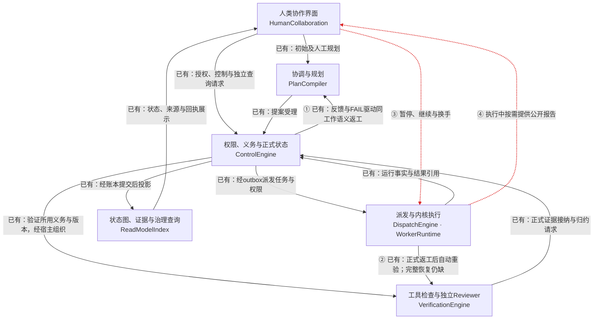
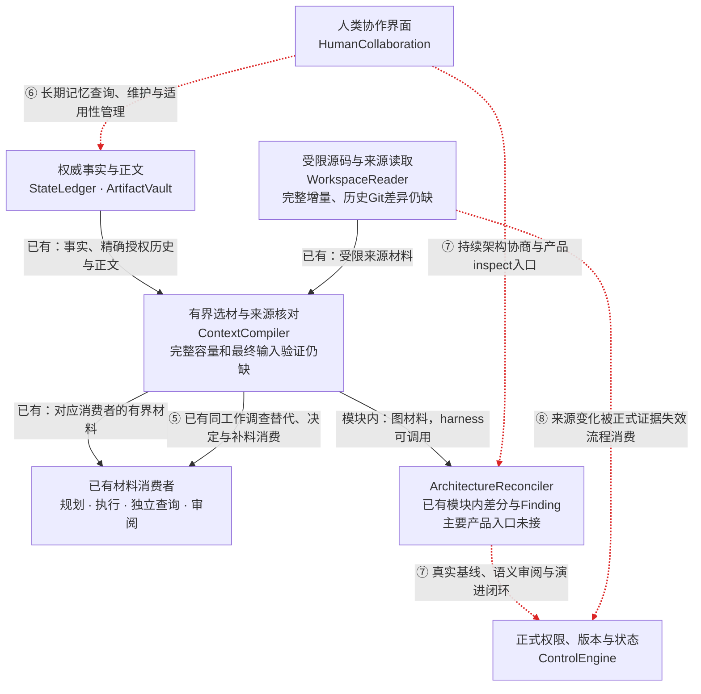

# 当前模块状态

当前增量（2026-09-18，I阶段关闭）：snap-30-context-corroboration 已由独立 Agent 对精确快照验收，I01–I04 全部 PASS。源码1453文件 `6b245cd1302cb2724b65eef926a4619f943663c56d5fcbd49135febc6576fe2d`，构建751文件 `0e82ef2533586b9d06bec638cf8ac735e73b62814c4a423a6918c53750d86058`，集中回归后复算一致。证据包括53/53定向、文档13/13、UI37/37、platform2551PASS/7配置SKIP、vendor最终172/172和real31真实统一Coding场景1/1。报告见产品 `evidence/collaboration-memory/batch/integration/snap-30-context-corroboration/acceptance-final/`。历史语义FAIL、首次并行vendor失败、real29观察不足和real30 INCONCLUSIVE保留；本PASS不证明任意开放解释普遍可靠。后续Session/生命周期、Agent状态记忆、ContextCompiler拆分及R1–R11重构另立快照，不继承本PASS，不重做S01–S05。

## CM-1A-001：Gate A与M06已独立通过；Gate B/C已独立通过

2026-09-14。已接通真实 Host 请求/回应/订阅/all-wait、当前参与关系和换手、admission 固定 Work 与 Delivery、后继 Runtime 准备和实际输入；持续路由在源事务固定范围，历史补投有固定 horizon。普通 Task/后继采用逐请求许可及材料撤权复核，执行代际在 Runtime 入口前消费；仅未进入代际可撤销重试，unknown 经正式对账或隔离。唯一 drive 内有界只读并发，写操作保留 Workspace lease。

本轮按 [五步计划](../dev_docs/planning/active/collaboration-memory/CM-1A-001-FOLLOWUP-PLAN.md) 完成实施与最终证据收口；最终交付日志在产品 evidence/collaboration-memory/CM-1A-001/implementation/CM1A-001-snap-04/。冻结源码 1241 文件，指纹 f930c3efb08d9d665117ddbc974f406a09e7d98efc2f24563ef3a78f709e4a81；最终全量 315 文件 / 2113 用例通过、0 失败，类型 0 诊断、边界 issues 为空、当前构建与文档检查通过。独立验收已核实同快照，并另跑111例与2例增强输入见证通过。先前“消费者未实现”仅属于 snap-01 历史，不再描述当前源码。旧记录保留于各自 evidence；当前检查点已给出逐文件哈希与准确差异。

独立 A01–A12 PASS，Gate A 在 snap-04 的1A工程范围成立，见[独立结论](../../../../agent_platform/evidence/collaboration-memory/CM-1A-001/acceptance/CM1A-001-snap-04/gate-a-01/acceptance.md)。统筹已放行[CM-M06-001](../dev_docs/planning/active/collaboration-memory/CM-M06-001.md)，snap-01 已独立通过（release-log R-16，318 文件/2145 用例全量通过）；1B 的 CM1B-001-snap-01 已独立通过 Gate B（R-17，322 文件/2156 用例全量通过）；1C 的 CM1C-001-snap-02 已独立 C01–C04 PASS（R-21），M01–M05 已独立接纳，M 后结构整理 S01–S05 已在 snap-07 独立接纳，I01–I04 已在 snap30 独立接纳。后续新修改及重构必须另验，不由旧票、全量或本次PASS自动覆盖。

## M01–M05：已独立接纳

CM-M01-001 至 CM-M05-001 在 CMM01-M05-snap-03 获逐项独立 PASS，统筹已接纳。普通/计划/人工入口共用调度，Query精确绑定与持久结果恢复、Reviewer/Handoff生产消费者、规划返工及宿主扫描/退出均已交付；共享执行规则、生产composition命名及失实注释同步整理，保留12 Module和Control/Ledger两层复核。

源码1319条目4064c26af78bf34b361623dab13338e8f3296708384129dff6b7577b2b85fb1f。稳定受影响集39文件183例通过，浏览器31通过/1条件跳过；类型、边界、构建及文档通过。M-AC-01/02/03关闭；原全量失败与构建干扰失败保留，不报告新全量全部通过。见[独立报告](../../../../agent_platform/evidence/collaboration-memory/batch/M01-M05-implementation/CMM01-M05-snap-03/acceptance/acceptance.md)及[验证](../../../../agent_platform/evidence/collaboration-memory/batch/M01-M05-implementation/CMM01-M05-snap-03/verification.md)。I01 真实执行/质量仍未通过，I02 限定工程通过、I04 独立报告已交付，协议替身不代表真实模型在外部项目的自主质量。

## M 后结构整理 S01–S05：已独立接纳

当前 I 进度（2026-09-15 恢复/context核对）：暂停已解除。24捕获样本33请求完整input核对通过，但独立验证全集、通用人类请求及当前源码验收见证未提供；既有Q03–Q06不可统一归因缺输入。DeepSeek生产新请求max默认131072/其他支持思考配置65536，显式及旧预算优先；4文件27定向通过，root类型通过。snap-10原清单保留为未完整冻结候选，新候选集中回归、real18及独立I04尚待执行。所有既有质量FAIL保留，S01–S05不重做，无提交推送。证据：integration/context-output-18。

当前后续：按 snap-04 独立报告继续处理 R01 与 Q01/Q02；工程回归已通过，不无故重复全量。 本轮通用Coding→Task独立取证→GoalGate独立取证→正式完成已由真实DeepSeek样例贯通；Query动态事实freshness、旧Host bootstrap兼容、显式单次响应容量和Reviewer JSON传输已定向修复。真实记忆回答质量仍有单列缺口，不将模型输入正确等同语义质量通过。发现并补通用Coding GoalGate独立工具轮次与Reviewer入口（显式GoalGate subject、真实producer溯源、前置当前Evidence复核，不复制Task PASS）；Host/UI与ReadModel消费者实现已接通，最终同快照工程回归已通过，真实12/13未完成初始Coding，后续未执行。新增旧库、Query/Handoff/架构决定新进程恢复及同Task记忆纠正场景，实际结果与替身/真实模型边界见[当前集成记录](../../../../agent_platform/evidence/collaboration-memory/batch/integration/progress.md)。不扩大下列S接纳范围。

依据原始架构对话完成 12 Module 的行为—责任—公开接口审查、118 个跨 Module 实现依赖裁决、协调五组业务操作与 Ledger 21 类提交责任归组、双 ReadModel 共享投影解释、生产默认能力及全部 queue/in-flight/wake/journal 审查、大文件裁决、命名和失实注释清理。Control 受理与 Ledger 提交复核、各运行类型权限差异、持久 schema/key 和稳定 fixture API 均按职责保留。

snap-07 源码 1368 条目、`094eb49537e667c46921074f3b15c4077dcef1c60a4bd13371857723b0b09954`；构建 475 文件、`60b47ef8ec30a4d6dc83d4a34a9870b9daccf978815dc064e36a456fc1db5a1e`。独立方关闭 AC-S06-01，判定 S01–S05 全 PASS，见[报告](../../../../agent_platform/evidence/collaboration-memory/batch/post-m-architecture/acceptance/snap-07/acceptance.md)。该结论不替代 I01–I04 的组合、旧库、真实展示与最终验收。
## CM-1C-001：人的架构决定与完整影响集回流

已接真实报告工具、精确提案/修改、人类四分支、完整 Work 目录事务守卫、持久投递/接续、当前输入及逐次调用证据和工作台。接受不替代 baseline/MigrationGate；专用 explore/review 不获取协调写入口，普通只读协调保持有效。

snap02 1289 文件，SHA256 cf2c775c1cebdc296a4deefc42d495f2102c2eaea14a2464c7e605d39febcc95。11 文件/78 例、独立 30 例和新构建浏览器 4 例通过，全部静态/构建/文档检查通过。旧全量 1 个权限失败经限定修复关闭，未变化范围复用旧全量，没有重跑全量；[独立报告](../../../../agent_platform/evidence/collaboration-memory/CM-1C-001/acceptance/CM1C-001-snap-02/gate-c-02/acceptance.md)。真实 DeepSeek 两个后继回应单列，报告 producer 为协议替身，不证明真实项目自主冲突发现、图像能力或完整迁移。

## 2026-09-12 基线：模板、协作选材与工作记忆

新增同角色多版本安装与激活、模板创建及职责/工具展示、规划读取可用模板、按任务和模板交集派发、Runtime 按信封组装工具。协调 Context 新增跨工作指派/依赖及正式归约依据。ExecutionNote 新增有来源记忆版本链、更新与废止；Context 排除失效版本，历史授权仍独立核对。

这是一批基础增量，不等同完整多 Agent 或长期记忆产品。该基线时尚无完整联合协商与产品记忆维护；此后 B 已补明确小记忆维护、C 已补有界架构决定回流。自动提炼、一般自由协商与通用外部工具适配器仍待完成。本批 302 文件/1997 项行为测试、28 项浏览器、类型/边界及文档 13/13 通过；验证范围和结果见[本批证据](../../../../agent_platform/evidence/2026-09-12-agent-templates-memory/verification.md)，不得沿用前次 1994/27 的通过数描述本次改动。

## 本次源码与契约整理

前轮的材料/测试分离、校验协议拆分、返工实现分责及无消费者删减保持。本轮进一步收敛有消费者的重复：删除PlanProposalPort与ReworkPlanDraftV1，提案/规划Context协议统一到planning.ts，计划字段由PlanRevisionDraft派生并保留普通变更与返工差异；初始请求迁移至requestInitial。两宿主九类共18个纯转发删除，调用者使用现有模块对象，Control和Context的真实行为保留。contracts文件115→115、接口92→91、直接命名导出1463→1465；命名导出净增源于类型归位，不将其报告成数量下降。

五组类型独立双向等价，相关191项、全仓299文件1953项与26项浏览器通过；类型、边界、构建/HTTP、文档、原始失败与保留核对统一见[本轮协议收敛证据](../../../../agent_platform/evidence/2026-09-11-source-cleanup/protocol-convergence/verification.md)。源码API迁移不保证未知外部旧导入/旧方法兼容；持久数据与HTTP、正式权限/义务和旧FAIL保留。前轮证据全部留存；该清理验证不代表下述新增语义能力的验证。

## 当前语义协作增量（最小闭环验收完成）

已有公开结构化执行反馈→PlanCompiler提交只读协调Query→实际规则调查→精确授权的同工作后继Run补料组装；查询视图显示反馈来源，运行manifest保存材料摘要与选择原因。Verification已有正式返工后的当前版本工具重验和必要Reviewer准备，组合根终态与重启扫描调用原持久流程。协议见[运行时协作](../dev_docs/interfaces/runtime-collaboration.md#2026-09-11-定向执行反馈增量)。

材料增长同时暴露内核把完整模型输入误用作16KiB辅助空记忆查询的问题，已仅约束辅助query，真实请求仍携带完整Context；未新增长期记忆能力。

新增精确调查替代链、目标澄清选项及正式人类决定回流。真实HTTP/SQLite/内核样例已证明必要Reviewer PASS、Reviewer FAIL阻塞、人的选择，以及决定落账后未应用/应用后未投递两个重启恢复断点；冻结源码回归与浏览器验收全部通过，完整范围见[本次验收](../../../../agent_platform/evidence/2026-09-11-semantic-completion/verification.md)。这些增量不取消下面14项的范围外能力。替身模型只证明流程，不证明真实模型协作质量；旧[反馈切片证据](../../../../agent_platform/evidence/2026-09-11-semantic-loop/verification.md)保留。

## 产品流程与未形成的连接

这两张图是[ARCHITECTURE的Plane图](../ARCHITECTURE.md#plane)的当前实现投影，分别展开主业务和支撑能力。它们表达运行时请求、材料和反馈，**不是源码依赖图**；箭头可能经组合根、Control命令、账本或outbox传递，不授权新增Module依赖。合并显示的框仍对应原12 Module。

实线＝标注范围已有真实消费者；虚线及编号＝该产品连接尚未形成完整闭环，可能已有局部接口。模块内实现用文字单独注明，不把“有代码”画成“已接产品”。

### 目标、执行、验证与反馈

①②已有同任务FAIL语义调查、正式返工、当前工具重验、必要Reviewer和Task归约联合样例；两个决定回流断点恢复已验证。持续多工作协调及全部强杀断点不因此视为完成。④不否认现有事件展示与独立QueryJob；缺的是源Worker公开材料的按需响应。

### 材料、记忆、来源与架构治理

⑥不表示存储或历史授权未实现；缺的是长期记忆管理及更多实际消费者。⑦包含已有局部守卫/机械算法尚不能组成的产品闭环。⑧不表示所有来源检查失效：读取及接纳时已有复核，缺的是已接纳Evidence的一般来源变化失效消费。

| 未形成的产品连接 | 主要责任Module | 对应下方剩余能力 |
| --- | --- | --- |
| ① 持续角色协作、反馈重规划与人的决定回流 | HumanCollaboration、PlanCompiler、ControlEngine，Dispatch/Runtime承载运行 | 1、2、5、13 |
| ② 返工后新版本执行到重验、重审、正式归约 | DispatchEngine、VerificationEngine、ControlEngine、ContextCompiler | 10 |
| ③ 暂停、继续、换手及中断后的可追溯接续 | WorkerRuntime、DispatchEngine、ControlEngine及Data | 6、7 |
| ④ 源Worker公开材料的按需响应 | HumanCollaboration、WorkerRuntime、DispatchEngine、ContextCompiler | 4 |
| ⑤ 缺料调查、带来源响应、重新编译和真实消费 | ContextCompiler、ControlEngine、PlanCompiler、DispatchEngine、WorkerRuntime | 3、5、9 |
| ⑥ 长期记忆管理、产出历史核对与真实使用 | ArtifactVault、ReadModelIndex、ContextCompiler；Control保留授权/策略权威 | 8、13 |
| ⑦ 需求/架构协商、真实基线、检查和演进 | HumanCollaboration、PlanCompiler、ArchitectureReconciler、ContextCompiler、WorkspaceReader、VerificationEngine、ControlEngine | 5、11 |
| ⑧ 一般来源失效及完整源码/历史差异能力 | WorkspaceReader、ContextCompiler、ControlEngine、VerificationEngine | 12 |

另外两项是跨链路验收要求，不能只靠连上一条箭头解决：材料容量及最终输入一致性（9），真实任务、故障恢复和效率证据（14）。下一阶段分工应以一条有明确结果的缺失连接为范围，不给每个Module同时领取“全部补齐”。

## 12 Module 审查结论与生产接线

| Module | 当前实现与实际消费者 | 本次结论、修复与限制 |
| --- | --- | --- |
| HumanCollaboration | createGoal/查询、探索审阅和历史授权入口；工作台经服务消费正式模块结果 | 交互不裁决完成；治理显示读取已移入 ReadModelIndex。已有目标澄清决定回流；完整秘书/参谋对话和跨工作包协调仍缺 |
| PlanCompiler | 初始协调、人工任务计划、目标变更与机械返工提案；新增公开执行反馈→正式只读协调Query，app实际消费 | 影响报告改读 Control 权威工作身份，保留自定义ID和返工起源，不再猜work-taskId；缺身份材料显式列缺口。已有带来源FAIL语义返工；持续角色收敛仍缺 |
| ControlEngine | 正式命令、权限/版本/义务/租约守卫、Task/Goal归约与治理激活；Plan/Dispatch/Verification消费 | 唯一状态写入与工作身份权威保留；返工处置采用当前canonical承担者与正式适用Evidence，不能凭旧PASS消除失败义务。已有目标澄清决定及部分提交恢复；一般来源失效触发归约与全部恢复仍缺 |
| DispatchEngine | outbox驱动普通Run、Reviewer、独立Query和人工计划；真实派发前建立/链接工作身份并准备材料 | 多失败按当前承担者逐组处理，计划换版不等于义务已处置。宿主先取得验证问题材料再传入，Dispatch不回调Verification；处置复核走Control。已接精确授权的同工作补料；已有精确同工作调查刷新；新 Run 换手及完整宿主恢复已在M系列限定范围独立验收；同 Run 暂停/热恢复仍缺 |
| VerificationEngine | 工具轮次、独立Reviewer、报告/配置/恢复journal、openIssues；新增正式返工reverifyRework及prepareReworkReview；HTTP/UI消费真实报告 | canonical计划与运行产出材料经Context取得，不直读Ledger；失败消除须正式当前Evidence，局部verdict或拒绝回执不够。requiredOutputs只记录声明性期望和见证，不降级轮次或扣留归约。同任务自动重验/必要独立Reviewer/Task归约已联合实测；广泛多工作与强杀断点未据此完成 |
| ArchitectureReconciler | 精确图材料→差分→Finding/Brief→逐次Control回执；harness可调用inspect | 模块内机械路径存在、拒绝停止；未接产品inspect、真实初始sourceBinding、完整语义审查和MigrationGate。未知图关系不能生成确定业务结论 |
| WorkerRuntime | 复用coding-agent内核的真实执行、只读查询和Reviewer；公开观察交ArtifactVault，Query成功read产生实际路径/版本见证 | 不自行规划或完成Task；取消、部分重启对账已接。新 Run 换手已通过 Host/Dispatch 接入；真实同 Run 暂停/继续/steer与通用公开snapshot仍unsupported或未接；未知副作用不靠重跑猜测 |
| StateLedger | Control提交事件/快照/幂等/outbox；持久宿主用SQLite，内存用于隔离测试 | 新库身份槽原已具备；本次补旧库无槽时事务内canonical冲突检查，旧多身份不删不选赢家。内存入/出边界隔离可变引用，消除无commit改状态旁路 |
| ArtifactVault | 不可变正文/owner/来源，探索、Reviewer、工作历史消费；授权候选由ReadModel发现，canonical与来源再核对 | 保留精确授权、撤销、完整读者/owner范围及摘要检查。跨工作历史准入看显式授权，与本Run可写/只读正交；不同来源算法不强行合并。长期记忆管理仍未完成 |
| ReadModelIndex | 状态/任务图/时间线/证据/角色查询；治理视图经GovernanceViewPort供app/UI消费 | 治理读取和公共wire类型已归位；角色就绪仍复用Control同一政策。矩阵与policy标识取同一revision，扫描不足显式gaps；按需治理查询不是跨聚合原子快照。旧双后端投影重复是内部维护债 |
| ContextCompiler | Task/Work/History/Planning/Query/Reviewer/Verification/Architecture材料进入真实消费者；新增反馈协议和定向补料经ContextBundle入模型及manifest | 源码适配已属WorkspaceReader；本次补I/O后canonical版本复核及Verification材料读取。WorkRun主流程已有领域步骤；必需材料缺失拒绝，历史不继承权限/完成。已有定向补料/调查替代及决定正文消费；模型token精确计量和一般最终输入验证仍缺 |
| WorkspaceReader | 路径沙箱、源码/索引/来源pin；Runtime工具、Context、Vault来源检查实际消费 | 角色code通道已归位，本次重读所选正文与有界清单，变化明确拒绝；仅保证可观察变化检测，不声称多文件原子快照。完整多语言/外部依赖/持久增量/历史Git树与通用差异接口仍缺 |

审查原文：[Data](../../../../agent_platform/evidence/2026-09-11-architecture-convergence/audit-data.md)、[Control](../../../../agent_platform/evidence/2026-09-11-architecture-convergence/audit-control.md)、[Human/Execution](../../../../agent_platform/evidence/2026-09-11-architecture-convergence/audit-interaction.md)。独立责任与可读性复核：[Data](../../../../agent_platform/evidence/2026-09-11-architecture-convergence/final-review-data.md)、[治理视图](../../../../agent_platform/evidence/2026-09-11-architecture-convergence/final-review-view.md)、[规划身份](../../../../agent_platform/evidence/2026-09-11-architecture-convergence/final-review-plan.md)。这些报告保留发现时点，不自行覆盖当前规范。

历史[延期登记](../dev_docs/planning/active/external-review-repair/deferred-register.md)继续保留为维护事项入口：未复核条目不自动视为已修，也不直接当成当前确认缺陷；重新实施前须核对现码，不能因旧审计归档而取消。

## 当前行为口径

- 工作身份由Control/账本权威保证，Dispatch复用正式解析结果；旧重复历史不靠归档或自动改名消除。返工起源链的既有有界行为不等于完整异常链治理。
- 角色必读材料仍有权限、版本和缺口检查；requiredOutputs保留声明与见证，缺项不再作为角色门禁。[用户原话第5项与收口第7项](user-replies-2026-09-11.md)说明后续约束；不据“记忆相关”另增第13个Module。
- 跨工作历史指其他工作的运行历史；必须有精确读取授权。工作区工具/写权限既不自动授予、也不自动禁止该历史。显式跨Workspace授权保留，禁止自动共享；同工作留痕与开发记忆按各自语义处理。
- 返工已有失败分类、提案、自动受理、派发、可见回执及停用开关；不能继续写“FAIL没有消费者”。自动受理仍受既有授权/预算/人的拒绝/版本守卫约束；已接新版本工具重验、必要重审及两个决定恢复断点并走通单任务；一般强杀恢复仍需专项证明。普通取消、停用自动返工和暂停正在运行的内核是不同能力。

## 剩余产品能力（不是实施顺序）

2026-09-11下一步产品方向已同步到[PRODUCT](../PRODUCT.md#通用角色模板与工具组合)：通用角色模板、工具组合、名片及任务级授权，以及业务不确定时的完成边界。2026-09-12 已开始实现：模板创建/多版本激活及按授权派发已接通；完整实例管理、外部领域适配和持续多工作协作仍未完成。契约应先复用现有RoleSpec/RoleBinding，不另建平行编排系统。

以下14项承接旧映射与全部有效未完义务；详细要求、模块和证据见 [核心义务映射](../dev_docs/verification/2026-09-10-core-obligations-map.md)。它们不授权本轮扩展功能，也不表示全部技术选型已决定。

1. 秘书/参谋/书记/规划/集成的真实角色生成、持续分工和跨工作包收敛。
2. 同工作FAIL语义返工与目标澄清回流已接；范围外验收、架构变更及持续多工作重规划仍按各自正式入口扩展。
3. 已有同工作反馈→只读调查→带来源补料/决定→后继消费及精确调查替代；更多角色路由、变化的失败集合与跨工作联合协作仍需专项证明。
4. 执行中公开进展/决策材料的按需索取、主动上报和独立查询；不读取隐藏思维。
5. 需求/架构冲突在测试前提出、讨论、决定，送达全部受影响工作并证实材料刷新。
6. 同 Run 暂停/继续/steer仍待实现；有界材料的新 Run 换手已接，M 系列已补齐并独立验收所列恢复场景。
7. 强杀/重启后的未知副作用、租约、outbox与证据对账，不用重跑冒充恢复。
8. 长期记忆查看/更新/检索/作废、适用性与跨任务实际消费者，保持授权边界。
9. 相关性选材、单次token容量与字节上限协同，必需材料及manifest与最终模型输入一致性。
10. 已实测返工后的新版本执行→工具重验→必要独立Reviewer→Evidence→Control Task归约及两个决定提交断点恢复；连续多工作失败、更多强杀断点仍需专项验收。
11. 真实初始架构来源/基线绑定、inspect产品入口、语义与机械审查、MigrationGate和演进反馈。
12. 全角色来源/Evidence失效消费、完整配置/外部依赖/多语言增量、按Git版本读历史树和通用差异。
13. 面向人的解释、规则/记忆/角色设置保存与真实生效、必要提醒及可追溯反馈；已有布局/文件预览/模型设置不重新算缺失。
14. 真实任务贯穿提问、分工、取材、验证返工、重启与决定回流；随后按已批准题面做公开基准，测成功率、重复探索、用量/耗时和不必要人工介入，区分真实模型质量与替身流程证据。

以上存在局部产物依赖，例如重审需当前修订及来源，消费回执需已接受材料；不等于必须按此编号串行实施。新产品语义、模块边界和未定技术选型仍须具体选项交用户决定；等待期间可推进独立已授权工作。用户未设置累计Token/调用/时长预算，不自行新增。

## 验证与历史

此前语义协作增量验收与限制见[本轮证据](../../../../agent_platform/evidence/2026-09-11-semantic-loop/verification.md)。此前架构专项、类型/构建/全仓/浏览器/文档验证以 [历史产品证据](../../../../agent_platform/evidence/2026-09-11-architecture-convergence/data-changes.md) 及其同目录日志为准；最终实测：296文件/1939项行为测试、25项浏览器测试全部通过；前后端类型与构建通过、模块结构0问题、文档13/13。完整命令、身份与历史失败见[本次偏差摘要](../dev_docs/verification/2026-09-11-architecture-convergence/summary.md)。该次架构收口已结束；清理基线与后续语义增量分别验证，以本页顶部对应证据为准。

原本页所有历史验收、真实失败、图与旧状态已在改写前[原样保存](../dev_docs/verification/2026-09-11-architecture-convergence/history/module-status.md.txt)，与写前SHA256一致；旧相对链接按原human/module-status.md位置解释。工具验证、独立Reviewer、DEF-17、目录整理及RW系列的历史证据仍有效于其当时范围，不能当当前完整产品PASS。历史中的建议、阶段顺序和候选方案不提供新的执行授权。

2026-09-15 I阶段后续委托：默认双阶段Query提案不作为当前阻塞；按用户明确要求先验证事实工具＋引用＋短Skill＋适用记忆，模型已显式max。fact-skill-max固定18格诊断17answered/1截断失败，独立审阅仍有虚构待办及引用支持不足，不算质量PASS。当前read_query_fact/短V7/引用展开候选已通过4文件10项定向，尚待类型复查、独立实现审查、真实工具样例与新快照集中验收。源变化与完整状态见产品integration/fact-skill-max；S不重做、I04仍未接纳。
